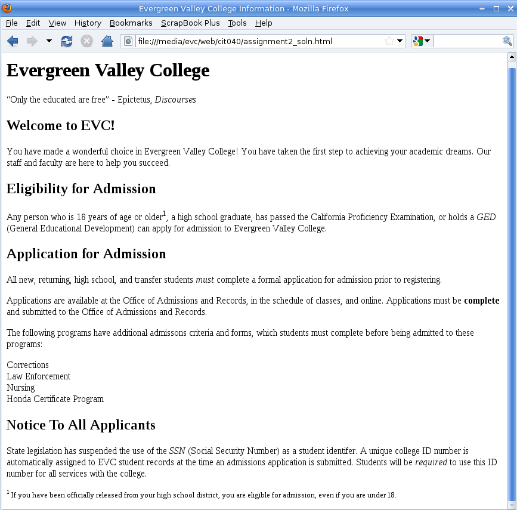

# HTML Assignment 01 - Bài tập HTML 01

Cho đoạn văn bản dưới đây:

<details>
  <summary>Nội dung văn bản</summary>

```
Evergreen Valley College

"Only the educated are free" - Epictetus, Discourses

Welcome to EVC!

Replace this paragraph with text of your own invention that
welcomes students to EVC.

Eligibility for Admission

Any person who is 18 years of age or older1, a high school graduate,
has passed the California Proficiency Examination, or holds a GED
(General Educational Development) can apply for admission to
Evergreen Valley College.

Application for Admission

All new, returning, high school, and transfer students must complete
a formal application for admission prior to registering.

Applications are available at the Office of Admissions and Records,
in the schedule of classes, and online.  Applications must be complete
and submitted to the Office of Admissions and Records.

The following programs have additional admissons criteria and
forms, which students must complete before being admitted to these
programs:

Corrections
Law Enforcement
Nursing
Honda Certificate Program

Notice To All Applicants

State legislation has suspended the use of the SSN (Social Security
Number) as a student identifer. A unique college ID number is 
automatically assigned to EVC student records at the time an
admissions application is submitted.  Students will be required
to use this ID number for all services with the college.

1 If you have been officially released from your high school district,
you are eligible for admission, even if you are under 18.

```

</details>

Hãy sử dụng các kiến thức HTML cơ bản để thực hiện chỉnh sửa đoạn văn bản bên trên cho ra kết quả sau:



<details>
<summary>Theo dõi theo số thứ tự dòng để làm theo hướng dẫn bên dưới</summary>

```
  1  Evergreen Valley College
  2
  3  "Only the educated are free" - Epictetus, Discourses
  4
  5  Welcome to EVC!
  6
  7  Replace this paragraph with text of your own invention that
  8  welcomes students to EVC.
  9
 10  Eligibility for Admission
 11
 12  Any person who is 18 years of age or older1, a high school graduate,
 13  has passed the California Proficiency Examination, or holds a GED
 14  (General Educational Development) can apply for admission to
 15  Evergreen Valley College.
 16
 17  Application for Admission
 18
 19  All new, returning, high school, and transfer students must complete
 20  a formal application for admission prior to registering.
 21
 22  Applications are available at the Office of Admissions and Records,
 23  in the schedule of classes, and online.  Applications must be complete
 24  and submitted to the Office of Admissions and Records.
 25
 26  The following programs have additional admissons criteria and
 27  forms, which students must complete before being admitted to these
 28  programs:
 29
 30  Corrections
 31  Law Enforcement
 32  Nursing
 33  Honda Certificate Program
 34
 35  Notice To All Applicants
 36
 37  State legislation has suspended the use of the SSN (Social Security
 38  Number) as a student identifer. A unique college ID number is
 39  automatically assigned to EVC student records at the time an
 40  admissions application is submitted.  Students will be required
 41  to use this ID number for all services with the college.
 42
 43  1 If you have been officially released from your high school district,
 44  you are eligible for admission, even if you are under 18.
```

</details>

Cụ thể:

- Sử dụng thẻ `<title>` để làm tiêu đề cho trang web `Evergreen Valley College Information`
- Dòng đầu tiên là heading cấp 1 (thẻ `<h1>`)
- Dòng 3, đoạn chữ `Only the educated are free` sẽ là một trích dẫn quotation, từ `Discourses` sẽ là một citation
- Dòng 5, 10, 17 và 35 sẽ là heading cấp 2 (thẻ `<h2>`)
- Với dòng 7 và 8, hãy làm theo yêu cầu mà dòng đó viết
- Từ `GED` ở dòng 13 là viết tắt của một định nghĩa, tương tự với từ `SSN` ở dòng 37
- Từ `must` ở dòng 19 và từ `required` ở dòng 40 được nhấn mạnh (emphasized)
- Từ `complete` ở dòng 23 là một từ được nhấn mạnh (strongly emphasized text)
- Số `1` sau từ `older` ở dòng 12 sẽ cần được đẩy thành superscript
- Dòng 30, 31, 32, và 33 sẽ nằm ở các dòng riêng biệt, và tất cả các dòng đó không phải nằm chung trong cùng 1 đoạn văn
- Dòng 43 và 44, chữ sẽ nhỏ hơn bình thường, số `1` ở đầu dòng 43 cần được đẩy thành superscript
- Các dòng sau sẽ cùng nằm trong một đoạn văn
    
    + Dòng 7 - 8
    + Dòng 12 - 15
    + Dòng 19 - 20
    + Dòng 22 - 24
    + Dòng 26 - 28
    + Dòng 30 - 33
    + Dòng 37 - 41
    + Dòng 43 - 44