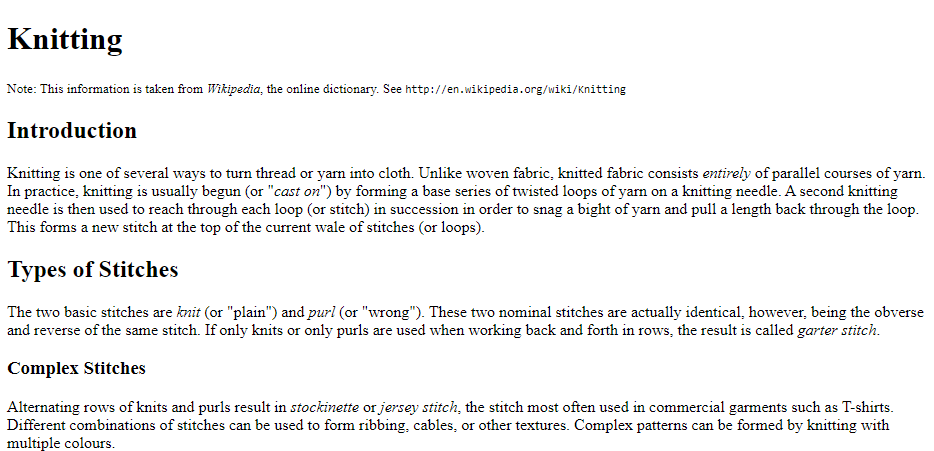

# HTML Assignment 02 - Bài tập HTML 02

Cho đoạn văn bản dưới đây:

<details>
  <summary>Nội dung văn bản</summary>

```
Knitting

Note: This information is taken from Wikipedia, the
online dictionary.  See http://en.wikipedia.org/wiki/Knitting

Introduction

Knitting is one of several ways to turn thread or yarn into
cloth. Unlike woven fabric, knitted fabric consists entirely
of parallel courses of yarn. In practice, knitting is
usually begun (or "cast on") by forming a base series of
twisted loops of yarn on a knitting needle. A second
knitting needle is then used to reach through each loop (or
stitch) in succession in order to snag a bight of yarn and
pull a length back through the loop. This forms a new stitch
at the top of the current wale of stitches (or loops).

Types of Stitches

The two basic stitches are knit (or "plain") and purl (or
"wrong"). These two nominal stitches are actually identical,
however, being the obverse and reverse of the same stitch.
If only knits or only purls are used when working back and
forth in rows, the result is called garter stitch.

Complex Stitches

Alternating rows of knits and purls result in stockinette or
jersey stitch, the stitch most often used in commercial
garments such as T-shirts. Different combinations of
stitches can be used to form ribbing, cables, or other
textures. Complex patterns can be formed by knitting with
multiple colours.
```

</details>

Hãy sử dụng các kiến thức HTML cơ bản để thực hiện chỉnh sửa đoạn văn bản bên trên cho ra kết quả sau:



<details>
<summary>Theo dõi theo số thứ tự dòng để làm theo hướng dẫn bên dưới</summary>

``` 
 1	Knitting
 2
 3	Note: This information is taken from Wikipedia, the
 4	online dictionary.  See http://en.wikipedia.org/wiki/Knitting
 5
 6	Introduction
 7
 8	Knitting is one of several ways to turn thread or yarn into
 9	cloth. Unlike woven fabric, knitted fabric consists entirely
10	of parallel courses of yarn. In practice, knitting is
11	usually begun (or "cast on") by forming a base series of
12	twisted loops of yarn on a knitting needle. A second
13	knitting needle is then used to reach through each loop (or
14	stitch) in succession in order to snag a bight of yarn and
15	pull a length back through the loop. This forms a new stitch
16	at the top of the current wale of stitches (or loops).
17
18	Types of Stitches
19
20	The two basic stitches are knit (or "plain") and purl (or
21	"wrong"). These two nominal stitches are actually identical,
22	however, being the obverse and reverse of the same stitch.
23	If only knits or only purls are used when working back and
24	forth in rows, the result is called garter stitch.
25
26	Complex Stitches
27
28	Alternating rows of knits and purls result in stockinette or
29	jersey stitch, the stitch most often used in commercial
30	garments such as T-shirts. Different combinations of
31	stitches can be used to form ribbing, cables, or other
32	textures. Complex patterns can be formed by knitting with
33	multiple colours.
```

</details>

Cụ thể:

- Sử dụng thẻ `<title>` để làm tiêu đề cho trang web `About Knitting`.

- Dòng đầu tiên là heading cấp 1 (thẻ `<h1>`).

- Dòng 6 và 18 sẽ là heading cấp 2 (thẻ `<h2>`).

- Dòng 26 sẽ là heading cấp 3 (thẻ `<h3>`).

- Các dòng sau sẽ cùng nằm trong một đoạn văn
  
  + Dòng 3 và 4
  + Dòng 8 tới dòng 16
  + Dòng 20 tới dòng 24
  + Dòng 28 tới dòng 33

- Dòng 3 và 4 có chữ nhỏ hơn bình thường.

- Từ `Wikipedia` ở dòng 3 là từ trích dẫn (citation).

- Từ `entirely` ở dòng 9 được nhấn mạnh (emphazied).
