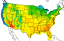
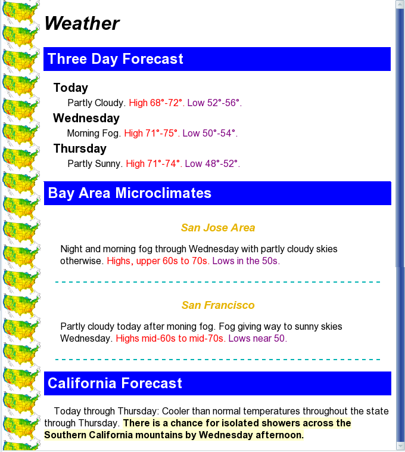

# HTML Assignment 05 - Bài tập HTML 05

Hãy tạo file `style1.html` với nội dung file như sau:

```html
<!DOCTYPE html>

<html xmlns="http://www.w3.org/1999/xhtml" xml:lang="en" lang="en">
<head>
<meta http-equiv="content-type" content="text/html; charset=utf-8" />
<title>Your Name - Styles</title>
<style type="text/css">

/* Your styles go here */

</style>
</head>

<body>
<h1>Weather</h1>

<h2>Three Day Forecast</h2>

<dl>
<dt>Today</dt>
	<dd>
	Partly Cloudy.
	High 68&#176;-72&#176;.
	Low 52&#176;-56&#176;.
	</dd>

<dt>Wednesday</dt>
	<dd>
	Morning Fog.
	High 71&#176;-75&#176;.
	Low 50&#176;-54&#176;.
	</dd>

<dt>Thursday</dt>
	<dd>
	Partly Sunny.
	High 71&#176;-74&#176;.
	Low 48&#176;-52&#176;.
	</dd>
</dl>

<h2>Bay Area Microclimates</h2>

<div>
<h3>San Jose Area</h3>
<p>
Night and morning fog through Wednesday with partly cloudy skies
otherwise. Highs, upper 60s to 70s. Lows in the 50s.
</p>
</div>

<div>
<h3>San Francisco</h3>
<p>
Partly cloudy today after moning fog. Fog giving way to sunny skies
Wednesday. Highs mid-60s to mid-70s. Lows near 50.
</p>
</div>

<h2>California Forecast</h2>
<p>
Today through Thursday: Cooler than normal temperatures throughout
the state through Thursday.  There is a chance for isolated showers
across the Southern California mountains by Wednesday afternoon.
</p>

</body>
</html>
```

Nếu mở file trên trình duyệt, ta có thể thấy rằng chúng chưa được style bằng CSS. Nhiệm vụ của bài tập này cụ thể như sau:

- Thay từ `Your Name` ở thẻ `<title>` bằng tên của bạn.

- Phần thân của trang web sẽ có ảnh nền là ảnh `noaa2.png`. 

Ảnh nền sẽ được lặp lại theo chiều dọc (của trục y).

- Font chữ của trang web sẽ là Arial, Helvetica, hoặc bất kì font nào thuộc họ `sans-serif`. Lề bên trái là 70px (margin left), lề này được dành ra để cho hình nền có thể hiển thị.

- Tất cả các thẻ `<h1>` đều được in nghiêng và đậm.

- Tất cả các thẻ `<h2>` đều là chữ trắng trên nền xanh da trời, với padding là 0.25em và lề dưới (margin bottom) là 0.25em.

- Thẻ `<dl>` có lề trái (margin left) là 1em. Các thẻ `<dt>` được in đậm và độ lớn của chữ là 125% so với độ lớn thông thường. Các thẻ `<dd>` đều có lề trên và dưới (margin top, margin bottom) là 0.25em, lề trái (margin left) là 1.5em.

- Các thẻ `<div>` đều có *đường viền dưới* là dấu gạch ngang với độ dày 2px và màu mang giá trị `#00b2b2`. Các thẻ này ngoài ra còn có padding 1.5em và margin 1.5cm.

- Các thẻ `<h3>` đều được đưa vào giữa của trang web, in nghiêng và không có margin top, bottom. Màu của các chữ trong thẻ `<h3>` này sẽ là 90% đỏ, 70% xanh lá và 0% xanh dương.

- Tất cả các câu được bắt đầu bằng chữ `High` hoặc `Highs` thì sẽ đều được hiển thị bằng màu đỏ. Tất cả các câu được bắt đầu bằng từ `Low` hoặc `Lows` thì sẽ được hiển thị bằng màu tím.

- Tất cả các đoạn văn đều có độ rộng của dòng (line height) là 12%.

- Đối với thẻ `<p>` cuối cùng, dòng đầu tiên sẽ thụt đầu dòng 1em (indent 1 em). Câu văn `There is a chance for isolated showers across the Southern California mountains by Wednesday afternoon` sẽ được in đậm và có màu nền mang giá trị `#ffffcc`.


Các yêu cầu khác:

- Không được sử dụng thuộc tính `style` ở bất kì thẻ html nào
- Có thể thêm các thẻ `<span>` nếu cần
- Không được phép sử dụng `&nbsp;`
- Có thể thêm vào các khoảng trắng nếu cần, nhưng không được xóa nội dung của web đã có sẵn


Kết quả mong muốn đạt được


