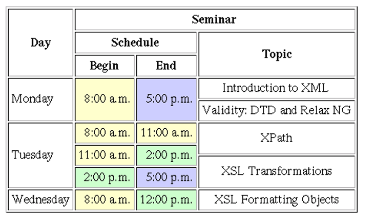
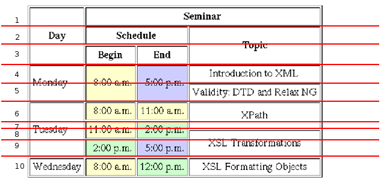

# HTML Assignment 07 - Bài tập HTML 07

Sử dụng các kiến thức về HTML, đặc biệt là về bảng biểu (table) để thể hiện trang web tĩnh có nội dung như sau:



Dưới đây là gợi ý: 

- Chia dòng



- Các màu sử dụng: 

    + Vàng: `#ffffcc`
    + Xanh sáng: `#ccffcc`

- Để tạo đường viền như trong hình, chúng ta sử dụng CSS như sau:

```CSS
table {
  border-left: 1px solid gray;
  border-top: 1px solid gray;
  border-right: 1px solid black;
  border-bottom: 1px solid black;
}

th, td {
  border-left: 1px solid black;
  border-top: 1px solid black;
  border-right: 1px solid gray;
  border-bottom: 1px solid gray;
  padding: 4px;
}
```