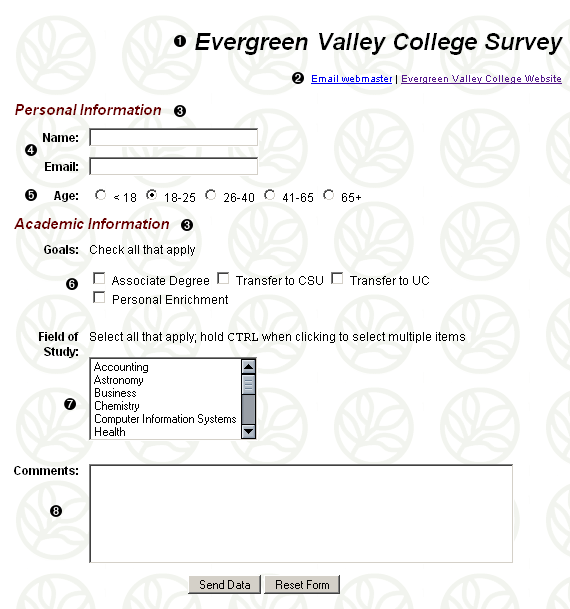
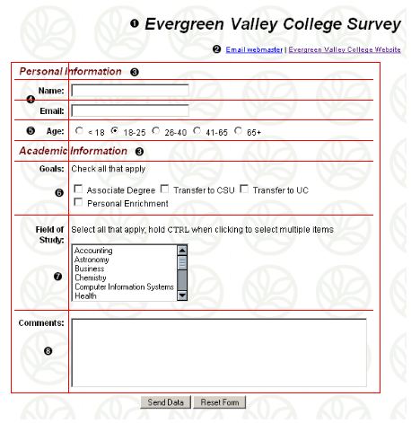

# HTML Assignment 07 - Bài tập HTML 07

Sử dụng kiến thức về HTML, CSS cơ bản và form để dựng trang web có giao diện sau:

Yêu cầu:

- Font chữ chung cho trang web là Arial/Helvetica/sans-serif

- Ảnh nền của web sẽ sử dụng ảnh [sau](./images/background-assignment-07.png)

- Tất cả các tiêu đề cho các ô input (như Name, Email, Goal, ...) đều được in đậm, căn phải, cùng dòng với các thành phần của form bên tay phải của chúng. Ngoài ra, chúng cần được căn bên trên của dòng (so với các thành phần input bên cạnh)

- Các số trong ảnh sẽ được giải thích chi tiết như sau:

  + 1 -> Heading level 1, căn phải
  + 2 -> Khi click vào `Email webmaster`, hộp thoại mail mở ra cho chúng ta thực hiện tác vụ gửi mail
  + 3 -> Heading level 2, màu của dòng này sẽ mang giá trị `#660000`, cỡ chữ sẽ là 125% so với bình thường, in nghiêng. Thiết lập `margin: 0px` cho dòng này.
  + 4 -> 2 trường name và email có độ dài tối đa 28 ký tự, độ rộng của ô input là 30 ký tự
  + 5 -> Radio buttons có giá trị mặc định là `18 - 25`
  + 6 -> Các checkbox có giá trị và hiển thị như sau

      + Associate Degree (value = `AA`)
      + Transfer to CSU (value = `CSU`)
      + Transfer to UC (value = `UC`)
      + Personal Enrichment (value = `Personal`)
  
  + 7 -> Tên của select box là `academic_field`, cho phép chọn nhiều lựa chọn cùng lúc, value và giá trị hiển thị được liệt kê dưới đây (với value được để trong ngoặc vuông)

      + [ACCT] Accounting
      + [ASTR] Astronomy
      + [BUS] Business
      + [CHEM] Chemistry
      + [CIT] Computer/Information Technology
      + [HLTH] Health
      + [HIST] History
      + [LART] Language Arts
      + [MATH] Mathematics
      + [P-E] Physical Education
      + [PSYC] Psychology
      + [SOC] Sociology
      + [THEA] Theatre Arts

  + 8 -> textarea `comments` có chiều ngang là 50 cột và cao 5 dòng.

Gợi ý: sử dụng bảng để chia bố cục như sau

