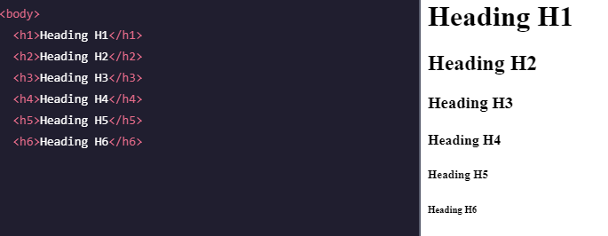

# **Giới thiệu về HTML**

# 0. Contents
1. Khái niệm
2. Lịch sử
3. Các phần mềm sử dụng để lập trình HTML
4. Cấu trúc trang HTML
5. HTML element
6. HTML Attributes: thuộc tính HTML
7. Tìm hiểu về các element có trong HTML

# 1. Khái niệm
- HTML viết tắt của `HyperText Markup Language` (Ngôn ngữ đánh dấu siêu văn bản).
- HTML là ngôn ngữ đánh dấu tiêu chuẩn để tạo các trang web.
- HTML mô tả cấu trúc của một trang web.
- HTML bao gồm một tập các phần tử (elements: `<head>`, `<body>`, `<h1>`, `<h2>`,...), các phần tử cho trình duyệt biết cách hiển thị nội dung.
- HTML giúp người dùng tạo và cấu trúc các thành phần trong trang web hoặc ứng dụng, phân chia các đoạn văn, heading, links,...  

# 2. Lịch sử
- HTML được tạo ra bởi Tim Berners-Lee là nhà vật lý học của trung tâm nghiên cứu CERN ở Thụy Sĩ. Ông đã nghĩ ra và viết siêu văn bản trên Internet. 
- HyperText (Siêu văn bản) đề cập đến cách mà các trang Web (tài liệu HTML) được liên kết với nhau. Do đó, liên kết có sẵn trên một trang web được gọi là Siêu văn bản.
- HTML đầu tiên được công khai là một tài liệu có tên “HTML Tags” được đề cập trên Internet vào cuối năm 1991.
- Năm 1998, HTML phiên bản 4.01 ra đời.
- Năm 2000, các phiên bản HTML được thay thế bằng XHTML.
- Năm 2014, HTML được nâng cấp lên HTML5 với sự cải tiến rõ rệt.

# 3. Các phần mềm sử dụng để lập trình HTML
- HTML documents là files được kết thúc bằng `.html` hay `.htm`. Với những file này bạn có thể xem bằng cách sử dụng bất kỳ trình duyệt nào (Google Chrome, Firefox, Safari,…). 
- Mục đích của trình duyệt web (Chrome, Edge, Firefox, Safari) là đọc các tài liệu HTML và hiển thị chúng một cách chính xác.
Trình duyệt không hiển thị các thẻ HTML, nhưng sử dụng chúng để xác định cách hiển thị tài liệu.
- Các trình soạn thảo văn bản HTML được sử dụng để tạo và sửa đổi các trang web. HTML là một tập tin siêu văn bản nên chúng ta có thể dùng các chương trình soạn thảo văn bản không có chức năng định dạng văn bản để tạo ra một tập tin HTML. Một số trình soạn thảo để viết một tập tin  html như Visual Studio Code, SubLime Text, Notepad++, TextEdit... Miễn là sau đó chúng ta phải lưu tập tin thành đuôi `.html` hoặc `.htm` và sử dụng trình duyệt website để đọc nó.
- HTML dùng ngôn ngữ của mình để đánh dấu siêu văn bản, điều này sẽ giúp các văn bản trên trên website được chia bố cục rõ ràng, chia khung sườn các thành phần của trang web, tạo trang web thành một hệ thống hoàn chỉnh.
# 4. Cấu trúc trang HTML

HTML có nhiều dạng thẻ khác nhau, mỗi thẻ sẽ có những nhiệm vụ khác nhau và ý nghĩa nhất định, có ảnh hưởng và tác động đến nhau.  

Về cơ bản, cấu trúc của HTML thường có ba phần:

- **Phần khai báo chuẩn của html, xhtml**. Có cấu trúc là `<!Doctype>`.
Phần này cho người dùng biết được trình duyệt đang sử dụng hiện đang dùng phiên bản HTML nào. Trên trang web hiện đang rất nhiều loại HTML khác nhau và mỗi trình duyệt chỉ một loại HTML nhất định.

- **Phần tiêu đề**: Phần khai báo ban đầu, khai báo về meta - một khung chứa siêu dữ liệu
Phần này có cấu trúc bắt đầu bằng thẻ `<head>` và kết thúc bởi thẻ `</head>`. Đây là phần chứa tiêu đề và tiêu đề được hiển thị trên thanh điều hướng của trang web. Cụ thể, tiêu đề là phần nội dung nằm giữa cặp thẻ `<title>` và `</title>`. Bên cạnh đó phần tiêu đề còn chứa các thông tin khác như:  
    - Thông tin về style cho 1 tài liệu HTML, tức là cách mà các phần tử HTML để hiện thị như thế nào trên trang web. Và nó được định nghĩa trong phần tử `<style>`.  
    - Mối quan hệ của trang với một tài nguyên bên ngoài thông qua phân tử `<link>`. Tiêu biểu là sử dụng để liên kết đến các style sheets (CSS).
    - Phần tử `<script>` được sử dụng để định nghĩa  code JavaScript phía client.
    - Phần tử `<base>` chỉ định một URL cơ sở và target cơ sở đối với tất cả các URL liên quan trong một trang.

- **Phần thân (`body`)**: Phần chứa nội dung của trang web, là nơi hiển thị nội dung của trang web.
Phần này nằm phía sau tiêu đề, bao gồm các thông tin mà bạn muốn hiển thị trên trang web bao gồm văn bản, hình ảnh và các liên kết. Phần thân bắt đầu bằng thẻ `<body>` và kết thúc bằng thẻ `</body>`.

- Thẻ cặp nằm ngoài cùng, cả phần tiêu đề và phần thân đều phải nằm trong cặp thẻ `<html>` và `</html>`. Đây là cặp thẻ nằm ngoài cùng, cặp thẻ này có nhiệm vụ bao hết nội dung của trang web lại. 

*Lưu ý:* Nội dung bên trong phần `<body>` (vùng trắng ở trên) sẽ được hiển thị trong trình duyệt. Nội dung bên trong phần tử `<title>` sẽ được hiển thị trên thanh tiêu đề của trình duyệt hoặc trong tab của trang.

# **=> HTML có phải là một ngôn ngữ lập trình không?**  
- HTML có khả năng trong xác định cấu trúc trang web. Bên cạnh đó, HTML còn có thể xác định dữ liệu hiển thị trực tuyến. *`Tuy nhiên, HTML không thể gọi là ngôn ngữ lập trình, HTML được hiểu là một loại ngôn ngữ đánh dấu`*. HTML dùng để đánh dấu dữ liệu trong các thẻ, dùng để định nghĩa dữ liệu và mô tả mục đích của nó với trang web.
- Các trình duyệt web sẽ đọc HTML để nhận phần nào là tiêu đề, xác định phần nào là đoạn văn, phần nào là liên kết. HTML sẽ mô tả dữ liệu với trình duyệt và trình duyệt sẽ dựa vào đó để hiển thị dữ liệu sao cho phù hợp. 
- Hơn nữa, `HTML không xử lý logic được nên không được gọi là ngôn ngữ lập trình, khác với các ngôn ngữ khác như C, Java, Python,` ...
# 5. HTML element
- Cấu trúc: Một element được xác định bởi 3 thành phần: thẻ mở, nội dung và tên thẻ đóng.  
    `<tagname> Content...</tagname>`  
*Ví dụ:*  
    

    
    

    - `Thẻ mở (opening tag)`: là thẻ đầu tiên để bắt đầu một HTML element, nó được đặt trong cặp dấu `<>`.     

    - `Nội dung (content)`: là phần được hiển thị lên trên trang web.  

    - `Thẻ đóng (closing tag)`: là thẻ dùng để kết thúc một HTML element, nó được đặt trong cặp dấu `</>`.   
- Tuy nhiên, có một số trường hợp đặc biệt mà phần tử chỉ có một thành phần duy nhất chính là thẻ mở, những phần tử này được gọi là phần tử rỗng, vd như thẻ ` `.

- Một tài liệu HTML bao gồm rất nhiều các thẻ element: `<html>`, `<head>`, `<title>`, `<body>`, ` `, `
`,... 
- Các thẻ này có thể đặt lồng nhau.  
    

    
    

    - Trong ví dụ trên, các thẻ `body, div, h1, p` được đặt lồng nhau. Thẻ `<body>` là *thẻ cha* của thẻ `
`, thẻ `<h1>` và `
` là *thẻ con* của thẻ `
`. Phân cấp trong thẻ HTML rất quan trọng vì thẻ con có thể kế thừa những hành vi và style từ thẻ cha. Điều này sẽ được thể hiện rõ hơn khi học đến phần CSS.  

- Thẻ HTML không phân biệt chữ in hoa hay chữ thường, nhưng *khuyến cáo viết tên các thẻ HTML bằng chữ viết thường.*
# 6. HTML Attributes: thuộc tính HTML
- Tất cả các thẻ HTML đều có thể có những thuộc tính.
- Thuộc tính cung cấp những thông tin bổ sung của các element.
- Thuộc tính luôn được đặt bên trong thẻ mở, và thường chứa 1 cặp giá trị như **property='value'**.  
### Một số thuộc tính:  
- Thuộc tính `href`: Nó được đặt trong thẻ `<a>`. Thẻ `<a>` xác định 1 hyperlink (1 siêu liên kết). Và thuộc tính `href` này chỉ định địa chỉ URL của trang web mà liên kết sẽ đi đến.  
    VD: `<a href="https://www.google.com">Visit Goodle</a>`
- Thuộc tính `src`: Nó được đặt trong thẻ ``. Thẻ `` thường được sử dụng để nhúng 1 hình ảnh vào trong một trang HTML. Thuộc tính `src` này chỉ ra đường dẫn đến ảnh đó.  
    VD: ``  
- Thuộc tính `width`, `height`: xác định độ dài rộng của 1 đối tượng trong thẻ.  
- Thuộc tính `alt`: được đặt trong thẻ ``, dùng 1 đoạn text để thay thế cho một bức ảnh nếu như bức ảnh đó có vấn đề nào đó mà không hiển thị lên được. 

    VD: ``
- Thuộc tính `style`: được sử dụng để thêm các style cho một thẻ, ví dụ như màu sắc, kích cỡ, font,...
# 7. Tìm hiểu về các elements có trong HTML
## 7.1 HTML Headings
### 7.1.1 Tổng quan
- `HTML Headings` là những tiêu đề hoặc tiêu đề con mà hiển thị lên 1 trang web.  

- Thẻ `Heading` là một yếu tố không thể thiếu trong SEO giúp cải thiện chất lượng bài viết và hướng dẫn công cụ tìm kiếm dễ dàng tìm kiếm nội dung.

- Thẻ `Heading` trong SEO chia thành: `<h1>`, `<h2>`,... , `<h6>` với thứ tự ưu tiên, kích thước, mức độ quan trọng giảm dần. Đây là các thẻ được sử dụng nhiều để tối ưu website, nhấn mạnh nội dung của chủ đề nói đến trong bài viết.

- Mỗi HTML heading có một kích thước mặc định. Tuy nhiên cũng có thể thay đổi kích thước của bất kỳ heading nào bằng cách sử dụng thuộc tính `style` và giá trị `font-size` của CSS.

### 7.1.2 Tầm quan trọng của thẻ heading trong SEO
- ### Thể hiện cấu trúc bài viết
    - Heading có chức năng chỉ cho người đọc biết được phần đó, đoạn văn đó nói về chủ đề gì. 
- ### Thẻ heading giúp tăng sức mạnh SEO
    - Sử dụng heading có thể cải thiện chất lượng bài viết, giúp người đọc dễ theo dõi và nắm bắt thông tin đồng thời tăng sức mạnh cho SEO. Ngoài ra heading còn giúp nhấn mạnh từ khóa chính (và từ đồng nghĩa của nó), đồng thời làm rõ nội dung mà trang truyền tải.

### 7.1.3 Phân loại và cách tối ưu heading hiệu quả nhất trong SEO
- Thẻ Heading `<h1>`: thường đề cập đến nội dung chính mà trang web muốn nói đến. Thẻ này phải chứa từ khóa chính, nội dung có thể trùng hoặc khác với thẻ title. Thẻ `<h1>` chỉ nên xuất hiện 1 lần trong mỗi trang và có nội dung tương ứng, bổ trợ cho `<title>` và thẻ `<meta>` description.   

- Thẻ Heading `<h2>`: Mô tả ngắn gọn nội dung chính và bổ trợ cho thẻ H1. Tùy theo độ dài và độ bao quát nội dung mà để số lần xuất hiện thẻ `<h2>` cho phù hợp.   

- Thẻ Heading `<h3>`: sử dụng để mô tả chi tiết cho từng ý trong bài viết. Mỗi thẻ `<h2>` có thể bao gồm vài thẻ `<h3>`. 
## 7.2 HTML Paragraphs
- Thẻ `
` HTML xác định 1 đoạn văn bản. Một đoạn luôn bắt đầu trên 1 dòng mới và thường là một khối text.  
### 7.2.1 HTML Display
- Chúng ta không thể biết chắc chắn cách mà HTML sẽ được hiển thị.  
- Màn hình lớn hay nhỏ, kích thước của cửa sổ sẽ cho ra những kết quả khác nhau.
- Với HTML, không thể thay đổi sự hiển thị bằng cách thêm khoảng trắng hay thêm dòng vào trong code HTML. Lúc đó, trình duyệt sẽ tự động xóa bất kì khoảng trắng hay dòng mới được thêm vào khi trang web được hiển thị.  
VD: 

### 7.2.2. HTML Line breaks: xuống dòng
- Thẻ ` ` được sử dụng để ngắt xuống 1 dòng.
- Thẻ ` ` là một thẻ trống, tức là nó không có thẻ đóng.  

## 7.3 HTML Styles
- Dùng để thêm style cho một element, ví dụ như màu sắc, font chữ, kích thước...
- Thuộc tính HTML style có cú pháp như sau: `<tagname style = "property:value;">`
Trong đó, `property` là một thuộc tính của CSS (vd: `background-color`, `font-size`, `color`...) và `value` là một giá trị của CSS (vd: `green`, `blue`...)
## 7.4 HTML Text Formatting
- HTML chứa 1 số thẻ dùng để định nghĩa chữ với một ý nghĩa cụ thể.  

### 7.4.1 Thẻ `<b>` và `<strong>`: 
- Thẻ `<b>` định nghĩa đoạn text in đậm mà không có bất kì sự quan trọng nào khác.
- Thẻ `<strong>` định nghĩa đoạn text với tầm quan trọng mạnh. Nội dung bên trong thẻ này sẽ được in đậm.   

### 7.4.2 Thẻ `<i>` và `<em>`
- Nội dung bên trong 2 thẻ này sẽ được in nghiêng.
- Thẻ `<i>` thường được sử dụng để chỉ ra một thuật ngữ, một cụm từ từ ngôn ngữ khác, tên riêng...
- Thẻ `<em>` định nghĩa một đoạn text được nhấn mạnh.  

### 7.4.3 Thẻ `<small>`: 
- Định nghĩa đoạn text kích thước nhỏ hơn.   
### 7.4.4 Thẻ `<mark>`: 
- Định nghĩa đoạn text mà nên được đánh dấu, bôi đậm hoặc nhấn mạnh.  
### 7.4.5 Thẻ `<del>`: 
- Định nghĩa đoạn text đã được xóa từ một tài liệu. Trình duyệt sẽ kẻ một đường nằm ngang đoạn text bị xóa đó.  
### 7.4.6 Thẻ `<ins>`: 
- Định nghĩa đoạn text được chèn vào 1 tài liệu. Trình duyệt sẽ gạch chân đoạn text được chèn đó.  
### 7.4.7 Thẻ `` và ``
- Thẻ ``: đoạn text chỉ số dưới, nó sẽ xuất hiện ở vị trí thấp hơn dòng bình thường và có kích thước chữ nhỏ hơn.  
- Thẻ ``: đoạn text chỉ số trên, nó sẽ xuất hiện ở vị trí cao hơn dòng bình thường và có kích thước chữ nhỏ hơn.  

### 7.4.8 Thẻ `
` và ``
- Cả 2 thẻ trên cho phép nhóm 1 số elements để tạo thành các phần của 1 trang web.

- Mặt khác thẻ `` có thể được sử dụng để nhóm các elements chỉ trên 1 dòng.

  
## 7.5 HTML Quotations
- HTML `<blockquote>`: định nghĩa 1 phần mà được trích dẫn từ một nguồn khác. Trình duyệt thường sẽ lùi thẻ `<blockquote>` về phía bên phải.  

- HTML `<q>`: định nghĩa cho 1 câu trích dẫn ngắn. Thường được trình duyệt đánh dấu trong dấu nháy kép.

- HTML `<abbr>`: định nghĩa từ viết tắt, giống như HTML, CSS, ATM,...Sử dụng thuộc tính `<title>` để mô tả cho cụm từ viết tắt đó khi di chuột vào phần tử.  

- HTML `<address>`: định nghĩa thông tin liên hệ của tác giả/chủ sở hữu của 1 tài liệu, bài báo. Thông tin liên hệ có thể là 1 địa chỉ email, sđt,... Nội dùng trong thẻ `<address>` thường in nghiêng và được tách bằng lệnh xuống dòng.  

- HTML `<cite>`: định nghĩa cho tiêu đề của 1 công việc mang tính sáng tạo như tiêu đề của 1 quyển sách, 1 bài thơ, 1 bức tranh... Nội dung trong thẻ `<cite>` thường in nghiêng.  

## 7.6 HTML Comments
- Comment là phần code mà bị bỏ qua bởi bất kỳ trình duyệt web nào. 
- Comment là 1 phương pháp tốt đối với tài liệu HTML, nó giúp chỉ ra các phần của tài liệu, những chú ý, giúp cho mọi người hiểu được các dòng code và tăng khả năng đọc hiểu code.
- HTML comments được đặt ở giữa thẻ `<!-- ... -->`
- HTML hỗ trợ comment trên nhiều dòng. 

## 7.7 HTML Colors
- Màu sắc là một yếu tố rất quan trọng để cho các trang web dễ nhìn và bắt mắt hơn.  
- Có thể thiết lập màu sắc cho các yếu tố như: *background*, *text*, *border box*,...  

HTML Colors có các phương thức khác nhau để đặt màu sắc cho các thành phần trên trang web như: *Color names*, *RGB*, *HEX*, *HSL*...  

### 7.7.1 HTML Colors - Color names
- Một màu sắc có thể được chỉ định bằng cách sử dụng trực tiếp tên của màu đó: green, blue, red, black,... 
- HTML hỗ trợ [140 tên màu tiêu chuẩn.](https://www.w3schools.com/colors/colors_names.asp).   
- Có thể sử dụng thuộc tính `<style>` đặt trong thẻ mở của các HTML element mà ta muốn thiết lập màu sắc 
VD:  Background Color, Text Color, Border Color   

### 7.7.2 HTML RGB & RGBA Colors
- Một hệ màu RGB là đại diện của 3 tham số màu RED, GREEN, BLUE; giống như `rgb(red, green, blue)`.   
- Mỗi tham số màu có giá trị từ 0 - 255. Có nghĩa là sẽ có khoảng 256 x 256 x 256 = 16777216 màu sắc.   
- VD: `rgb(0,0,0): màu đen`; `rgb(255,255,255): màu trắng`; `rgb(255,0,0): màu đỏ`

- RGBA là mở rộng của hệ màu RGB với 1 tham số alpha chỉ độ trong suốt của màu. Tham số alpha này có giá trị từ 0.0 - 1.0;  alpha càng nhỏ thì độ mờ càng cao 

### 7.7.3 HTML HEX Color
- Một hệ màu HEX (thập lục phân) được định nghĩa bằng cách sử dụng các giá trị thập lục phân theo dạng `#rrggbb`, mỗi giá trị rr, gg, bb có giá trị từ 00 - FF (tương tự như từ 0 - 255).  
- VD: `#ff0000: màu đỏ`; `#ffff00: màu vàng`, `#000000: màu đen ` 

## 7.8 HTML Styles - CSS
- CSS viết tắt của `Cascading Style Sheets` được sử dụng để định dạng bố cục cho 1 trang web. Với CSS, có thể thay đổi màu sắc, phông chữ, kích thước, khoảng cách giữa các element và nhiều yếu tố khác nữa.  
- CSS có thể được thêm vào tài liệu HTML bằng 3 cách:
    - Inline: sử dụng thuộc tính `style` ngay bên trong thẻ mở của HTML.
    - Internal: sử dụng một `<style>` element đặt trong phần `<head>` của tài liệu HTML.
    - External: sử dụng một `<link>` để liên kết tới một file CSS bên ngoài.  

### 7.8.1 Inline CSS
- Được sử dụng để định dạng cho mỗi HTML element.
- Sử dụng thuộc tính `style` đặt trong thẻ mở của mỗi element.

    VD: 

### 7.8.2 Internal CSS
- Một internal CSS được sử dụng để định nghĩa 1 `style` cho mỗi trang HTML.  
- Được đặt trong phần `<head>` của một trang HTML, và kết hợp trong một element `<style>`.  
    VD: 
    

    
    

### 7.8.3 External CSS
- Một external style sheet được sử dụng để định dạng style cho nhiều trang HTML.
- Được sử dụng bằng cách thêm một element link vào trong phần `<head>` của mỗi trang HTML.  
`<link rel="stylesheet" href="file.css">`
- File css có thể được viết bằng các trình soạn thảo bất kỳ, tuy nhiên file này không chứa bất kỳ mã lệnh HTML nào, và được lưu với đuôi mở rộng `.css`.   
VD: 
    - File.html 
    

    
    
 
    - File externel .css
    

    
    
  
    
### **=> Trong 3 phương pháp kể trên, thì khuyến cáo chúng ta nên sủ dụng phương pháp `External CSS`. Vì:**   
- Tổ chức code rõ ràng, ngăn nắp hơn (phân tách html và css ra, không dính dáng tới nhau).  
- Dễ dàng tìm và sửa lỗi, bảo trì.  
- Tái sử dụng code ( vì style cho cùng 1 element nhưng có thể áp dụng cho nhiều trang html khác nhau mà không cần code đi code lại).  
- Kết hợp với cơ chế cache của trình duyệt làm cho trang web load mượt mà hơn.

# Summary
- Qua bài học đầu tiên này, chúng ta đã có cái nhìn khái quát về HTML:
    - Về khái niệm, công cụ hỗ trợ lập trình HTML, cấu trúc của 1 trang HTML.
    - Tìm hiểu về các thuộc tính có trong HTML: href, src, style, alt,...
    - Tìm hiểu về 1 số phần tử đầu tiên của HTML: heading, paragraphs, styles, formating, comments, colors, css