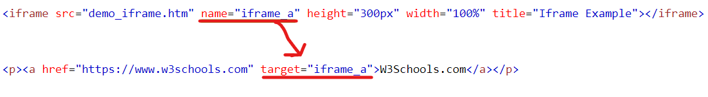

## 1. HTML Links
- `Links (Liên kết)` được tìm thấy ở hầu hết các trang web. Nó cho phép những người dùng click vào sẽ chuyển từ trang web này sang trang web khác.
### 1.1. HTML Links - HyperLinks
- `HTML Links` là những `hyperlinks (siêu liên kết)`.
- Chúng ta có thể click vào một liên kết và chuyển sang tài liệu khác.
- Khi di chuyển chuột vào một liên kết, con trỏ chuột sẽ chuyển từ mũi tên sang hình bàn tay.
- Một liên kết có thể là chữ, hình ảnh, hoặc bất kỳ phần tử khác.
- Thẻ `<a>` định nghĩa 1 hyperlink. Cú pháp: `<a href="url">link text</a>`  . Trong đó
    - Thuộc tính quan trọng nhất trong thẻ `<a>` là thuộc tính `href`, nó chỉ ra đưuòng dẫn địa chỉ của liên kết sẽ hướng đến.
    - `Link text` là phần sẽ được hiển thị trên trang web.
### 1.2. HTML Links - Thuộc tính `target`
- Mặc định, trang web được liên kết sẽ được hiển thị trên cửa sổ của trang web hiện tại. Để thay đổi điều này, chúng ta có thể điều chỉnh sang `target` khác.
- Thuộc tính `target` định nghĩa nơi hiển thị của tài liệu được liên kết.
- Một số giá trị của thuộc tính `target` :
    - _self: mở tài liệu được liên kết trong cửa sổ hoặc tab hiện tại (mặc định).
    - _blank: mở tài liệu được liên kết trong cửa sổ hoặc tab mới.
    - _parent: mở tài liệu được liên kết trong khung cha.
    - _top: mở tài liệu được liên kết trong toàn bộ phần thân của cửa sổ.

### 1.3. HTML Links - Thuộc tính `href`
- Thuộc tính `href` được sử dụng để đưa ra đường dẫn địa chỉ URL của tài liệu/website được liên kết đến.
- Có thể sử dụng 2 loại đường dẫn địa chỉ URL sau:
    - Đường dẫn tuyệt đối (Absolute URLs: là một chuỗi đầy đủ bao gổm http://, tên miền của trang web, đường dẫn đến tập tin). VD: `https://www.w3schools.com/html/html_links.asp`

    - Đường dẫn tương đối (Relative URLs): là một phần nhỏ của đường dẫn tuyệt đối, thông thường đường dẫn tương đối là phần đường dẫn đến tập tin. VD: `html_links.asp`
- Liên kết tới một địa chỉ Email
    - Sử dụng `mailto` bên trong thuộc tính `href` để tạo 1 liên kết để mở ứng dụng email của người  dùng.
    - Cú pháp: `<a href="mailto:someone@example.com">Send email</a> `
### 1.4. HTML Links - Sử dụng hình ảnh như một liên kết
- Để sử dụng hình ảnh như một liên kết, chỉ cần đặt thẻ `` bên trong thẻ `<a>`

VD: 

`<a href="default.asp">`

``

`</a>`

### 1.5. Link title
- Thuộc tính `title` xác định thêm thông tin về một phần tử HTML. Thông tin thường được hiện ra như 1 đoạn text chú thích khi di chuột tới phần tử liên kết đó.

VD:

`<a href="https://www.w3schools.com/html/" title="Go to W3Schools HTML section">Visit our HTML Tutorial</a>`

### 1.6. HTML Links Colors
- Khi di chuyển chuột qua một liên kết, có hai thứ thường xảy ra:

    - Mũi tên của chuột sẽ trở thành hình một bàn tay nhỏ.
    - Màu sắc của phần tử liên kết sẽ được thay đổi.
- Mặc định, một liên kết sẽ xuất hiện như sau trên tất cả các trình duyệt:
    - Liên kết chưa được ghé thăm (`unvisited`) được `gạch dưới và có màu xanh`.
    - Liên kết đã được ghét thăm (`visited`) được `gạch dưới và có màu tím`.
    - Liên kết được kích hoạt (`active`) được `gạch dưới và có màu đỏ`.

Chúng ta có thể thay đổi những trạng thái màu này bằng CSS.
### 1.7. HTML Link - Bookmarks
- HTML links có thể được dùng để tạo một `bookmark (dấu trang)`, vì vậy người đọc có thể nhảy đến những  phần cụ thể của một trang web.
- Dấu trang có thể hữu ích nếu như một trang web quá dài.
- Để tạo một dấu trang, đầu tiên tạo một dấu trang sau đó thêm một liên kết tới nó.
    - Sử dụng thuộc tính `id` (id="value") để định nghĩa những dấu trang trong một trang web.
    - Sử dụng thuộc tính `href` (href="#value") để liên kết tới dấu trang.

    

    
    

- Khi liên kết được clicked, trang web sẽ cuộn lên hoặc xuống để tới được dấu trang.
## 2. HTML Images
- Hình ảnh được sử dụng để cho một trang web hiển thị sinh động hơn...
### 2.1. Cú pháp: 
- Thẻ `` được sử dụng để nhúng một hình ảnh vào trang web.
- Thẻ `` là một thẻ trống, nó chỉ chứa những thuộc tính và không có thẻ đóng.
- Thẻ `` có 2 thuộc tính được yêu cầu:
    - `src`: xác định đường dẫn URL tới ảnh.
    - `alt`: xác định đoạn text thay thế cho hình ảnh khi nó gặp một vấn đề nào đó mà không hiển thị ảnh lên được.
- Cú pháp: ``
### 2.2. Images Size - Width & Height
- Chúng ta có thể sử dụng thuộc tính `style` để xác định chiều dài và chiều cao cho bức ảnh. VD:

``
- Chúng ta cũng có thể sử dụng thuộc tính `width` và `height` để xác định `chiều dài` và `chiều cao`. Đơn vị kích thước cho bức ảnh sẽ là `pixels`.

``
### 2.3. Image Floating
- Sử dụng thuộc tính `float` của CSS để đặt bức ảnh nổi sang bên phải hay bên trái của một đoạn text. VD: 

`

The image will float to the right of the text.
`

`
The image will float to the left of the text.
`
### 2.4. HTML Background Images
#### 2.4.1. Hình nền trong một phần tử HTML
- Một bức hình nền có thể được xác định cho hầu hết các thẻ HTML.
- Để thêm một bức hình nền, sử dụng thuộc tính `style` và thuộc tính `background-image` của CSS.  
`
`
- Chúng ta cũng có thể xác định hình nền bằng thẻ `<style>` ở trong phần tiêu đề `<head>`.  

#### 2.4.2. Hình nền trên một trang web
- Nếu muốn để hình nền cho cả trang web, chúng ta định nghĩa thuộc tính `background-image` trong thẻ `<body>`

#### a. Background Repeat
- Nếu hình nền có kích thước nhỏ hơn phần tử HTML, thì hình ảnh đó sẽ bị lặp lại, theo chiều ngang, chiều dọc cho đến cuối phần tử HTML đó.

- Để tránh điều đó, đặt thuộc tính `background-repeat` với giá trị là `no-repeat.`

#### b. Background Cover
- Nếu muốn hình nền bảo phủ toàn bộ phần tử HTML, hãy đặt thuộc tính `background-size` với giá trị là `cover`.
- Để chắc chắn, toàn bộ phần tử HTML luôn được bảo phủ, đặt thuộc tính `background-attachment` với giá trị `fixed`. Bằng cách này, hình nền sẽ bao phủ toàn bộ phần tử, không bị kéo dãn và vẫn giữ nguyên được tỷ lệ ảnh ban đầu.
#### c. Background Stretch
- Nếu muốn hình nền được kéo dãn để vừa với toàn bộ phần tử, có thể đặt thuộc tính `background-size` với giá trị là `100% 100%`.

### 2.5. HTML `<picture>` element
- Phần tử `<picture>` cho phép hiển thị những bức ảnh khác nhau cho những thiết bị hoặc kích thước màn hình khác nhau.
- Phần tử `<picture>` mang lại cho những người lập trình web linh hoạt hơn trong việc định nghĩa tài nguyên ảnh.
- Phần tử `<picture>` chứa một hay nhiều phần tử `<source>`, mỗi phần tử này tham chiếu tới  những hình ảnh khác nhau thông qua thuộc tính `srcset`. Bằng cách này, trình duyệt có thể chọn hình ảnh nào mà phù hợp nhất với hiện thị hoặc kích thước màn hình hiện tại.
- Mỗi thẻ `<source>` có một thuộc tính `media` để định nghĩa khi nào thì hình ảnh là thích hợp nhất.

*Lưu ý:* Luôn luôn định nghĩa một phần tử `` như là phần tử con cuối cùng của `<picture>`. Phần tử `` này được sử dụng khi mà những trình duyệt không hỗ trợ phần tử `<picture>` hay khi không có một thẻ `<source>` nào phù hợp.

 ### **=> Khi nào sử dụng phần tử `<picture>`**
Có hai mục đích chính cho phần tử `<picture>`:

- Băng thông

    - Nếu chúng ta có màn hình hoặc thiết bị nhỏ, không nhất thiết phải tải tệp hình ảnh lớn. Trình duyệt sẽ sử dụng phần tử `<source>` đầu tiên có các giá trị thuộc tính phù hợp và bỏ qua bất kỳ phần tử nào sau đấy.

- Hỗ trợ định dạng
    - Một số trình duyệt hoặc thiết bị có thể không hỗ trợ tất cả các định dạng hình ảnh. Bằng cách sử dụng phần tử `<picture>`, chúng ta có thể thêm hình ảnh của tất cả các định dạng và trình duyệt sẽ sử dụng định dạng đầu tiên mà nó nhận ra và bỏ qua bất kỳ phần tử nào sau đấy.
## 3. HTML Tables
- HTML Tables cho phép những người lập trình web sắp xếp dữ liệu thành những hàng và cột.
### 3.1. Định nghĩa một HTML Table
- Table được tạo bằng cách sử dụng cặp thẻ đóng mở `<table>   </table>`
- Một bảng trong HTML chứa các ô bên trong những hàng và cột.
- Ô bảng (`Table Cells`): được định nghĩa bởi cặp thẻ đóng mở `<td> </td>`. Mọi thứ ở giữa cặp thẻ đóng mở này chính là nội dung của ô bảng.
    - Một ô bảng có thể chứa tất cả những phần tử của HTML: `<images>`, `<link>`, `
`,...

- Dòng của bảng (`Table Rows`): bắt đầu bởi cặp thẻ đóng mở `<tr> </tr>`. Một bảng có thể có nhiều dòng, nhưng cần đảm bảo rằng số lượng ô bảng là như nhau ở mỗi hàng.
- Tiêu đề (`Table Heading`): đôi khi chúng ta muốn những ô bảng là tiêu đề của các cột trong bảng, thì trong trường hợp đó hãy sử dụng thẻ `<th>` thay cho thẻ `<td>`. Mặc định, text trong thẻ `<th>` sẽ được in đậm và nằm ở vị trí trung tâm trong ô bảng.
- `Table Caption`: đây được coi là tiêu đề cho toàn bộ bảng (hay chính là tên bảng). Để thêm tên bảng, sử dụng cặp thẻ `<caption> </caption>`

### 3.2. Width and height Attributes
- Sử dụng hai thuộc tính `Width` và `height` để định nghĩa chiều dài và chiều cao của một bảng. Đơn vị kích thước của chiều dài và chiều cao có thể là `pixels` hoặc là tỷ lệ phần trăm theo kích thước của màn hình hiển thị.
### 3.3. HTML Table Borders
- Table có thể có những `style` và hình dạng đường viền (`border`) khác nhau.
- Để thêm 1 đường viền, sử dụng thuộc tính `border` của CSS trong những thẻ `<table>`, `<th>`, `<td>`.

- Để tránh có hai đường viền giống như ví dụ trên, hãy đặt thuộc tính `border-collapse` với giá trị `collapse`. 

### 3.4. Cellpadding and Cellspacing Attributes
- `Cell spacing`: 
    - Định nghĩa khoảng cách giữa những ô bảng, mặc định khảng cách được đặt là 2px.
    - Để thay đổi kích thước này, sử dụng thuộc tính `border-spacing` trong phần tử `<table>`.
- `Cell padding`: 
    - Định nghĩa khoảng cách giữa những đường viền của ô bảng với nội dung bên trong ô bảng, mặc định padding = 0.
    - Để thay đổi sử dung thuộc tính `padding` CSS.
    - `Padding` có thể thay đổi khoảng cách của nội dung trong ô với 4 cạnh viền của ô bảng: `padding-top`, `padding-right`, `padding-bottom`, `padding-left`.

    

    
    

    - VD: Nếu như chỉ sử dụng `padding: 10px` thì có nghĩa là chúng ta đang định nghĩa khoảng cách tử nội dung trong ô đến 4 cạnh viền border đều bằng nhau và bằng 10px.
### 3.5. Colspan and Rowspan Attributes
- Thuộc tính `Colspan`: sử dụng thuộc tính này nếu muốn *gộp hai hay nhiều cột lại thành 1 cột đơn*.
- Thuộc tính `Rowspan`: sử dụng thuộc tính này nếu muốn *gộp hai hay nhiều hàng lại thành 1 hàng*.

    

    
    

    
    - Ví dụ trên `rowspan = "2"` tức là gộp 2 dòng thứ 2 và thứ 3 của bảng lại thành 1  dòng. Tương tự `colspan = "3"` tức là gộp cột thứ 1, thứ 2 và thứ 3 của bảng lại thành 1 cột duy nhất.
## 4. HTML Lists

- HTML Lists cho phép những người lập trình web nhóm 1 tệp những `item` liên quan vào trong một danh sách.
### 4.1. Unordered HTML List: danh sách không theo thứ tự
- Sử dụng thẻ `<ul>` để định nghĩa một danh sách không theo thứ tự.
- Một danh sách sẽ được đặt trong cặp thẻ `<ul>  </ul>`. Mỗi item trong danh sách bắt đầu với thẻ `<li>`.
- Mỗi item sẽ được đánh dấu bằng một dấu đầu dòng, mặc định là chấm tròn nhỏ màu đen.
    
- Sử dụng thuộc tính `list-style-type` của CSS để định nghĩa `style` của điểm đánh dấu của danh sách các item. Thuộc tính này có 1 số giá trị sau:
    - `disc`: Các mục trong danh sách sẽ được đánh *chấm tròn nhỏ màu đen* (mặc định).
    - `circle`: Các mục trong danh sách sẽ được đánh *vòng tròn rỗng*.
    - `square`: Các mục trong danh sách sẽ được đánh *hình vuông*.
    - `none`: Các mục trong danh sách sẽ *không có điểm đánh dấu*.

    

    
    

- Unordered Lists có thể lồng nhau. Trong 1 thẻ `<li>` có thể chứa 1 danh sách mới, và nhũng phần tử HTML khác như `images`, `links`,...
- HTML lists có thể được đặt `style` với nhiều cách khác nhau bằng cách sử dụng CSS, một cách phổ biến là danh sách nằm ngang (còn gọi là menu ngang).

### 4.2. Ordered HTML List: danh sách theo thứ tự

- Sử dụng thẻ `<ol>` để định nghĩa một danh sách theo thứ tự, thứ tự có thể là số (1, 2, 3...) hoặc là theo bảng chữ cái (a, b, c,...) ...
- Một danh sách sẽ được đặt trong cặp thẻ `<ol>  </ol>`. Mỗi item trong danh sách bắt đầu với thẻ `<li>`.   
- Mỗi item sẽ được đánh dấu mặc định với những con số (1, 2, 3,...).  
    
- Thuộc tính type của thẻ `<ol>`, xác định loại điểm đánh dấu mục danh sách:
    - `type = "1"`: Các mục trong danh sách sẽ được đánh số bằng `số` (mặc định).
    - `type = "A"`: Các mục trong danh sách sẽ được đánh dấu bằng `chữ cái in hoa`.
    - `type = "I"`: Các mục trong danh sách sẽ được đánh dấu bằng `số La Mã in hoa`.
    - `type = "a"`: Các mục trong danh sách sẽ được đánh dấu bằng `chữ cái thường`.
    - `type = "i"`: Các mục trong danh sách sẽ được đánh dấu bằng `số La Mã thường`.
    

    
    

- Ordered Lists có thể lồng nhau. Trong 1 thẻ `<li>` có thể chứa 1 danh sách mới, và nhũng phần tử HTML khác như `images`, `links`,...

### 4.3. HTML Descript List: danh sách mô tả

- Danh sách mô tả là danh sách các thuật ngữ, với mô tả của từng thuật ngữ.

- Thẻ `<dl>` xác định danh sách mô tả, thẻ `<dt>` xác định thuật ngữ (tên) và thẻ `<dd>` mô tả từng thuật ngữ.

    

    
    

## 5. HTML Block & InLine

- Mỗi phần tử HTML có một giá trị hiển thị mặc định, tùy thuộc vào nó thuộc loại phần tử nào.
- Có 2 giá trị hiện thị là: `block (khối)` và `inline (nội tuyến)`.
### 5.1. Block-level Elements: phần tử khối
- *Một phần tử khối luôn bắt đầu trên một dòng mới*, và trình duyệt sẽ tự động thêm một khoảng trống trước và sau phần tử đó.
- Một phần tử khối luôn chiếm toàn bộ chiều dài có sẵn (nó sẽ kéo dài từ trái sang phải miễn là nó có thể).
- Có 2 phần tử khối thường dùng là `
` và `
`
    - `
`: định nghĩa 1 đoạn văn trong 1 tài liệu HTML.
    - `
`: định nghĩa 1 phần hoặc 1 bộ phận trong 1 tài liệu HTML.
- Thẻ `
` thường được sử dụng để chứa những thẻ HTML khác. Nó không yêu cầu những thuộc tính, nhưng các thuộc tính như `style`, `id`, `class` thường hay sử dụng.
- Ngoài ra có những phần tử khối khác trong HTML:
    

    
    

### 5.2. Inline Elements: phần tử nội tuyến
- *Một phần tử nội tuyến không bắt đầu trên một dòng mới*.
- Một phần tử nội tuyến chỉ chiếm một chiều dài cần thiết. 
- Dưới đây là những thẻ nội tuyến trong HTML: 
    

    
    

- Thẻ `` là một thẻ nội tuyến, thường được sử dụng để đánh dấu một phần của một đoạn text, hoặc một phần của một tài liệu. Nó không yêu cầu những thuộc tính, nhưng các thuộc tính như `style`, `id`, `class` thường hay sử dụng.

## 6. HTML Classes

- Thuộc tính HTML `class` thường được sử dụng để định nghĩa tên một class cho một phần tử HTML.
-* Nhiều phần tử HTML có thể có chung tên class*.
- Cách sử dụng thuộc tính `class`:
    - Thường được sử dụng để chỉ tới tên một class trong một style sheet. Nó có thể được sử dụng bởi một JavaScript để truy cập và thao tác với các phần tử với một tên lớp cụ thể.
    - Thuộc tính class được sử dụng trong bất kỳ phần tử HTML nào.
- Cú pháp cho class:
    - Để tạo một class: viết một ký tự dấu `"."`, theo sau là `tên class`. Sau đó, định nghĩa thuộc tính CSS bên trong cặp dấu ngoặc nhọn `{}`.
- Các phần tử HTML có thể có nhiều hơn một tên class. Khai báo các tên class trong phần tử HTML cách nhau bởi 1 khoảng trắng. Những phần tử này sẽ được tạo style dựa theo tất cả các tên class đó.

## 7. HTML Id

- Thuộc tính HTML `id` được sử dụng để định nghĩa một id riêng biệt cho mỗi phần tử HTML
- *Không thể có 2 phần tử HTML trong một tài liệu HTML có cùng 1 giá trị id.*
- Cách sử dụng thuộc tính `id`
    - Giá trị của thuộc tính `id` phải `riêng biệt` trong tài liệu HTML.
    - Thường được sử dụng để chỉ tới tên một class trong một style sheet. Nó có thể được sử dụng bởi một JavaScript để truy cập và thao tác với các phần tử với một id cụ thể.
    - Thuộc tính class được sử dụng trong bất kỳ phần tử HTML nào.
- Cú pháp cho id:
    - Để tạo một class: viết một ký tự dấu `"#"`, theo sau là `tên id`. Sau đó, định nghĩa thuộc tính CSS bên trong cặp dấu ngoặc nhọn `{}`.

- *Quy tắc đặt tên id:* Tên id phải chứa ít nhất một ký tự, không bắt đầu bằng chữ số và không chứa khoảng trắng.

###  *Điểm khác nhau giữa HTML `class` và `id` là: tên một `class` có thể được sử dụng cho nhiều phần tử HTML khác nhau, còn tên một `id` chỉ có thể sử dụng cho 1 phần tử HTML trong cùng một tài liệu HTML* 

## 8. HTML Iframe
- HTML Iframe được sử dụng để hiển thị một trang web trong một trang web.
- Thẻ `<iframe>` định nghĩa một khung nội tuyến. Một khung nội tuyến được sử dụng để nhúng một tài liệu khác vào trong một tài liệu HTML hiện tại.
- Cú pháp: `<iframe src="url" title="description"></iframe>`

- Iframe - Width & Height
    - Sử dụng thuộc tính width & height để xác định kích thước của `iframe`.
    - Cũng có thể thêm thuộc tính style vào thẻ `<iframe>` và sử dụng thuộc tính width, height của CSS.
    

    
    

- Xóa bỏ border của Iframe
    - Mặc định, một `iframe` có một đường viền bao quanh nó. Để xóa đường viền này, thêm thuộc tính style và sử dụng thuộc tính `border` của CSS với giá trị là `none`.
    

    
    

- Iframe - Target for a link
    - Một `iframe` có thể được sử dụng để làm khung hiển thị cho một liên kết. 
    - Thuộc tính `target` của thẻ liên kết `<a>` phải tham chiếu tới thuộc tính name của iframe.
    

    
    

## 9. HTML JavaScript
- `JavaScript` là ngôn ngữ lập trình phổ biến dùng để tạo ra các trang web tương tác. Được tích hợp và nhúng vào HTML giúp website trở nên sống động hơn. JavaScript đóng vai trò như một phần của trang web, thực thi cho phép `Client-Side Script` từ phía người dùng cũng như phía máy chủ (Nodejs) tạo ra các trang web động.
- Thẻ HTML `<script>`
    - Thẻ `<script>` được sử dụng để định nghĩa một `client-side script (kịch bản phía máy khách.)`
    - Phần tử `<script>` chứa các câu lệnh `script` hoặc nó trỏ đến một tệp `script` bên ngoài thông qua thuộc tính `src`.
    - Để chọn một phần tử HTML, JavaScript thường sử dụng phương thức `document.getElementById()`.
    

    
    

- JavaScript có thể thay đổi nội dung, style, thuộc tính của các phần tử HTML.
    

    
    

    - Ví dụ trên, JS sẽ thay đổi nội dung trong thẻ `
` có `id là demo` từ `This is a demostration.` thành `Hello JavaScript!`
- Thẻ HTML `<noscript>` xác định nội dung thay thế sẽ được hiển thị cho người dùng đã tắt `script` trong trình duyệt của họ hoặc có trình duyệt không hỗ trợ `script`.

- Có thể giữ mã JavaScript trong một tệp riêng biệt và sau đó đưa vào bất kỳ nơi nào cần thiết hoặc có thể xác định chức năng bên trong chính tài liệu HTML.
### a. External JavaScript
- Nếu xác định một chức năng sẽ được sử dụng trong các tài liệu HTML khác nhau thì tốt hơn nên giữ chức năng đó trong một tệp JavaScript riêng và sau đó đưa tệp đó vào các tài liệu HTML. Một tệp JavaScript sẽ có phần mở rộng là `.js` và nó sẽ được bao gồm trong các tệp HTML bằng thẻ `<script>`.
    

    
    

### b. Internal JavaScript
- Có thể viết mã tập lệnh trực tiếp vào tài liệu HTML. Thông thường, sẽ giữ mã tập lệnh trong tiêu đề của tài liệu bằng thẻ `<script>`, nếu không thì có thể đặt mã nguồn của mình ở bất kỳ đâu trong tài liệu nhưng vẫn phải trong thẻ `<script>`.
    

    
    

## 10. HTML File Path: đường dẫn tệp
- Đường dẫn tệp mô tả vị trí của tệp trong cấu trúc thư mục của trang web.
- Đường dẫn tệp được sử dụng khi liên kết tới những file bên ngoài trang hiện tại như: hình ảnh, style sheets,...
- Có 2 đường dẫn tệp là `đường dẫn tuyệt đối` và `đường dẫn tương đối` (đã được trình bày tại mục HTMl Images)
## 11. HTML Head
Phần tử HTML `<head>` là vùng chứa cho các phần tử sau : `<title>`, `<style>`, `<meta>`, `<link>`, `<script>`, `<base>`.
    

    
    

### 11.1. Phần tử HTML `<head>`
- Phần tử `<head>` là vùng chứa siêu dữ liệu `meta` (dữ liệu về dữ liệu) và được đặt giữa thẻ `<html>` và thẻ `<body>`.

- Siêu dữ liệu HTML là dữ liệu về tài liệu HTML. Siêu dữ liệu không được hiển thị trên trình duyệt.

- Siêu dữ liệu thường `xác định tiêu đề tài liệu, bộ ký tự, kiểu, tập lệnh và các thông tin meta khác.`

### 11.2. Phần tử `<title>` HTML
- Phần tử `<title>` xác định tiêu đề của tài liệu. Tiêu đề phải ở dạng văn bản và nó được hiển thị trên thanh tiêu đề của trình duyệt hoặc trong tab của trang.

- Phần tử `<title>` này là bắt buộc trong các tài liệu HTML!

- Nội dung của tiêu đề trang rất quan trọng đối với việc tối ưu hóa công cụ tìm kiếm (SEO)! Tiêu đề trang được sử dụng bởi các thuật toán của công cụ tìm kiếm để quyết định thứ tự khi liệt kê các trang trong kết quả tìm kiếm.

- Phần tử `<title>`:

    - Xác định tiêu đề trong thanh công cụ của trình duyệt.
    - Cung cấp tiêu đề cho trang khi nó được thêm vào mục yêu thích.
    - Hiển thị tiêu đề cho trang trong kết quả của công cụ tìm kiếm.

### 11.3. Phần tử `<style>` HTML
- Phần tử `<style>` được sử dụng để xác định thông tin style cho một trang HTML:
### 11.4. Phần tử `<link>` HTML
- Phần tử `<link>` xác định mối quan hệ giữa tài liệu hiện tại và tài nguyên bên ngoài.

- Thẻ `<link>` thường được sử dụng nhất để liên kết với các trang định kiểu bên ngoài
### 11.5. Phần tử HTML `<script>`
- Phần tử `<script>` được sử dụng để xác định JavaScripts phía máy khách.
### 11.6. Phần tử HTML `<base>`
- Phần tử `<base>` chỉ định URL cơ sở và (hoặc) target cho tất cả các URL tương đối trong một trang.

- Thẻ `<base>` phải có một `href` hoặc một thuộc tính đích hoặc cả hai.

- Chỉ có thể có một phần tử `<base>` duy nhất trong một tài liệu!