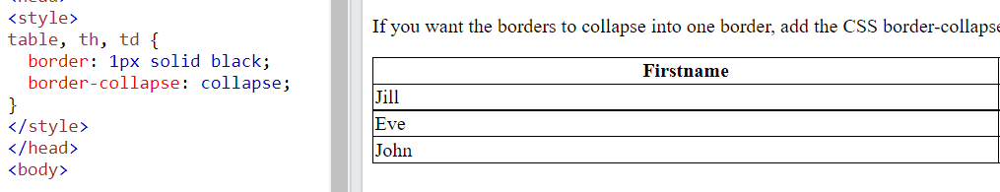

# 0. Contents
1. HTML Links
2. HTML Images
3. HTML Favicon
4. HTML Tables
5. HTML Lists
6. HTML Block & InLine
# 1. HTML Links
- `Links (Liên kết)` được tìm thấy ở hầu hết các trang web. Nó cho phép những người dùng click vào sẽ chuyển từ trang web này sang trang web khác.
## 1.1. HTML Links - HyperLinks
- `HTML Links` là những `hyperlinks (siêu liên kết)`.
- Chúng ta có thể click vào một liên kết và chuyển sang tài liệu khác.
- Khi di chuyển chuột vào một liên kết, con trỏ chuột sẽ chuyển từ mũi tên sang hình bàn tay.
- Một liên kết có thể là chữ, hình ảnh, hoặc bất kỳ phần tử khác.
- Thẻ `<a>` định nghĩa 1 hyperlink. Cú pháp: `<a href="url">link text</a>`  . Trong đó
    - Thuộc tính quan trọng nhất trong thẻ `<a>` là thuộc tính `href`, nó chỉ ra đường dẫn địa chỉ của liên kết sẽ hướng đến.
    - `Link text` là phần sẽ được hiển thị trên trang web.
## 1.2. HTML Links - Thuộc tính `target`
- Mặc định, trang web được liên kết sẽ được hiển thị trên cửa sổ của trang web hiện tại. Để thay đổi điều này, chúng ta có thể điều chỉnh sang `target` khác.
- Thuộc tính `target` định nghĩa nơi hiển thị của tài liệu được liên kết.
- Một số giá trị của thuộc tính `target` :
    - `_self`: mở tài liệu được liên kết trong cửa sổ hoặc tab hiện tại (mặc định).
    - `_blank`: mở tài liệu được liên kết trong cửa sổ hoặc tab mới.
    - `_parent`: mở tài liệu được liên kết trong khung cha, tương đương với _self nếu khung hiện tại không có khung cha.
    - `_top`: mở tài liệu được liên kết trong toàn bộ phần thân của cửa sổ, tương đương với _self nếu khung hiện tại không có khung cha.

## 1.3. HTML Links - Thuộc tính `href`
- Thuộc tính `href` được sử dụng để đưa ra đường dẫn địa chỉ URL của tài liệu/website được liên kết đến.
- Có thể sử dụng 2 loại đường dẫn địa chỉ URL sau:
    - Đường dẫn tuyệt đối (Absolute URLs: là một chuỗi đầy đủ bao gồm `http://, tên miền của trang web, đường dẫn đến tập tin`). VD: `https://www.w3schools.com/html/html_links.asp`

    - Đường dẫn tương đối (Relative URLs): là một phần nhỏ của đường dẫn tuyệt đối, thông thường đường dẫn tương đối là phần đường dẫn đến tập tin. VD: `html_links.asp`

    *Lưu ý:* Nội dung về đường dẫn tuyệt đối và tương đối sẽ có bài riêng học sau, ở phần này chúng ta chỉ chú trọng vào đường dẫn tuyệt đối.

- Liên kết tới một địa chỉ Email
    - Sử dụng `mailto` bên trong thuộc tính `href` để tạo 1 liên kết để mở ứng dụng email của người  dùng.
    - Cú pháp: `<a href="mailto:someone@example.com">Send email</a> `
## 1.4. HTML Links - Sử dụng hình ảnh như một liên kết
- Để sử dụng hình ảnh như một liên kết, chỉ cần đặt thẻ `` bên trong thẻ `<a>`

    VD: 
    ```html
    <a href="default.asp">
    
    </a>
    ```

## 1.5. Link title
- Thuộc tính `title` xác định thêm thông tin về một phần tử HTML. Thông tin thường được hiện ra như 1 đoạn text chú thích khi di chuột tới phần tử liên kết đó.

    VD:

    `<a href="https://www.w3schools.com/html/" title="Go to W3Schools HTML section">Visit our HTML Tutorial</a>`

<p align = "center">

</p>

## 1.6. HTML Links Colors
- Khi di chuyển chuột qua một liên kết, có hai thứ thường xảy ra:

    - Mũi tên của chuột sẽ trở thành hình một bàn tay nhỏ.
    - Màu sắc của phần tử liên kết sẽ được thay đổi.
- **Mặc định**, một liên kết sẽ xuất hiện như sau trên tất cả các trình duyệt:
    - Liên kết chưa được truy cập (`unvisited`) được `gạch dưới và có màu xanh`.
    - Liên kết đã được truy cập (`visited`) được `gạch dưới và có màu tím`.
    - Liên kết được kích hoạt (`active`) được `gạch dưới và có màu đỏ`.

Chúng ta có thể thay đổi những trạng thái màu này bằng CSS.  
VD: 
- Đây là trạng thái màu mặc định của liên kết

    ```html
    </head>
    <body>
    <h2>Link Colors</h2>

    <p>You can change the default colors of links</p>

    <a href="html_images.asp" target="_blank">Visited Link</a>
    <a href="https://google.com/" target="_blank">Unvisited Link</a>
    ```

<p align = "center">

</p>

- Đây là trạng thái màu sau khi chúng ta thay đổi bằng CSS. Liên kết unvisited có màu đen và không có gạch chân, liên kết visited có màu đỏ và không có gạch chân

    ```html
    <style>
        a:link {
        color: black;
        text-decoration: none;
        }
        a:visited {
        color: red;
        text-decoration: none;
        }
    </style>
    </head>
    <body>
    <h2>Link Colors</h2>

    <p>You can change the default colors of links</p>

    <a href="html_images.asp" target="_blank">Visited Link</a>
    <a href="https://google.com/" target="_blank">Unvisited Link</a>
    ```

<p align = "center">

</p>

## 1.7. HTML Link - Bookmarks
- HTML links có thể được dùng để tạo một `bookmark (dấu trang)`, vì vậy người đọc có thể nhảy đến những  phần cụ thể của một trang web.
- Dấu trang có thể hữu ích nếu như một trang web quá dài.
- Để tạo một dấu trang, đầu tiên tạo một dấu trang sau đó thêm một liên kết tới nó.
    - Sử dụng thuộc tính `id` (id="value") để định nghĩa những dấu trang trong một trang web.
    - Sử dụng thuộc tính `href` (href="#value") để liên kết tới dấu trang.

    <p align = "center">
    
    </p>
- Khi liên kết được clicked, trang web sẽ cuộn lên hoặc xuống để tới được dấu trang.

## 1.8. Button as a link
- Để sử dụng button như một liên kết, chúng ta phải thêm JavaScipt code.
- JavaScipt cho phép chỉ định điều gì sẽ xảy ra tại một số sự kiện nhất định, chẳng hạn như click vào một button.  
VD:  `<button onclick="document.location='default.asp'">This is a link</button>`

<p align = "center">

</p>

# 2. HTML Images
- Hình ảnh được sử dụng để cho một trang web hiển thị sinh động hơn...
## 2.1. Cú pháp: 
- Thẻ `` được sử dụng để nhúng một hình ảnh vào trang web.
- Thẻ `` là một thẻ trống, nó chỉ chứa những thuộc tính và không có thẻ đóng.
- Thẻ `` có 2 thuộc tính được yêu cầu:
    - `src`: xác định đường dẫn URL tới ảnh. Đường dẫn này có thể là ảnh trong máy (local image) hoặc ảnh sử dụng từ các nguồn khác trên internet. Các định dạng ảnh được hỗ trợ trong thẻ ``, bao gồm các ảnh thông thường (jpg, jpeg, png, ..), ảnh vector như svg hoặc ảnh động như gif.
    - `alt`: xác định đoạn text thay thế cho hình ảnh khi nó gặp một vấn đề nào đó mà không hiển thị ảnh lên được.
- Cú pháp: ``
## 2.2. Images Size - Width & Height
- Chúng ta có thể sử dụng thuộc tính `style` để xác định chiều dài và chiều cao cho bức ảnh. VD:

```html

```
- Chúng ta cũng có thể sử dụng thuộc tính `width` và `height` để xác định `chiều dài` và `chiều cao`. Đơn vị kích thước cho bức ảnh sẽ là `pixels`.

```html

```

VD: 
<p align = "center">

</p>

*Lưu ý:* nếu như chúng ta muốn thiết lập ảnh với các đơn vị khác pixel như `cm`, `em`, `tỷ lệ phần trăm`... sẽ được thể hiện ở trong thẻ `style`.

VD: 
 <p align = "center">

</p>

 <p align = "center">

</p>

## 2.3. Image Floating
- Sử dụng thuộc tính `float` của CSS để đặt bức ảnh nổi sang bên phải hay bên trái của một đoạn text. VD: 

```html
<p>The image will float to the right of the text.</p>
```


```html
<p>The image will float to the left of the text.</p>
```
## 2.4. HTML Background Images
### 2.4.1. Hình nền trong một phần tử HTML

- Để thêm một bức hình nền, sử dụng thuộc tính `style` và thuộc tính `background-image` của CSS.  
```html 
<p style="background-image: url('img_girl.jpg');"> 
```
- Chúng ta cũng có thể xác định hình nền bằng thẻ `<style>` ở trong phần tiêu đề `<head>`. 
    ```html 
    <head>  
        <style>
        p {
            background-image: url('img_girl.jpg');
        }
        </style>
    </head>
    ```

### 2.4.2. Hình nền trên một trang web
- Nếu muốn để hình nền cho cả trang web, chúng ta định nghĩa thuộc tính `background-image` trong thẻ `<body>`
    ```html 
    <head>  
        <style>
        body {
            background-image: url('img_girl.jpg');
        }
        </style>
    </head>
    ```

### a. Background Repeat
- Nếu hình nền có kích thước nhỏ hơn phần tử HTML, thì hình ảnh đó sẽ bị lặp lại, theo chiều ngang, chiều dọc cho đến cuối phần tử HTML đó.  
VD:
    ```css
    <style>
    body {
        background-image: url('example_img_girl.jpg');
    }
    </style>
    ```

<p align = "center">

</p>

- Để tránh điều đó, đặt thuộc tính `background-repeat` với giá trị là `no-repeat.`

    ```html
    <style>
    body {
    background-image: url('example_img_girl.jpg');
    background-repeat: no-repeat;
    }
    </style>
    ```
### b. Background Cover
- Nếu muốn hình nền bảo phủ toàn bộ phần tử HTML, hãy đặt thuộc tính `background-size` với giá trị là `cover`.
- Để chắc chắn, toàn bộ phần tử HTML luôn được bảo phủ, đặt thuộc tính `background-attachment` với giá trị `fixed`. Bằng cách này, hình nền sẽ bao phủ toàn bộ phần tử, không bị kéo dãn và vẫn giữ nguyên được tỷ lệ ảnh ban đầu.

    ```html
    <style>
    body {
    background-image: url('img_girl.jpg');
    background-repeat: no-repeat;
    background-attachment: fixed;
    background-size: cover;
    }
    </style>
    ```  
### c. Background Stretch
- Nếu muốn hình nền được kéo dãn để vừa với toàn bộ phần tử, có thể đặt thuộc tính `background-size` với giá trị là `100% 100%`.
    ```html
    <style>
    body {
    background-image: url('img_girl.jpg');
    background-repeat: no-repeat;
    background-attachment: fixed;
    background-size: 100% 100%;
    }
    </style>
    ``` 
## 2.5. HTML `<picture>` element
- Phần tử `<picture>` cho phép hiển thị những bức ảnh khác nhau cho những thiết bị hoặc kích thước màn hình khác nhau.
- Phần tử `<picture>` mang lại cho những người lập trình web linh hoạt hơn trong việc định nghĩa tài nguyên ảnh.
- Phần tử `<picture>` chứa một hay nhiều phần tử `<source>`, mỗi phần tử này tham chiếu tới  những hình ảnh khác nhau thông qua thuộc tính `srcset`. Bằng cách này, trình duyệt có thể chọn hình ảnh nào mà phù hợp nhất với hiện thị hoặc kích thước màn hình hiện tại.
- Mỗi thẻ `<source>` có một thuộc tính `media` để định nghĩa khi nào thì hình ảnh là thích hợp nhất.

    ```html
    <picture>
    <source media="(min-width: 650px)" srcset="img_food.jpg">
    <source media="(min-width: 465px)" srcset="img_car.jpg">
    
    </picture>
    ```

*Lưu ý:* Luôn luôn định nghĩa một phần tử `` như là phần tử con cuối cùng của `<picture>`. Phần tử `` này được sử dụng khi mà những trình duyệt không hỗ trợ phần tử `<picture>` hay khi không có một thẻ `<source>` nào phù hợp.

 ### **Khi nào sử dụng phần tử `<picture>`**
Có hai mục đích chính cho phần tử `<picture>`:

- Băng thông

    - Nếu chúng ta có màn hình hoặc thiết bị nhỏ, không nhất thiết phải tải tệp hình ảnh lớn. Trình duyệt sẽ sử dụng phần tử `<source>` đầu tiên có các giá trị thuộc tính phù hợp và bỏ qua bất kỳ phần tử nào sau đấy.

- Hỗ trợ định dạng
    - Một số trình duyệt hoặc thiết bị có thể không hỗ trợ tất cả các định dạng hình ảnh. Bằng cách sử dụng phần tử `<picture>`, chúng ta có thể thêm hình ảnh của tất cả các định dạng và trình duyệt sẽ sử dụng định dạng đầu tiên mà nó nhận ra và bỏ qua bất kỳ phần tử nào sau đấy.

# 3. HTML Favicon
- Một `favicon` là một hình ảnh nhỏ được hiển thị bên cạnh tiêu đề trang trong thanh trình duyệt.
VD:
<p align = "center">

</p>

- Để thêm một bức ảnh `favicon` tới trang web của mình, chúng ta sử dụng thẻ `<link>` đặt sau thẻ `<title>` trong tài liệu HTML của mình. Ví dụ như sau:

    ```html
    <head>
    <title>My Page Title</title>
    <link rel="icon" type="image/x-icon" href="/images/favicon.ico">
    </head>
    ```

*Lưu ý*: Tên thông thường của một bức ảnh favicon là `"favicon.ico"`

# 4. HTML Tables
- HTML tables giúp chúng ta có thể dựng các bảng biểu trên các trang web từ cách đơn giản tới phức tạp, ....
## 4.1. Định nghĩa một HTML Table
- Table được tạo bằng cách sử dụng cặp thẻ đóng mở `<table>   </table>`
- Một bảng trong HTML chứa các ô bên trong những hàng và cột.
- Một ô trong bảng (`Table Cells`): được định nghĩa bởi cặp thẻ đóng mở `<td> </td>` (`td` viết tắt của `table data`). Mọi thứ ở giữa cặp thẻ đóng mở này chính là nội dung của một ô trong bảng.

    - Một ô trong bảng có thể chứa tất cả những phần tử của HTML: `<images>`, `<link>`, `<p>`,...

- Dòng của bảng (`Table Rows`): bắt đầu bởi cặp thẻ đóng mở `<tr> </tr>`. Một bảng có thể có nhiều dòng, nhưng cần đảm bảo rằng số lượng một ô trong bảng là như nhau ở mỗi hàng.
- Tiêu đề (`Table Heading`): đôi khi chúng ta muốn những một ô trong bảng là tiêu đề của các cột trong bảng, thì trong trường hợp đó hãy sử dụng thẻ `<th>` thay cho thẻ `<td>`. Mặc định, text trong thẻ `<th>` sẽ được in đậm và nằm ở vị trí trung tâm của một ô trong bảng. Tuy nhiên, chúng ta cũng có thể sử dụng thuộc tính `text-align` CSS để thay đổi 
    ```css
    th {
    text-align: left;
    }
    ```
- `Table Caption`: đây được coi là tiêu đề cho toàn bộ bảng (hay chính là tên bảng). Để thêm tên bảng, sử dụng cặp thẻ `<caption> </caption>`

<p align = "center">

</p>

## 4.2. Width and height Attributes
- Sử dụng hai thuộc tính `Width` và `height` để định nghĩa chiều dài và chiều cao của một bảng. Đơn vị kích thước của chiều dài và chiều cao có thể là `pixels` hoặc là tỷ lệ phần trăm theo kích thước của màn hình hiển thị.
## 4.3. HTML Table Borders
- Table có thể có những `style` và hình dạng đường viền (`border`) khác nhau.
- Để thêm 1 đường viền, sử dụng thuộc tính `border` của CSS trong những thẻ `<table>`, `<th>`, `<td>`.   
    ```css
    table, th, td {
        border: 1px solid black;
    }
    ``` 

<p align = "center">

</p>

- Để tránh có hai đường viền giống như ví dụ trên, hãy đặt thuộc tính `border-collapse` với giá trị `collapse`. 
<p align = "center">

</p>  

- Chúng ta cũng có thể thay đổi các kiểu của đường viền bằng thuộc tính `border-style` như: 
    - `border-style: dotted` - đường viền là một dãy các chấm nhỏ.
    - `border-style:dashed` - đường viền là một dãy các đoạn thẳng ngắn.
    - `border-style:solid` - đường viền liền đơn
    - `border-style:none` - tức là không có border (tương đương với border-width: 0;).
    - `border-style:double` - đường viền là hai đường dạng solid.
    - ...
## 4.4. Cellpadding and Cellspacing Attributes
- `Cell spacing`: 
    - Định nghĩa khoảng cách giữa các ô trong bảng, mặc định khảng cách được đặt là 2px.
    - Để thay đổi kích thước này, sử dụng thuộc tính `border-spacing` trong phần tử `<table>`.
- `Cell padding`: 
    - Định nghĩa khoảng cách giữa những đường viền của một ô trong bảng với nội dung bên trong của một ô trong bảng, mặc định padding = 0.
    - Để thay đổi sử dung thuộc tính `padding` CSS.
    - `Padding` có thể thay đổi khoảng cách của nội dung trong ô với 4 cạnh viền của một ô trong bảng: `padding-top`, `padding-right`, `padding-bottom`, `padding-left`.

    ```css
    th, td {
    padding-top: 10px;
    padding-bottom: 20px;
    padding-left: 30px;
    padding-right: 40px;

    //padding: 10px;
    }
    ```
- VD: Nếu như chỉ sử dụng `padding: 10px` thì có nghĩa là chúng ta đang định nghĩa khoảng cách tử nội dung trong ô đến 4 cạnh viền border đều bằng nhau và bằng 10px.
## 4.5. Colspan and Rowspan Attributes
- Thuộc tính `Colspan`: sử dụng thuộc tính này nếu muốn *gộp hai hay nhiều cột lại thành 1 cột đơn*.
- Thuộc tính `Rowspan`: sử dụng thuộc tính này nếu muốn *gộp hai hay nhiều hàng lại thành 1 hàng*.

    <p align = "center">
    
    </p>
    
    - Ví dụ trên `rowspan = "2"` tức là gộp 2 dòng thứ 2 và thứ 3 của bảng lại thành 1  dòng. Tương tự `colspan = "3"` tức là gộp cột thứ 1, thứ 2 và thứ 3 của bảng lại thành 1 cột duy nhất.

## 4.6. HTML Table Headers
- Bảng HTML có thể có tiêu đề cho mỗi cột hoặc hàng hoặc cho nhiều cột / hàng.
- Tiêu đề bảng được xác định bằng các phần tử `<th>`. Mỗi thphần tử đại diện cho một ô trong bảng.
### 4.6.1. Tiêu đề bảng theo chiều dọc
- Để sử dụng cột đầu tiên làm tiêu đề bảng, hãy xác định ô đầu tiên trong mỗi hàng dưới dạng phần tử `<th>`:
    <p align = "center">
    
    </p>
### 4.6.2. Tiêu đề cho nhiều cột
- Sử dụng thuộc tính `colspan` cho phần tử `<th>`
    <p align = "center">
    
    </p>

## 4.7 HTML Table Styling
- Sử dụng CSS để tạo kiểu cho bảng trông đẹp mắt hơn.
- Bảng có màu nền xen kẽ giữa các hàng, các cột
    - Sử dụng bộ chọn `:nth-child(even)` (cột hoặc hàng chẵn), `:nth-child(odd)` (cột hoặc hàng lẻ)  
     VD: <p align = "center">
    
    </p>
- Horizontal Dividers: Nếu muốn chỉ định đường viền ở cuối mỗi hàng trong bảng, ta sẽ có một bảng với các đường chia ngang.
    - Thêm thuộc tính `border-bottom` vào tất cả các phần tử `<th>, <td>` để có được các dải phân cách ngang: 
        ```css
        th, td {
        border-bottom: 1px solid #ddd;
        }
        ```
- Sử dụng bộ chọn `:hover` cho thẻ `<tr>` để đánh dấu các hàng trong bảng khi di chuột qua, VD:
    ```css
    tr:hover {background-color: #D6EEEE;}
    ```

## 4.8. HTML Table Colgroup
- Nếu muốn tạo kiểu cho 1 số cột trong bảng, có thể sử dụng phần tử `<colgroup>` và `<col>`  
VD: <p align = "center">
    
    </p>

Trong đó: 
- Phần tử `<colgroup>` được sử dụng như một vùng chứa cho các thông số kỹ thuật của cột.

- Mỗi nhóm được chỉ định bằng một phần tử `<col>`. Nếu muốn tạo kiểu cho nhiều cột với các kiểu khác nhau, có thể sử dụng nhiều thẻ `<col>`.

- Thuộc tính `span` chỉ định bao nhiêu cột nhận kiểu. Số cột được nhận kiểu sẽ là các cột kế tiếp sau cột trước đấy. 

- Thuộc tính `style` chỉ định kiểu để cung cấp cho các cột.

- Nếu muốn tạo kiểu cho các cột ở giữa bảng, thì chèn một thẻ `<col>` trống (không có thuộc tính `style`) cho những cột ở phía trước. VD:
    ```html
    <colgroup>
        <col span="3">
        <col span="2" style="background-color: pink">
    </colgroup>
    ```
- Chúng ta cũng có thể ẩn 1 số cột trong bảng đi bằng thuộc tính `visibility: collapse`. VD
    ``` html
    <colgroup>
        <col span="2">
        <col span="3" style="visibility: collapse">
    </colgroup>
    ```
# 5. HTML Lists

- HTML Lists cho phép những người lập trình web nhóm 1 tập những `item` liên quan vào trong một danh sách.

*Lưu ý*: 
- Thẻ `<colgroup>` phải là thẻ con của phần tử `<table>`, và nên đặt trước bất kỳ thẻ nào khác trong table, trừ thẻ `<caption>`
## 5.1. Unordered HTML List: danh sách không theo thứ tự 
- Sử dụng thẻ `<ul>` (`ul` viết tắt của `unordered list`) để định nghĩa một danh sách không theo thứ tự.
- Một danh sách sẽ được đặt trong cặp thẻ `<ul>  </ul>`. Mỗi item trong danh sách bắt đầu với thẻ `<li>` (`li` viết tắt của `list item`).
- Mỗi item sẽ được đánh dấu bằng một dấu đầu dòng, mặc định là chấm tròn nhỏ màu đen.
    
- Sử dụng thuộc tính `list-style-type` của CSS để định nghĩa `style` của điểm đánh dấu của danh sách các item. Thuộc tính này có 1 số giá trị sau:
    - `disc`: Các mục trong danh sách sẽ được đánh *chấm tròn nhỏ màu đen* (mặc định).
    - `circle`: Các mục trong danh sách sẽ được đánh *vòng tròn rỗng*.
    - `square`: Các mục trong danh sách sẽ được đánh *hình vuông*.
    - `none`: Các mục trong danh sách sẽ *không có điểm đánh dấu*.

    <p align = "center">
    
    </p>

- Danh sách không theo thứ tự có thể lồng nhau. Trong 1 thẻ `<li>` có thể chứa 1 danh sách mới, và nhũng phần tử HTML khác như `images`, `links`,...

VD: Danh sách lồng và có chứa hình ảnh trong danh sách.   

```html
    <p>Lists can be nested (list inside list):</p>

    <ul>
    <li>Coffee
        <ul>
        <li>Cappuccino</li>
        <li>Americano</li>
        </ul>
    </li>
    
    <li>Tea
        <ul>
        <li></li>
        <li></li>
        </ul>
    </li>
    <li>Milk</li>
    </ul>
```

<p align = "center">

</p>

- HTML lists có thể được đặt `style` với nhiều cách khác nhau bằng cách sử dụng CSS, một cách phổ biến là danh sách nằm ngang (còn gọi là menu ngang), ứng dụng của nó là làm thành `navigation bar (thanh điều hướng)`.

    ```html
    <!DOCTYPE html>
    <html>
    <head>
    <style>
    ul {
    list-style-type: none;
    margin: 0;
    padding: 0;
    overflow: hidden;
    background-color: #333333;
    }

    li {
    float: left;
    }

    li a {
    display: block;
    color: white;
    text-align: center;
    padding: 16px;
    text-decoration: none;
    }

    li a:hover {
    background-color: #111111;
    }
    </style>
    </head>
    <body>

    <h2>Navigation Menu</h2>
    <p>In this example, we use CSS to style the list horizontally, to create a navigation menu:</p>

    <ul>
    <li><a href="#home">Home</a></li>
    <li><a href="#news">News</a></li>
    <li><a href="#contact">Contact</a></li>
    <li><a href="#about">About</a></li>
    </ul>

    </body>
    </html>
    ```

<p align = "center">

</p>

## 5.2. Ordered HTML List: danh sách theo thứ tự

- Sử dụng thẻ `<ol>` (`ol` viết tắt của `ordered list`) để định nghĩa một danh sách theo thứ tự, thứ tự có thể là số (1, 2, 3...) hoặc là theo bảng chữ cái (a, b, c,...), số La Mã (I, II, III),...
- Một danh sách sẽ được đặt trong cặp thẻ `<ol>  </ol>`. Mỗi item trong danh sách bắt đầu với thẻ `<li>`.   
- Mỗi item sẽ được đánh dấu mặc định với những con số (1, 2, 3,...).  
    
- Thuộc tính type của thẻ `<ol>`, xác định loại điểm đánh dấu mục danh sách:
    - `type = "1"`: Các mục trong danh sách sẽ được đánh số bằng `số` (mặc định).
    - `type = "A"`: Các mục trong danh sách sẽ được đánh dấu bằng `chữ cái in hoa`.
    - `type = "I"`: Các mục trong danh sách sẽ được đánh dấu bằng `số La Mã in hoa`.
    - `type = "a"`: Các mục trong danh sách sẽ được đánh dấu bằng `chữ cái thường`.
    - `type = "i"`: Các mục trong danh sách sẽ được đánh dấu bằng `số La Mã thường`.
    <p align = "center">
    
    </p>
- Ordered Lists có thể lồng nhau. Trong 1 thẻ `<li>` có thể chứa 1 danh sách mới, và nhũng phần tử HTML khác như `images`, `links`,...
- VD: 
```html
<ol>
  <li>Coffee
	<ol>
      <li>Cappuccino</li>
      <li>Americano</li>
    </ol>
  </li>
  
  <li>Tea
    <ol>
      <li></li>
      <li></li>
    </ol>
  </li>
  <li>Milk</li>
</ol>
```
<p align = "center">

</p>

- Chúng ta cũng có thể sử dụng thuộc tính `start` để bắt đầu đánh số danh sách bắt đầu từ một giá trị bất kỳ mà chúng ta muốn. VD:
<p align = "center">

</p>

## 5.3. HTML Description List: danh sách mô tả

- Danh sách mô tả là danh sách các thuật ngữ, với mô tả của từng thuật ngữ.

- Thẻ `<dl>` (`dl` viết tắt của `definition list`) xác định danh sách mô tả
- Thẻ `<dt>` (`dt` viết tắt của `defines an term`) xác định thuật ngữ (tên)
- Thẻ `<dd>` (`dd` viết tắt của `defines describe an item`) mô tả từng thuật ngữ.

    <p align = "center">
    
    </p>
# 6. HTML Block & InLine

- Mỗi phần tử HTML có một giá trị hiển thị mặc định, tùy thuộc vào nó thuộc loại phần tử nào.
- Có 2 giá trị hiện thị là: `block (khối)` và `inline (nội tuyến)`.
## 6.1. Block-level Elements: phần tử khối
- *Một phần tử khối luôn bắt đầu trên một dòng mới*, và trình duyệt sẽ tự động thêm một khoảng trống trước và sau phần tử đó.
- Một phần tử khối luôn chiếm toàn bộ bề ngang màn hình (nó sẽ kéo dài từ trái sang phải miễn là nó có thể).
- Có 2 phần tử khối thường dùng là `<p>` và `<div>`
    - `<p>`: định nghĩa 1 đoạn văn trong 1 tài liệu HTML.
    - `<div>`: định nghĩa 1 phần hoặc 1 bộ phận trong 1 tài liệu HTML.
- Thẻ `<div>` thường được sử dụng để chứa những thẻ HTML khác. Nó không yêu cầu những thuộc tính, nhưng các thuộc tính như `style`, `id`, `class` thường hay sử dụng. Bên cạnh đó, thẻ `<div>` cũng được dùng để phân chia bố cục web, chia khối trong web. 
- Ngoài ra có những phần tử khối khác trong HTML:

    ```html
    <address>, <article>, <aside>, <blockquote>, <canvas>, <dd>,
    <div>, <dl>, <dt>, <fieldset>, <figcaption>, 
    <figure>, <footer>, <form>, <h1>-<h6>, <header>, 
    <hr>, <li>, <main>, <nav>, <noscript>, <ol>, <p>, 
    <pre>, <section>, <table>, <tfoot>, <ul>, <video>
    ```
   *Lưu ý*: Các thẻ nào mà chưa được học thì sẽ được học chi tiết sau.

## 6.2. Inline Elements: phần tử nội tuyến
- *Một phần tử nội tuyến không bắt đầu trên một dòng mới*.
- Các phần tử inline sẽ chiếm một diện tích đúng bằng phần nội dung mà nó đang có, không hơn không kém.
- Dưới đây là những thẻ nội tuyến trong HTML: 
    ```html
    <a>, <abbr>, <acronym>, <b>, <bdo>, <big>, <br>,
    <button>, <cite>, <code>, <dfn>, <em>, <i>, 
    , <input>, <kbd>, <label>, <map>, <object>, 
    <output>, <q>, <samp>, <script>, <select>, <small>,
    <span>, <strong>, <sub>, <sup>, <textarea>,
    <time>, <tt>, <var>
    ```
*Lưu ý*: Các thẻ nào mà chưa được học thì sẽ được học chi tiết sau.
- Thẻ `<span>` là một thẻ nội tuyến, thường được sử dụng để đánh dấu một phần của một đoạn text, hoặc một phần của một tài liệu. Nó không yêu cầu những thuộc tính, nhưng các thuộc tính như `style`, `id`, `class` thường hay sử dụng.

# Summary
- Qua bài học này, chúng ta biết thêm 1 số phần tử nữa của HTML cũng như các thuộc tính có trong từng phần tử đo: links, images, tables,  lists, block & inline.