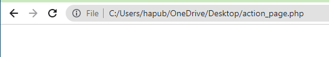
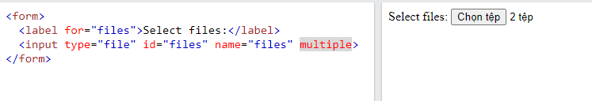
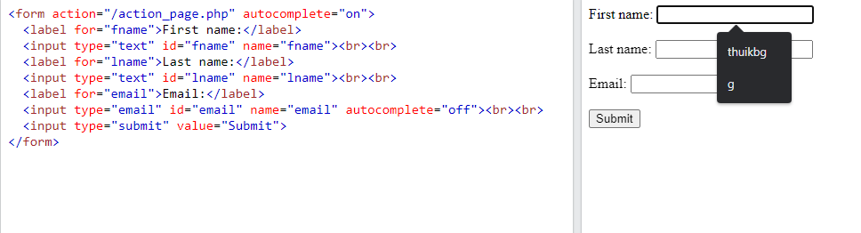
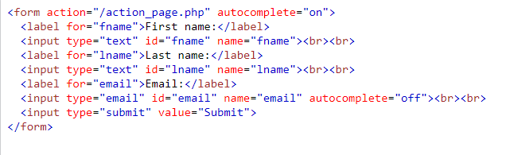
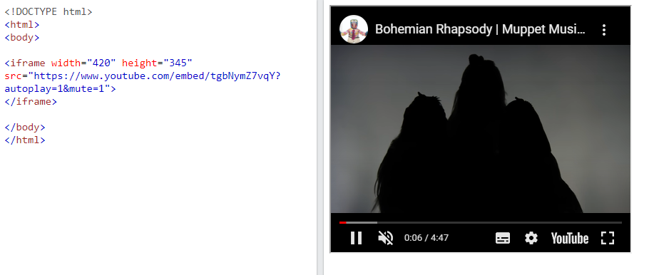

# 0. Contents
1. HTML Layout
2. HTML Responsive
3. HTML Semantic Elements
4. HTML Style Guide
5. HTML Entities
6. HTML Forms
7. HTML Multimedia

<br/>

# 1. HTML Layout - Bố cục
- Các trang web thường hiển thị nội dung theo bố cục trong nhiều cột (giống như các tờ báo).
## 1.1. Bố cục của HTML
- HTML có một số yếu tố ngữ nghĩa xác định các thành phần khác nhau của một trang web:
    <p align = "center">
    
    </p>

    <p align = "center">
    
    </p>

    - `<header>`: Xác định tiêu đề cho một tài liệu hoặc một phần
    - `<nav>`: Xác định một tập hợp các liên kết điều hướng
    - `<section>`: Xác định một phần trong tài liệu
    - `<article>`: Xác định một nội dung độc lập, khép kín
    - `<aside>`: Xác định nội dung ngoài nội dung (như một thanh bên)
    - `<footer>`: Xác định chân trang cho một tài liệu hoặc một phần
    - `<details>`: Xác định các chi tiết bổ sung mà người dùng có thể mở và đóng theo yêu cầu
    - `<summary>`: Xác định tiêu đề cho phần tử `<details>`

## 1.2. Các kỹ thuật tạo bố cục HTML
- Có 4 kỹ thuật khác nhau để tạo bố cục nhiều cột:  

    - CSS framework
    - Thuộc tính `float` CSS
    - CSS flexbox
    - CSS grid (lưới CSS)

# 2. HTML Responsive
## 2.1. Định nghĩa
- `Responsive` là một tính từ để chỉ một website có thể hiển thị nội dung tương thích trên mọi kích thước hiển thị của trình duyệt (ví dụ trên laptop, máy tính bảng hay điện thoại).
- `Responsive Web Design` (RWD) là xu hướng mới theo đó quy trình thiết kế và phát triển web sẽ đáp ứng mọi thiết bị và môi trường của người dùng theo các tiêu chí kích thước và chiều của màn hình thiết bị. 
- Responsive Web Design được tạo nên từ 3 thành phần cơ bản:

    - Flexible Grid based layout
    - Media Queries
    - Flexible Media

## 2.2.Tại sao cần Responsive Web Design
- Giúp tiết kiệm rất nhiều thời gian và chi phí khi mà không cần phải duy trì từng phiên bản web khác nhau cho điện thoại và máy tính
- `Responsive Web Desig`n giúp cải thiện SEO (search ranking) cho trang web khi mà mọi luồng đều chỉ dẫn đến một địa chỉ URL duy nhất thay vì nhiều URL khác nhau.
- `Responsive Design` giúp dễ dàng bảo trì trang web khi mà nó `không liên quan gì đến phía server`, chỉ việc thay đổi html và css để thay đổi giao diện hoặc bố cục thích hợp với các thiết bị khác nhau.
## 2.3. Cách áp dụng Responsive lên website
### 2.3.1. Flexible Grid based layout
Khai báo `meta viewport`
- `Viewport` là khung hình người dùng nhìn thấy trên thiết bị của họ khi vào một trang web bất kì. 
- Đặt thẻ `<meta>` dưới đây vào trong cặp thẻ `<head>` của tài liệu HTML  
    `<meta name="viewport" content="width=device-width, initial-scale=1">`  
    - `meta viewport` nghĩa là một thẻ thiết lập cho trình duyệt hiển thị tương ứng với kích thước màn hình. Chẳng hạn như ví dụ trên, có nghĩa là chúng ta sẽ thiết lập trình duyệt hiển thị cố định và tương ứng trên tất cả các thiết bị dựa vào chiều rộng của thiết bị (`device-width`) và không cho phép người dùng phóng to (thiết lập `initial-scale` với giá trị cố định là 1). 

    <p align = "center">
    
    </p>
### 2.3.2. Sử dụng kỹ thuật CSS
### a. Media Queries
- `Media Queries` là một kỹ thuật CSS được giới thiệu trong CSS3. Ta sử dụng cú pháp `@media` để bao gồm một khối các thuộc tính CSS chỉ khi một điều kiện nhất định là đúng. Nói một cách đơn giản là ta sẽ định nghĩa CSS riêng cho một nhóm các thiết bị có kích thước giống nhau.

- `Media Queries` có thể được sử dụng trực tiếp trong thẻ HTML hoặc viết bên trong file css. (*Nên sử dụng `@media` bên trong css để tránh việc phải viết lặp lại nhiều lần*).

    `@media all and (max-width: 1024px) {...}`

    `@media only screen and (orientation: portrait) {...}`

- Các thuộc tính trong Media Queries  

    - `Height & Width`: Chiều cao và chiều rộng của viewport được chỉ định qua từ khóa height và width. Giá trị của height hoặc width có thể là đơn vị độ dài, tương đối hoặc tuyệt đối. Chúng còn thường được đi kèm với các tiền tố min và max để xác định giới hạn màn hình mà các truy vấn được áp dụng. VD - `@media all and (min-width: 320px) and (max-width: 780px) {...}`
    - `Orientation: Portrait / Landscape`: Media queries còn được sử dụng để xác định hướng của browser thiết bị sử dụng từ khóa orientation, cho phép ta xác định thiết bị đang được xem nằm ở `hướng dọc (portrait)` hay `ngang (landscape)`. VD - `@media all and (orientation: landscape) {...}`
    - `Aspect Ratio`: `Tỉ lệ khung hình (aspect ratio)` trong media queries cho phép ta chỉ định tỉ lệ chiều rộng\chiều cao của thiết bị mà truy vấn được áp dụng . `@media all and (min-device-aspect-ratio: 16/9) {...}`

- *`Nguyên tắc Mobile First trong Responsive`*: Moble First nghĩa là luôn thiết kế ứng dụng cho màn hình mobile trước rồi mới đến các màn hình lớn dần. (Điều này giúp trang web hiển thị nhanh hơn trên các thiết bị màn hình nhỏ hơn) 
    ```css
        /*Smart phone nhỏ*/
        @media screen and (min-width: 240px){

        }
        /*Iphone(480 x 640)*/
        @media screen and (min-width: 320px){

        }
        /*Tablet nhỏ(480 x 640)*/
        @media screen and (min-width: 480px){

        }
        /*Ipad dọc(768 x 1024)*/
        @media screen and (min-width: 768px){

        }
        /*Ipad ngang(1024 x 768)*/
        @media screen and (min-width: 1024px){

        }
    ```

### b. Flexible Media
- Khi mà `viewport` thay đổi kích thước thì các đa phương tiện (ảnh, video,..) cũng cần có khả năng thay đổi sao cho phù hợp.
- Một cách thông dụng là thiết lập `width là 100%` cùng với `height: auto`. Khi đó ảnh hoặc video sẽ thay đổi chiều rộng và chiều cao sao cho phù hợp với độ dãn của màn hình.
```html

```
- Nếu muốn ảnh hoặc video thay đổi theo viewport nhưng không quá kích thước gốc của nó ta có thể sử dụng thuộc tính `max-width`:  
```html 

```
- Nếu muốn thay đổi cả kích thước của chữ theo kích thước của cửa sở trình duyệt, chúng ta có thể sử dụng đơn vị cho kích thước chữ `vw` (`vw` viết tắt của `viewpoth width`):
```html
<h1 style="font-size:10vw">Hello World</h1>
```

### 2.4. Responsive Web Design - Frameworks
-  W3.CSS
- Bootstrap

# 3. HTML `semantic` elements: phần tử ngữ nghĩa
- Phần tử ngữ nghĩa là những phần tử mô tả rõ ràng ý nghĩa về cấu trúc của phần tử đó đối với các trình duyệt và lập trình viên. Nói một cách dễ hiểu hơn có nghĩa là chỉ cần đọc tên các element này là chúng ta có thể hiểu được nội dung bên trong element này nói về cái gì.
- Hiện nay có rất nhiều website vẫn đang thiết kế dựa trên các mã HTML như sau để tạo giao diện có `menu điều hướng (nav)`, `đầu trang (header)` và `cuối trang (footer)`:
    ```html
    <div class="header"> <div id="footer">
    ```

- Tuy nhiên, HTML5 cung cấp các phần tử ngữ nghĩa mới để xác định rõ từng phần khác nhau của một trang web, ngữ nghĩa của các phần tử này sẽ rõ hơn so với thẻ `<div>`:
    ```html
    <article>, <aside>, <details>, <figcaption>, <figure>,
    <footer>, <header>, <main>, <mark>,
    <nav>, <section>, <summary>, <time> 
    ```

## 3.1. Các phần tử ngữ nghĩa trong HTML
### 3.1.1. Phần tử HTML `<section>`
- Phần tử `<section>` xác định một phần trong tài liệu.

- Theo tài liệu HTML của W3C: "Phần là một nhóm nội dung theo chủ đề, thường có một tiêu đề."

- Ví dụ về nơi một phần tử `<section>` có thể được sử dụng:

    - Chương
    - Giới thiệu
    - Mục tin tức
    - Thông tin liên lạc

### 3.1.2. Phần tử HTML `<article>` 
- Phần tử `<article>` chỉ định nội dung độc lập, và chứa nội dung của riêng nó. Nội dung bên trong `<article>` có ý nghĩa riêng biệt và có thể độc lập với các nội dung khác của trang web.

- Một bài báo nên tự nó có ý nghĩa và có thể phân phối nó một cách độc lập với phần còn lại của trang web.

- Ví dụ về nơi phần tử `<article>` có thể sử dụng:

    - Bài đăng trên diễn đàn
    - Bài đăng trên blog
    - Ý kiến ​​người sử dụng
    - Thẻ sản phẩm
    - Các bài báo

### 3.1.3 Phần tử HTML `<header>`
- Phần tử `<header>` đại diện cho một vùng chứa cho nội dung giới thiệu hoặc một tập hợp các liên kết điều hướng.

- Một phần tử `<header>` thường chứa:

    - Một hoặc nhiều phần tử tiêu đề (`<h1>` - `<h6>`)
    - Logo hoặc biểu tượng
    - Thông tin về quyền tác giả

*Lưu ý*: Chúng ta có thể có nhiều phần tử `<header>` trong một tài liệu HTML. Tuy nhiên, không thể đặt `<header>` trong một phần tử `<footer>`, `<address>`, hay một `<header>` khác.

### 3.1.4. Phần tử HTML `<footer>`
- Phần tử `<footer>` xác định chân trang cho tài liệu hoặc một phần trong tài liệu.

- Một phần tử `<footer>` thường chứa:

    - Thông tin về quyền tác giả
    - Thông tin bản quyền
    - Thông tin liên lạc
    - Sơ đồ trang web
    - Quay lại liên kết đầu
    - Tài liệu liên quan
- Có thể có nhiều phần tử `<footer>` trong một tài liệu.

### 3.1.5. Phần tử HTML `<nav>`
- Phần tử `<nav>` xác định một tập hợp các liên kết điều hướng.

*Lưu ý*:  `KHÔNG` phải tất cả các liên kết của một tài liệu phải nằm bên trong một phần tử `<nav>`. Phần tử `<nav>` này chỉ dành cho các khối liên kết điều hướng chính.
    <p align = "center">
    
    </p>

### 3.1.6. Phần tử HTML `<aside>`
- Phần tử `<aside>` xác định một số nội dung ngoài nội dung mà được đặt trong trang (như một thanh bên).

- Nội dung `<aside>` cần liên quan gián tiếp đến nội dung xung quanh có trên trang.
    <p align = "center">
    
    </p>
### 3.1.7. Phần tử HTML `<figure>` và `<figcaption>`
- Phần tử `<figure>` chỉ định nội dung độc lập, như hình minh họa, sơ đồ, ảnh, danh sách mã, v.v.

- Phân tử `<figcaption>` xác định chú thích cho một phần tử `<figure>`. Phần tử `<figcaption>` có thể được đặt làm phần tử con đầu tiên hoặc cuối cùng của một `<figure>`.

    <p align = "center">
    
    </p>

# 4. HTML Style Guide
Tài liệu HTML được viết theo một quy tắc nhất quán, gọn gàng giúp cho người đọc dễ hiểu hơn.  

Một số quy tắc hướng dẫn để tạo 1 tài liệu HTML tốt:
- Luôn khai báo loại tài liệu là dòng đầu tiên trong tài liệu HTML: `<!DOCTYPE html>`
- Nên sử dụng tên phần tử được viết bằng chữ thường.
- Có thẻ đóng của tất cả các phần tử trong HTML: `<p></p>`; `<h1></h1>`,...
- Sử dụng tên thuộc tính được viết bằng chữ thường: `style`, `href`, `src`,...
- Luôn chỉ định thuộc tính `alt`, `width` và `height` cho hình ảnh: `` 
- HTML cho phép khoảng trắng xung quanh các dấu bằng. Nhưng không gian ít hơn sẽ dễ đọc hơn và nhóm các thực thể lại với nhau tốt hơn. Vd: Cách viết  `<link rel="stylesheet" href="styles.css">` tốt hơn `<link rel = "stylesheet" href = "styles.css">`
- Tránh các dòng mã dài, không thuận tiên khi phải cuộn sang trái-phải để đọc code.
- Không thêm dòng trống, khoảng trắng hoặc thụt lề mà không có lý do.
- Không bao giờ bỏ qua phần tử `<title>`. Nội dung của tiêu đề trang rất quan trọng đối với việc tối ưu hóa công cụ tìm kiếm (SEO)! Tiêu đề trang được sử dụng bởi các thuật toán của công cụ tìm kiếm để quyết định thứ tự khi liệt kê các trang trong kết quả tìm kiếm.
- Luôn bao gồm thuộc tính `lang` bên trong thẻ `<html>`, để khai báo ngôn ngữ của trang Web. Điều này có nghĩa là để hỗ trợ các công cụ tìm kiếm và trình duyệt.
- Đặt chế độ xem viewport.


# 5. HTML Entities
## 5.1. HTML entities
- HTML cung cấp một số phương pháp để hiển thị các ký tự dành riêng đặc biệt. Các ký tự dành riêng là những ký tự được dành riêng cho ngôn ngữ HTML hoặc những ký tự không có trên bàn phím cơ bản (ví dụ: £, ¥, €, ©,...).
- HTML cung cấp 1 số `tên thực thể (Entity names)` và `số thực thể (Entity numbers`) để sử dụng được những ký tự này.
- Cú pháp: `&entity_name;` hoặc `&#entity_number;`

    VD: Để hiển thị dấu (`<`), chúng ta viết như sau: `&lt;` hoặc `&#60;`
- Một số thực thể ký tự sử dụng trong HTML:
    <p align = "center">
    
    </p>

VD: <p align = "center">
    
    </p>
*Lưu ý:* Việc sử dụng tên thực thể thì dễ nhớ. Nhưng các trình duyệt web không hỗ trợ hết tất cả các tên thực thể, thay vào đó các trình duyệt có thể hỗ trợ số thực thể rất tốt.
## 5.2. `Non-breaking Space`: dấu cách không ngắt
- Nó được sử dụng để cung cấp khoảng trống mà sẽ không ngắt thành một dòng mới. Thực thể này được đại diện bằng ký tự `&nbsp`.
- Hai từ được cách nhau bởi dấu cách không ngắt sẽ dính liền với nhau (không ngắt xuống dòng mới). 

VD: Một thẻ `<p>` sử dụng dấu cách không ngắt, và 1 thẻ `<p>` sử dụng bình thường
```html
<p style="font-size:40px">
    &nbsp;&nbsp;This&nbsp;is&nbsp;a&nbsp;non&nbsp;breaking&nbsp;Sentence&nbsp;&nbsp;&nbsp;!!
</p>
 
<p style="font-size:40px">
          This sentence will be line breaks.
</p>
```
- Kết quả:
    - Ở thẻ `<p>` thứ 2, trước nội dung `This sentence will be line breaks.`, chúng ta thêm 3 dấu cách khoảng trắng ở đó, nhưng khi chạy hiển thị trình duyệt tự động xóa 2 dấu cách trong số đó. 
    - Còn ở thẻ `<p>` thứ 1, chúng ta sử dụng dấu cách không ngắt, khi hiển thị trình duyệt vẫn giữ nguyên khoảng trống đó.

    <p align = "center">
    
    </p>

    - Sự khác nhau nữa là, khi ta thay đổi kích thước hiển thị của cửa sổ trang web, thẻ `<p>` thứ 1 các từ vẫn dính với nhau, không bị xuống dòng như thẻ `<p>` thứ 2.

    <p align = "center">
    
    </p>

## 5.3. Kết hợp dấu phụ và chữ
- Dấu phụ là một "glyph" được thêm vào một chữ cái. 
- Các dấu phụ như ``dấu huyền (`)`` và `dấu sắc (́ )` được gọi là dấu trọng âm. Nó có thể xuất hiện cả bên trên và bên dưới một chữ cái, bên trong một chữ cái và giữa hai chữ cái. 
- Dấu phụ có thể được sử dụng kết hợp với các ký tự chữ và số để tạo ra một ký tự không có trong bộ ký tự (mã hóa) được sử dụng trên trang. 
- Đây là danh sách một số dấu phụ.
    <p align = "center">
    
    </p>

# 6. HTML Forms
## 6.1. Định nghĩa
- Các phần tử trong form có thể chứa các các kiểu phần tử khác nhau như các ô nhập dữ liệu (`textboxes`), các ô cho người dùng lựa chọn (`checkboxes` hoặc `radio buttons`), các nút cho người dùng kích gửi dữ liệu (`submit buttons`) và nhiều phần tử khác nữa.

- HTML Form là phương tiện cho người dùng nhập dữ liệu được gửi đến máy chủ để xử lý.
- Tại sao sử dụng HTML Form: HTML Form được sử dụng khi chúng ta muốn thu nhập một số dữ liệu của người truy cập trang web. VD như điền thông tin vào đơn đăng ký học online, địa chỉ để giao hàng...
- Khai báo HTML Form:
    ```html
    <form action="server url" method="get|post">  
    //input controls ví dụ: textfield, textarea, radiobutton, button
    </form>
    ```
## 6.2. Thẻ `<form>`
- Thẻ `<form>` được sử dụng để tạo một biểu mẫu HTML cho người dùng nhập dữ liệu vào.
- Bên trong thẻ `<form>` chứa các loại phần tử đầu vào  khác nhau như: `<textfields>`, `<checkboxes>`, `<radiobuttons>`, `submit buttons`, etc. 

## 6.3. Thuộc tính trong Form
### 6.3.1. Thuộc tính `action`
- Thuộc tính `action` định nghĩa hành động sẽ được thực hiện khi một biểu mẫu được gửi đi khi người dùng thực hiện click nút submit.
- Thông thường, dữ liệu biểu mẫu được gửi tới một tập tin trên máy chủ khi người dùng thực hiện click vào nút button.
- VD dưới đây, dữ liệu biểu mẫu được gửi tới một file gọi là "action_page.php" một script chạy ở phía server được xác định để xử lý biểu mẫu đã gửi: `<form action="/action_page.php">`

- *Nếu như thuộc tính `action` được bỏ qua, `action` sẽ được thiết lập tới trang hiện tại*

### 6.3.2. Thuộc tính `target`
- Thuộc tính `target` định nghĩa nơi hiển thị phản hồi sau khi thực hiện click nộp từ biểu mẫu.
- Thuộc tính `target` có thể có một trng những giá trị sau: (giống thẻ link).

    VD:
`<form action="/action_page.php" target="_blank">`

### 6.3.3. Thuộc tính `method`
- Thuộc tính `method` xác định kiểu phương thức HTTP (`GET hoặc POST`) được sử dụng gửi dữ liệu trên biểu mẫu.
- Phương thức HTTP `mặc định` khi gửi dữ liệu biểu mẫu là `GET`.
- VD: 
    - Sử dụng phương thức GET: `<form action="/action_page.php" method="get">` 
    - Sử dụng phương thức POST: `<form action="/action_page.php" method="post">` 

### **Khi nào thì sử dụng phương thức POST và phương thức GET**
- Sử dụng `GET`:
    - Sử dụng GET nếu dữ liệu trong biểu mẫu gửi đi không cần mã hóa, không chứa các thông tin nhạy cảm như mật khẩu,...
    - Khi sử dụng GET, dữ liệu có trong biểu mẫu sẽ bị nhìn thấy trên thanh địa chỉ của trang, ví dụ:
    <p align="center">
    
    </p>

    <p align="center">
    
    </p>

    - Đặc điểm của GET: thêm dữ liệu vào thanh địa chỉ URL, theo cặp tên/giá trị như hình ảnh ví dụ bên trên.
    - Chiều dài của một URL bị giới hạn (2048 ký tự).

- Sử dụng `POST`: 
    - Nên sử dụng POST trong trường hợp nếu biểu mẫu cập nhật dữ liệu hoặc dữ liệu trên biểu mẫu gửi đi bao gồm các thông tin nhạy cảm như mật khẩu, mã thẻ ngân hàng,...
    - POST cung cấp cơ chế bảo mật hơn bởi vì dữ liệu được gửi đi không được hiển thị trên thanh địa chỉ của trang.
    - VD:
    <p align="center">
    
    </p>

    <p align="center">
    
    </p>

*Lưu ý:* Luôn sử dụng `POST` nếu dữ liệu trong biểu mẫu chưa những thông tin nhạy cảm và mang tính cá nhân
### 6.3.4. Thuộc tính `autocomplete`
- Thuộc tính tự động hoàn thành chỉ định xem biểu mẫu có nên bật hay tắt tính năng tự động hoàn thành hay không. 
- Khi bật tính năng tự động hoàn thành, trình duyệt sẽ tự động hoàn thành các giá trị dựa trên các giá trị mà người dùng đã nhập trước đó.  
VD: `<form action="/action_page.php" autocomplete="on">`
    <p align="center">
    
    </p>

### 6.3.5. Thuộc tính `novalidate`
- Thuộc tính `novalidate` là một thuộc tính `boolean` 
- Khi xuất hiện, nó chỉ định rằng dữ liệu nhập vào  trong biểu mẫu không được xác thực khi nộp.   

VD: `<form action="/action_page.php" novalidate>`

## 6.4. Các phần tử của HTML form
- Bên trong phần tử `<form>` có thể chứa 1 hoặc nhiều phần tử biểu mẫu khác
### 6.4.1. Phần tử `<input>`
- Một trong những phần tử form quan trọng nhất là thẻ `<input>`
- Thẻ `<input>` có thể được hiển thị bằng một vài cách, phụ thuộc vào thuộc tính type.
### 6.4.1.1. `Input Type Text`
- `input type="text"`: định nghĩa một trường nhập dữ liệu trên 1 dòng.
    <p align = "center">
    
    </p>
### 6.4.1.2. `Input Type password`
- `input type="password"`: định nghĩa một trường mật khẩu.
- Ký tự trong một trường mật khẩu được che dấu (mỗi ký tự khi hiển thị sẽ được thay bằng dấu hoa thị hoặc dấu tròn).
    <p align = "center">
    
    </p>

### 6.4.1.3. `Input Type Submit`
- `input type="submit"`: định nghĩa một nút nhấn để gửi dữ liệu nhập trên biểu mẫu (`submiting`) tới một trang khác để xử lý dữ liệu của biểu mẫu này (`form_handler`). Form-handler thường là một trang chạy ở phía server cho phép xử lý dữ liệu nhập. 
- Form-handler được chỉ định trong thuộc tính `action` của form.
    <p align = "center">
    
    </p>
### 6.4.1.4. `Input Type Reset`
- `input type="reset"`: định nghĩa một nút nhấn reset để đặt lại tất cả những giá trị trên biểu mẫu về giá trị mặc định của chúng.
- VD: Khi chúng ta đã nhập dữ liệu vào biểu mẫu như ví dụ dưới đây. Sau đó chúng ta nhấn nút reset trên biểu mẫu thì các trường trên biểu mẫu sẽ được đặt lại thành các giá trị mặc định ban đầu
    - Dữ liệu đã nhập:
    <p align="center">
    
    </p>

    - Dữ liệu sau khi nhấn reset:
    <p align="center">
    
    </p>

### 6.4.1.5. `Input Radio Button`
- `input type="radio"`: định nghĩa một radio button. Các nút radio `chỉ cho phép người sử dụng chọn một` trong một danh sách giới hạn các lựa chọn
    <p align="center">
    
    </p>
### 6.4.1.6. `Input Type Checkbox`
- `<input type="checkbox">`: định nghĩa một checkbox. Checkbox cho phép người dùng `không chọn hoặc chọn nhiều lựa chọn` trong một danh sách giới hạn các lựa chọn.

    <p align="center">
    
    </p>

### 6.4.1.7. `Input Type Button`
- `<input type="button">`: định nghĩa một nút nhấn
    <p align="center">
    
    </p>

### 6.4.1.8. `Input Type Color`
- `<input type="color">`: được sử dụng cho trường đầu vào của biểu mẫu mà tại đó chứa một loại màu.
- Phụ thuộc vào sự hỗ trợ của các trình duyệt (không hỗ trợ cho trình duyệt Internet Explorer 11, Safari 9.1 hoặc các phiên bản trước đấy), một công cụ chọn màu có thể được hiển thị trong một trường đầu vào.

    VD: <p align="center">
    
    </p>

### 6.4.1.9. `Input Type Date`
- `<input type="date">`: được sử dụng cho trường đầu vào mà ở đó chứa thông tin với định dạng tháng/ngày/năm (mm/dd/yyyy)
- Có thể sử dụng thuộc tính `max`, `min` để thêm giới hạn cho ngày nhập vào.  
VD: <p align="center">
    
    </p>
### 6.4.1.10. `Input Type Email`
- `<input type="email">`: được sử dụng cho trường đầu vào mà tại đó chứa một địa chỉ email.

    ```html
    <form>
    <label for="email">Enter your email:</label>
    <input type="email" id="email" name="email">
    </form>
    ```
- Một số loại điện thoại thông minh yêu cầu loại email phải có thêm đuôi `.com` để phù hợp với dữ liệu email nhập vào.

### 6.4.1.11. `Input Type Image`
- `<input type="image">` định nghĩa một hình ảnh như là một nút gửi (submit).  
VD: 
    ```html
    <form>
    <input type="image" src="img_submit.gif" alt="Submit" width="48" height="48">
    </form>
    ```
### 6.4.1.12. `Input Type File`
- `<input type="file">` định nghĩa một trường chọn tệp tin và một nút nhấn "Duyệt" để tải tập tin lên.
    <p align="center">
    
    </p>

### 6.4.1.13. `Input Type Hidden`
- `<input type="hidden">` định nghĩa một trường đầu vào bị ẩn đi (người dùng không xem được trường này).
- Một trường ẩn đi thường lưu trữ những gì mà cơ sở dữ liệu ghi lại để cập nhật dữ liệu khi biểu mẫu được gửi đi.  

*Lưu ý:* 
- Khi giá trị trong trường ẩn này không được hiển thị cho người dùng xem trên nội dung của trang web, nhưng nó có thể xem được (và có thể chỉnh sửa) bằng cách sử dụng bất kỳ công cụ phát triển web nào hoặc chức năng "Xem nguồn trang" trên trình duyệt
- Các trường `input hidden` thường được sử dụng để lưu trữ dữ liệu tạm thời trên web mà không cho người sử dụng nhìn thấy trực tiếp, các dữ liệu này thường sẽ vẫn xuất hiện trong cấu trúc html của web, vì vậy không nên lưu trữ các dữ liệu mang tính riêng tư, bảo mật hoặc bản quyền để tránh bị lộ khi người dùng biết một chút thủ thuật hoặc code về HTML.

    <p align="center">
    
    </p>

### 6.4.1.14. `Input Type Number`
- `<input type="number">` định nghĩa một trường nhập số học.
- Chúng ta cũng có thể đặt giới hạn cho những con số nào hợp lệ với thuộc tính `max` và `min`  
VD:
    ```html
    <form>
    <label for="quantity">Quantity (between 1 and 5):</label>
    <input type="number" id="quantity" name="quantity" min="1" max="5">
    </form>
    ```

### 6.4.1.15. `Input Type Range`
- `<input type="range">` định nghĩa 1 thanh trượt điều khiển cho việc nhập vào một con số. Giới hạn mặc định của thanh trượt là từ 0-100. Thuy nhiên, chúng ta có thể đặt giới hạn cho thanh trượt đó bằng thuộc tính `max`, `min` và `step`.  
VD:
    <p align="center">
    
    </p>

*Lưu ý:* Chúng ta có thể tham khảo thêm các loại input khác tại [HTML Input Types](https://www.w3schools.com/html/html_form_input_types.asp)
### 6.4.2. Thẻ `<label>`
- Thẻ `<label>` định nghĩa nhãn cho thành phần `<input>`.
- Thẻ `<label>` không hiển thị bất cứ gì đặc biệt cho người dùng, tuy nhiên nó cung cấp một cải thiện cho người sử dụng chuột, nếu click chuột vào nhãn, sẽ đưa con trỏ chuột vào vùng `<input>`.
- Muốn sử dụng hiệu quả `<label>`, cần thiết phải cho giá trị `id` của `<input>` trùng với giá trị `for` của `<label>`

    VD: 
    ```html
    <label for="male">Nam</label>: 
    <input type="radio" id="male" name="gender" value="" /><br />
    <label for="female">Nữ</label>:
    <input type="radio" id="female" name="gender" value="" />
    ```
### 6.4.3. Phần tử `<select>`
- Phần tử `<select>` xác định một danh sách thả xuống
- Phần tử `<option>` được sử dụng để định nghĩa 1 lựa chọn có thể được chọn trong danh sách.
- Mặc định, lựa chọn đầu tiên trong danh sách là đã được chọn.
- Để định nghĩa một lựa chọn mặc định, thêm thuộc tính `selected` vào lựa chọn đấy  
VD:
    <p align="center">
    
    </p>

### 6.4.4. Phần tử `<textarea>`
- Phần tử `<textarea>` định nghĩa một trường nhập dữ liệu nhiều dòng (một vùng văn bản).
- Sử dụng thuộc tính rows và cols để chỉ định số lượng dòng và chiều dài của một vùng văn bản có thể nhìn thấy trên trình duyệt.  
VD:
    <p align="center">
    
    </p>
- Chúng ta cũng có thể định nghĩa kích thước của vùng văn bản bằng thuộc tính `style` CSS 
    ```html
    <textarea name="message" style="width:200px; height:600px;">
    The cat was playing in the garden.
    </textarea>
    ```
### 6.4.5. Phần tử `<fieldset>` và `<legend>`

- Phần tử `<fieldset>` được sử dụng để nhóm các dữ liệu liên quan vào trong một biểu mẫu.
- Phần tử `<legend>` định nghĩa một tiêu đều cho phần tử `<fieldset>`

    VD:
    <p align="center">
    
    </p>
### 6.4.6. Phần tử `<datalist>`
- Phần tử `<datalist>` chỉ định danh sách các tùy chọn được xác định trước cho một phần tử `<input>`.

- Người dùng sẽ thấy danh sách thả xuống gồm các tùy chọn được xác định trước khi họ nhập dữ liệu.

- Thuộc tính `list` của phần tử `<input>`, phải tham chiếu đến thuộc tính `id` của phần tử `<datalist>`.

    VD:
    <p align="center">
    
    </p>
 
 ***Lưu ý:* Sự khác biệt giữa `<select>` và `<datalist>`**
 - Với `<select>`, người dùng chỉ có thể chọn các giá trị đã được liệt kê ra trong danh sách bằng các thẻ `<option>`. Còn với `<datalist>`, người dùng có thể chọn 1 trong các giá trị trong danh sách hoặc có thể nhập 1 giá trị lựa chọn khác không có trong danh sách bằng trường input.
 - Điểm khác thứ 2: với `<select>` sẽ luôn có một giá trị được mặc định trước, còn `<datalist>` thì không có giá trị mặc định cho trường input.
### 6.4.7. Phần tử `<output>`
- Phần tử `<output>` đại diện cho kết quả của một phép tính (giống như một phép tính được thực hiện bởi tập lệnh).

    VD:
    <p align="center">
    
    </p>

## 6.5. Thuộc tính trong HTML Input
### 6.5.1. Thuộc tính `value`
- Thuộc tính `value` định nghĩa một giá trị đầu tiên (mặc định) cho trường nhập dữ liệu đầu vào.
VD: <p align="center">
    
    </p>

### 6.5.2. Thuộc tính `readonly`
- Thuộc tính `readonly` định nghĩa một trường dữ liệu `chỉ đọc, không thể chỉnh sửa`
- Giá trị của trường này cũng sẽ được gửi khi thực hiện gửi biểu mẫu.
VD: `<input type="text" id="fname" name="fname" value="John" readonly>`
<input type="text" id="fname" name="fname" value="John" readonly><br>

### 6.5.3. Thuộc tính `disabled`
- Thuộc tính `disabled` định nghĩa một trường nhập dữ liệu bị vô hiệu hóa, tức là nó `không được sử dụng và không thể nhấp vào.`
- Giá trị của trường này cũng không được gửi đi.

    VD: `<input type="text" id="fname" name="fname" value="John" disabled><br>`
<input type="text" id="fname" name="fname" value="John" disabled><br>

### 6.5.4. Thuộc tính `size`
- Thuộc tính `size` định nghĩa chiều dài có thể nhìn thấy trên trình duyệt của một trường dữ liệu. Giá trị mặc định của `size` là 20.
- Thuộc tính `size` chỉ hoạt động với những loại input sau: `text, search, email, password, tel, url`.

    VD:
`<input type="text" id="fname" name="fname" value="John" size="4">`
<input type="text" id="fname" name="fname" value="John" size="4">

    `<input type="text" id="fname" name="fname" value="John" size="10">`
<input type="text" id="fname" name="fname" value="John" size="10">

### 6.5.5. Thuộc tính `maxlength`
- Thuộc tính `maxlength` định nghĩa số lượng ký tự tối đa được nhập vào một trường dữ liệu nhập vào.
- Khi một thuộc tính `maxlength` được thiết lập, thì trường dữ liệu đó sẽ không được nhập quá số lượng ký tự đã quy định.

    VD: `<input type="text" id="fname" name="fname" value="John" maxlength="4">`

### 6.5.6. Thuộc tính `max` và `min`
- Thuộc tính `max` và `min` chỉ định giá trị tối thiểu và tối đa có thể nhập vào trong một trường dữ liệu.
- Sử dụng đồng thời hai thuộc tính này sẽ tạo thành một phạm vi của giá trị hợp lệ.  
VD:
    ```html
    <form>
    <label for="datemax">Enter a date before 1980-01-01:</label>
    <input type="date" id="datemax" name="datemax" max="1979-12-31"><br><br>

    <label for="datemin">Enter a date after 2000-01-01:</label>
    <input type="date" id="datemin" name="datemin" min="2000-01-02"><br><br>

    <label for="quantity">Quantity (between 1 and 5):</label>
    <input type="number" id="quantity" name="quantity" min="1" max="5">
    </form>
    ```

### 6.5.7. Thuộc tính `multiple`
- Thuộc tính `multiple` định nghĩa rằng người dùng `có thể nhập vào nhiều hơn 1 giá trị` cho mỗi trường dữ liệu.
- Thuộc tính `multiple` hoạt động đối với loại input: `email` và `file`

    VD: `<input type="file" id="files" name="files" multiple>`
    <p align="center">
    
    </p>
### 6.5.8. Thuộc tính `pattern`
- Thuộc tính `pattern` định nghĩa một biểu thức chính quy mà giá trị của trường nhập dữ liệu phải dựa vào biểu thức đó để kiểm tra khi biểu mẫu được gửi đi.
- Sử dụng thuộc tính `title` để mô tả một mẫu giúp người dùng hiểu.

    VD: Nhập vào 1 số điện thoại có 10 chữ số (không có chữ cái và ký tự đặc biệt)

    `<input type="text" id="phonenumber" pattern="[0-9]{10}" title="A Phone number has ten numbers">`

### 6.5.9. Thuộc tính `placeholder`
- Thuộc tính `placeholder` định nghĩa một gợi ý ngắn để định nghĩa những giá trị được mong đợi của một trường nhập dữ liệu.
- Một gợi ý ngắn sẽ được hiển thị trong trường nhập dữ liệu trước khi người dùng nhập một giá trị vào.
- Thuộc tính `placeholder` hoạt động với những loại input sau: `text, search, email, password`.

    VD:
    <p align="center">
    
    </p>

### 6.5.10. Thuộc tính `required` 
- Thuộc tính `required` định nghĩa một trường dữ liệu phải được nhập vào trước khi thực hiện việc gửi biểu mẫu đi.
- Thuộc tính `required` hoạt động với những loại input: `text, search, email, password, radio`...

    VD: 
    <p align="center">
    
    </p>

### 6.5.11. Thuộc tính `autofocus`
- Thuộc tính `autofocus` định nghĩa rằng một trường dữ liệu sẽ `tự động được chỉ định` khi trang web được tải.  

    VD:

    ```html
    <label for="fname">First name:</label>

    <input type="text" id="fname" name="fname" autofocus><br>
    ```

    <label for="fname">First name:</label>
    <input type="text" id="fname" name="fname" autofocus><br>

### 6.5.12. Thuộc tính `height` và `width`
- Thuộc tính `height` và `width` xác định chiều cao và độ rộng của một phần tử `<input type="image">`
- `Luôn chỉ định cả thuộc tính chiều cao và chiều rộng cho hình ảnh`. Nếu chiều cao và chiều rộng được thiết lập, không gian cần thiết cho hình ảnh sẽ được dành riêng khi trang được tải. Nếu không có các thuộc tính này, trình duyệt không biết kích thước của hình ảnh và không thể dành không gian thích hợp cho nó. Hiệu quả sẽ là bố cục trang sẽ thay đổi trong quá trình tải (trong khi tải hình ảnh).

    VD: `<input type="image" src="img_submit.gif" alt="Submit" width="48" height="48">`

### 6.5.13. Thuộc tính `list`
- Thuộc tính `list` liên quan đến một phần tử `<datalist>` mà chứa những lựa chọn được xác định trước cho một phần tử `<input>`.
- Thuộc tính `list` của phần tử `<input>` và thuộc tính `id` của phần tử `<datalist>` `phải có giá trị trùng nhau`.

    VD:
    ```html
    <form>
    <input list="browsers">
    <datalist id="browsers">
        <option value="Internet Explorer">
        <option value="Firefox">
        <option value="Chrome">
        <option value="Opera">
        <option value="Safari">
    </datalist>
    </form>
    ```

### 6.5.14. Thuộc tính `autocomplete`
- Thuộc tính `autocomplete` định nghĩa một biểu mẫu hay một trường dữ liệu có tự động được hoàn thành hay không.
- `Autocomplete` cho phép những trình duyệt dự đoán trước những giá trị. Khi người dùng bắt đầu nhập vào một trường, trình duyệt hiển thị ra những lựa chọn để điền vào trường dữ liệu đó, dựa trên những giá trị  đã được nhập trước đó.

- VD:
    - Trường Firstname sử dụng thuộc tính `autocomplete = "on"`
    <p align="center">
    
    </p>

    - Trường Firstname sử dụng thuộc tính `autocomplete = "off"`
    <p align="center">
    
    </p>

## 6.6. Thuộc tính `form*` cho phần tử `<input>`
### 6.6.1. Thuộc tính `form`
- Thuộc tính `form` định nghĩa biểu mẫu mà phần tử `<input>` phụ thuộc vào.
- Giá trị của thuộc tính này phải `trùng với` giá trị của `thuộc tính id `của thẻ `<form>` mà `nó phụ thuộc`.  
VD:
    ```html
    <form action="/action_page.php" id="form1">
    <label for="fname">First name:</label>
    <input type="text" id="fname" name="fname"><br><br>
    <input type="submit" value="Submit">
    </form>

    <label for="lname">Last name:</label>
    <input type="text" id="lname" name="lname" form="form1">
    ```
### 6.6.2. Thuộc tính `formaction`
- Thuộc tính `formaction` định nghĩa tệp tin URL mà sẽ xử lý dữ liệu của biểu mẫu khi nó được gửi đi.
- Thuộc tính này sẽ ghi đè thuộc tính `action` của phần tử `<form>`.
- Thuộc tính này hoạt động với loại input: `submit` và `image`.

    VD:
    ```html
    <form action="/action_page.php">
    <label for="fname">First name:</label>
    <input type="text" id="fname" name="fname"><br><br>
    <label for="lname">Last name:</label>
    <input type="text" id="lname" name="lname"><br><br>
    <input type="submit" value="Submit">
    <input type="submit" formaction="/action_page2.php" value="Submit as Admin">
    </form>
    ```

### 6.6.3. Thuộc tính `formenctype`
- Thuộc tính `formenctype` định nghĩa cách mà dữ liệu biểu mẫu được mã hóa khi gửi đi (`chỉ xảy ra đối với biểu mẫu có method = "post"`)
- Thuộc tính này ghi đè thuộc tính `enctype` của phần tử `<form>`.
- Thuộc tính này hoạt động với loại input: `submit` và `image`.

    VD: Một biểu mẫu có hai nút gửi. Đầu tiên gửi dữ liệu biểu mẫu với mã hóa mặc định, thứ hai gửi dữ liệu biểu mẫu được mã hóa dưới dạng "`multipart/form-data`":

    ```html
    <form action="/action_page_binary.asp" method="post">
    <label for="fname">First name:</label>
    <input type="text" id="fname" name="fname"><br><br>
    <input type="submit" value="Submit">
    <input type="submit" formenctype="multipart/form-data"
    value="Submit as Multipart/form-data">
    </form>
    ```
- Ngoài ra còn có thuộc tính formenctype cho `<button>`

    VD: Một biểu mẫu có hai nút gửi. Nút gửi đầu tiên gửi dữ liệu biểu mẫu với mã hóa ký tự mặc định và nút thứ hai gửi dữ liệu biểu mẫu không có mã hóa ký tự:

<p align="center">

</p>

### 6.6.4. Thuộc tính `formmethod`
- Thuộc tính `formmethod` định nghĩa giao thức HTTP cho việc gửi dữ liệu biểu mẫu tới URL xử lý.
- Thuộc tính này sẽ ghi đè thuộc tính `action` của phần tử <form>.
- Thuộc tính này hoạt động với loại input: submit và image.
- Dữ liệu biểu mẫu có thể được gửi như `các biến URL (method="get")` hoặc như `một giao dịch HTTP post (method = "post")
`
### 6.6.5. Thuộc tính `formtarget`
- Thuộc tính `formtarget` định nghĩa một tên hoặc một từ khóa mà chỉ định nơi mà hiển thị những phản hồi sau khi dữ liệu biểu mẫu được gửi đi.
- Thuộc tính này ghi đè thuộc tính `target` của phần tử `<form>`.
- Thuộc tính này hoạt động với loại input: `submit` và `image`.

    VD: Kết quả khi nhấn hai nút nhấn submit sẽ hiện thị trên các cửa sổ khác nhau
    ```html
    <form action="/action_page.php">
    <label for="fname">First name:</label>
    <input type="text" id="fname" name="fname"><br><br>
    <input type="submit" value="Submit">
    <input type="submit" formtarget="_blank" value="Submit to a new window/tab">
    </form>
    ```
### 6.6.6. Thuộc tính `formnovalidate`
- Thuộc tính `formnovalidate` định nghĩa một phần tử `<input>` không được xác thực khi gửi đi.
- Thuộc tính này ghi đè thuộc tính `novalidate` của phần tử `<form>`.
- Thuộc tính này hoạt động với loại input: `submit`

    VD:
    ```html
    <form action="/action_page.php">
    <label for="email">Enter your email:</label>
    <input type="email" id="email" name="email"><br><br>
    <input type="submit" value="Submit">
    <input type="submit" formnovalidate="formnovalidate"
    value="Submit without validation">
    </form>
    ```
# 7. HTML Multimedia
## 7.1. Định nghĩa
- `Multimedia` (đa phương tiện) có rất nhiều định dạng khác nhau. Nó có thể là bất cứ cái gì mà bạn nghe hoặc nhìn được, ví dụ như hình ảnh, âm nhạc, âm thanh, video, bản ghi, phim, hình ảnh động,...
- Trên trang web thường chứa rất nhiều định dạng, kiểu loại khác nhau của những phần tử đa phương tiện.
- Định dạng đa phương tiện: các phần tử đa phương tiện (như audio, video) được lưu trữ trong tệp tin phương tiện (media file). Cách thông thường nhất để nhận biết loại tập tin là xem phần mở rộng của tệp tin. Tệp tin đa phương tiện thường có những phần mở rộng như: `.wav`, `.mp3`, `.mp4`, `.mpg`, `.wmv`, `.avi`

## 7.2. HTML Video
- Phần tử `<video>` được sử dụng để hiển thị một video trên HTML.

    VD:
    <p align="center">
    
    </p>

- Trong ví dụ trên:
    - Thuộc tính `controls` được thêm vào trong phần tử `<video>` để điều khiển một video như: `play (chạy video)`, `pause (dừng video)` và `volume (điều chỉnh âm lượng)`.
    - Luôn khai báo thuộc tính `width` và `height`. Nếu như không thiết lập hai thuộc tính này, trang web có thể bị nhấp nháy khi tải video.
    - Phần tử `<source>` cho phép chỉ định tệp video thay thế mà trình duyệt có thể chọn. Trình duyệt sẽ sử dụng định dạng được phát hiện đầu tiên.
    - `Phần văn bản` ở giữa cặp thẻ `<video> </video>` sẽ `chỉ được hiển thị` lên trình duyệt khi mà `trình duyệt đó không hỗ trợ` phần tử HTML `<video>`.

- HTML `<video>` autoplay:
    - Để tự động phát một video, sử dụng thuộc tính `autoplay`

    VD: 
    ```html
    <video width="320" height="240" autoplay>
        <source src="movie.mp4" type="video/mp4">
        <source src="movie.ogg" type="video/ogg">
        Your browser does not support the video tag.
    </video>
    ```
    - Để `tắt tiếng` của video, ta thêm `muted` đằng sau của thuộc tính `autoplay`:  
    `<video width="320" height="240" autoplay muted>`
## 7.3. HTML audio
- Để phát một tệp tin âm thanh, ta sử dụng phần tử `<audio>`.

    VD:
    <p align="center">
    
    </p>
- Trong ví dụ trên:
    - Thuộc tính `controls` được thêm vào trong phần tử `<audio>` để điều khiển một video như: `play (chạy)`, `pause (dừng)` và `volume (điều chỉnh âm lượng)`.
    - Phần tử `<source>` cho phép chỉ định tệp âm thanh thay thế mà trình duyệt có thể chọn. Trình duyệt sẽ sử dụng định dạng được phát hiện đầu tiên.
    - `Phần văn bản` ở giữa cặp thẻ `<audio> </audio>` sẽ `chỉ được hiển thị` lên trình duyệt khi mà `trình duyệt đó không hỗ trợ` phần tử HTML `<audio>`.

- HTML `<audio>` autoplay:
    - Để tự động phát một âm thanh, sử dụng thuộc tính `autoplay`

    VD: 
    ```html
    <audio width="320" height="240" controls autoplay>
        <source src="movie.mp4" type="video/mp4">
        <source src="movie.ogg" type="video/ogg">
        Your browser does not support the video tag.
    </audio>
    ```
    - Để `tắt tiếng` của video, ta thêm `muted` đằng sau của thuộc tính `autoplay`:  
    `<video width="320" height="240" controls autoplay muted>`

## 7.4. HTML Plug-ins
- `Plug-ins` (`công cụ/chương trình cài cắm`) là những chương trình máy tính để mở rộng những chức năng tiêu chuẩn của trình duyệt.
- Plug-ins được thiết kế để sử dụng cho những mục đích khác nhau:
    - Để chạy những ứng dụng Java.
    - Để hiển thị phim Flash.
    - Để hiển thị bản đồ
    - Để quét vi-rút.
    - Để xác thực mã ngân hàng.

- Phần tử `<object>`
    - Phần tử `<object>` hỗ trợ cho tất cả các trình duyệt.
    - Phần tử `<object>` định nghĩa một đối tượng được nhúng vào trong một tài liệu HTML.
    - Nó được thiết kế để nhúng các bộ cài cắm (như ứng dụng Java, trình đọc PDF,...) vào trang web, nhưng cũng có thể sử dụng để bao gồm HTML trong HTML:  
    VD: `<object width="100%" height="500px" data="snippet.html"></object>`
- Phần tử `<embed>`
    - Phần tử `<embed>` được hỗ trợ cho tất cả các trình duyệt chính.
    - Phần tử `<embed>` định nghĩa một đối tượng được nhúng vào trong một tài liệu HTML. VD: `<embed src="audi.jpeg">`
    - Phần tử `<embed>` không có thẻ đóng và nó không chứa đoạn văn để thay thế
    - Phần tử `<embed>` cũng có thể bao gồm HTML trong HTML. VD: `<embed width="100%" height="500px" src="snippet.html">`

## 7.5. HTML Youtube Videos
- Cách dễ nhất để hiển thị video trên HTML là sử dụng `Youtube`.
- Chuyển videos sang những định dạng khác nhau có thể khó và tốn thời gian. Vì vậy, một giải pháp dễ hơn là để Youtube phát videos trên trang web.
- `Youtube video id`: youtube sẽ hiển thị một `id` (như tgbNymZ7vqY) khi chúng ta lưu (hoặc chạy) một video. Chúng ta có thể sử dụng `id` này để tham chiếu tới video của chúng ta trong đoạn mã HTML.
### 7.5.1. Phát một video Youtube trong HTML
- Để phát một video trên một trang web, thực hiện các bước sau:
    - Tải video lên Youtube.
    - Ghi lại id của video.
    - Định nghĩa một thẻ `<iframe>` trên trang web của chúng ta.
    - Đặt thuộc tính src chỉ tới địa chỉ URL của video
    - Sử dụng thuộc tính `width`, `height` để định nghĩa `kích thước` của trình phát video.
    - Thêm những thông số bất kỳ khác tới URL (*theo dõi phần 8.5.2*).  
    VD: 
    <p align="center">
    
    </p>

### 7.5.2 Một số thông số có thể thêm vào URL
- `Youtube Autoplay + Mute`
    - Chúng ta có thể `để video của mình phát một cách tự động` khi một người dùng ghé thăm trang web, bằng cách `thêm` `autoplay = 1` vào địa chỉ URL của youtube. Ngoài ra có thể thêm `mute = 1 sau autoplay=1 để phát video tự động nhưng tắt tiếng`

    VD: 
    <p align="center">
    
    </p>

- `Youtube Loop`
    - Thêm `loop=1` để video của chúng ta `lặp lại mãi mãi`. Mặc định, l`oop=0` video sẽ `chỉ chạy 1 lần`.

    VD:
    ```html
    <iframe width="420" height="315"
    src="https://www.youtube.com/embed/tgbNymZ7vqY?playlist=tgbNymZ7vqY&loop=1">
    </iframe>
    ```

- `Youtube Controls`
    - Thêm `controls=0` để `tắt phần điều khiển` trên trình phát video. Mặc định `controls=1` là `phần điều khiển sẽ được hiển thị`.  

    VD:
    ```html
    <iframe width="420" height="315"
    src="https://www.youtube.com/embed/tgbNymZ7vqY?controls=0">
    </iframe>
    ```

<br>

# Câu hỏi trắc nghiệm ôn tập kiến thức

1. Để khai báo một phần tử điều khiển ẩn có chứa một value để phục vụ cho các mục đích khác trên trang web mà không muốn hiển thị ra, ta dùng thẻ:
    - a. `<input type = "text">`
    - ***b. `<input type = "hidden">`***
    - c. `<input type = "password">`
    - d. `<textarea>`

<br>

2. Để khai báo một phần tử điều khiển khi nhấn vào sẽ gửi thông tin của form đi, ta sử dụng thẻ:
    - a. `<input type = "text">`
    - ***b. `<input type = "submit">`***
    - c. `<input type = "password">`
    - d. `<input type = "reset">`

<br>

3. Thuộc tính method của form chỉ ra phương thức mà dữ liệu sẽ được chuyển đến Server. Nếu giá trị là _____, dữ liệu trên form sẽ được gửi như một khối dữ liệu. Nếu giá trị là _____, thì trình duyệt sẽ gửi dữ liệu bằng cách tạo một truy vấn bao gồm Url, tên các điều khiển và các giá trị của các điều khiển trên form:
    - ***a. Post/get***
    - b. Get/post
    - c. Post/none
    - d. Get/none

<br>

# Summary
Trong bài này, chúng ta đã học về:
- Responsive web: Các khái niệm và kĩ thuật cơ bản để bắt đầu tiếp xúc với responsive web, một khía cạnh mà trong các dự án front end luôn quan tâm tới.
- HTML semantic nói về ngữ nghĩa và cách sử dụng đúng ngữ nghĩa của các thẻ trong hệ thống thẻ của HTML.
- Cách thể hiện các ký tự đặc biệt trong HTML sử dụng entity.
- Tại bài học này, chúng ta đã biết cách để tạo ra một biểu mẫu (form) với các thành phần như input, button, checkbox, radio...trên 1 trang HTML
- Ngoài ra, chúng ta cũng đã biết cách hiển thị các đa phương tiện lên trang web của mình.
