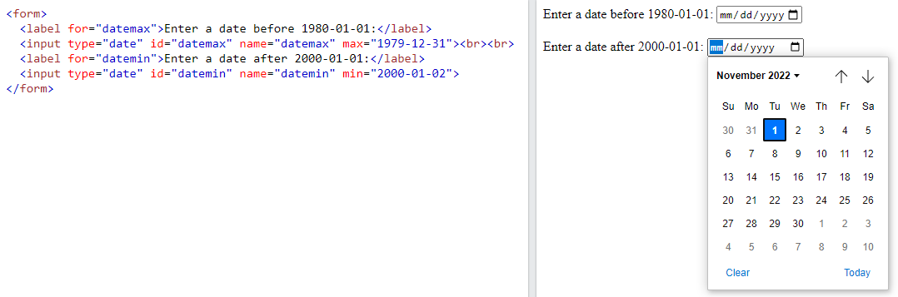

## 1. HTML Computer Code
Máy tính có định dạng và kiểu văn bản duy nhất để hiển thị các thông báo liên quan đến code. Có một số phần tử có sẵn của HTML để đánh dấu mã máy tính:
## 1.1. Thẻ `<code>`
- Thẻ `<code>` được sử dụng để định nghĩa đoạn mã máy tính. Trong quá trình tạo các trang web, đôi khi sẽ cần hiển thị đoạn mã lập trình máy tính.
- Cú pháp: `<code> Nội dung mã máy tính ... </code>`
    <p align = "center">
    
    </p>

*Lưu ý*: Nội dung trong thẻ `<code>` được hiển thị bằng font chữ `monospace` mặc định của trình duyệt. Do đó có một số kích thước và kiểu font chữ khác với thẻ tiêu đề cơ bản hay thẻ đoạn văn. 

## 1.2. Thẻ `<kdb>`
- Thẻ `<kdb>` là một thẻ ngữ pháp và được sử dụng để xác định dữ liệu nhập vào từ bàn phím. 
- Cú pháp: `<kbd> Contents... </kbd>`
 
 VD:<p align = "center">
    
    </p>
- Một số đặc điểm của thẻ `<kbd>`:
    - Nội dung trong thẻ `<kdb>` được hiển thị bằng font chữ `monospace` mặc định của trình duyệt.
    - Có thể đạt những hiệu ứng phong phú hơn với CSS.
    - Không có những thuộc tính thẻ cụ thể trong thẻ này.

## 1.3. Thẻ `<pre>`
- Thẻ `<pre>` được sử dụng để bao ngoài đoạn mã của thẻ `<code>` vì nó giúp cho đoạn mã giữ nguyên định dạng văn bản. Nó sẽ giữa nguyên dấu cách khoảng trông, xuống dòng, tabs, và những ký tự định dạng khác mà bị trình duyệt web bỏ qua. 
- Cú pháp `<pre> Contents... </pre>`
- VD: 
    - Khi không dùng thẻ `<pre>`, trình duyệt web sẽ bỏ qua cách khoảng trắng và xuống dòng.

    <p align = "center">
    
    </p>

    - Khi dùng thẻ `<pre>`, trình duyệt web sẽ giữ nguyên định dạng của nội dung có trong thẻ.
    <p align = "center">
    
    </p>

## 1.4. Thẻ `<samp>`
- Thẻ `<samp>` là một thẻ ngữ nghĩa và được sử dụng để định nghĩa kết quả đầu ra từ một chương trình máy tính. Nội dung trong thẻ `<samp>` được hiển thị bằng font chữ `monospace` mặc định của trình duyệt.
- Cú pháp: `<samp> Contents... </samp>`
## 1.5. Thẻ `<var>` 
- Thẻ `<var>` là một thẻ ngữ nghĩa và được sử dụng để định nghĩa biến trong một biểu thức toán học hoặc một chương trình máy tính. Nội dung trong thẻ này được hiển thị là kiểu chữ in nghiêng trên hầu hết các trình duyệt web.
- Cú pháp: `<var> Contents... </var>`
    <p align = "center">
    
    </p>

# 2. HTML Entities
## 2.1. HTML entities
- HTML cung cấp một số phương pháp để hiển thị các ký tự dành riêng đặc biệt. Các ký tự dành riêng là những ký tự được dành riêng cho ngôn ngữ HTML hoặc những ký tự không có trên bàn phím cơ bản (ví dụ: £, ¥, €, ©,...).
- HTML cung cấp 1 số `tên thực thể (Entity names)` và `số thực thể (Entity numbers`) để sử dụng được những ký tự này.
- Cú pháp: `&entity_name;` hoặc `&#entity_number;`

    VD: Để hiển thị dấu (`<`), chúng ta viết như sau: `&lt;` hoặc `&#60;`
- Một số thực thể ký tự sử dụng trong HTML:
    <p align = "center">
    
    </p>

VD: <p align = "center">
    
    </p>
*Lưu ý:* Việc sử dụng tên thực thể thì dễ nhớ. Nhưng các trình duyệt web không hỗ trợ hết tất cả các tên thực thể, thay vào đó các trình duyệt có thể hỗ trợ số thực thể rất tốt.
## 2.2. `Non-breaking Space`: dấu cách không ngắt
- Nó được sử dụng để cung cấp khoảng trống mà sẽ không ngắt thành một dòng mới. Thực thể này được đại diện bằng ký tự `&nbsp`.
- Hai từ được cách nhau bởi dấu cách không ngắt sẽ dính liền với nhau (không ngắt xuống dòng mới). 

VD: Một thẻ `<p>` sử dụng dấu cách không ngắt, và 1 thẻ `<p>` sử dụng bình thường
```html
<p style="font-size:40px">
    &nbsp;&nbsp;This&nbsp;is&nbsp;a&nbsp;non&nbsp;breaking&nbsp;Sentence&nbsp;&nbsp;&nbsp;!!
</p>
 
<p style="font-size:40px">
          This sentence will be line breaks.
</p>
```
- Kết quả:
    - Ở thẻ `<p>` thứ 2, trước nội dung `This sentence will be line breaks.`, chúng ta thêm rất 3 dấu cách khoảng trắng ở đó, nhưng khi chạy hiển thị trình duyệt tự động xóa 2 dấu cách trong số đó. 
    - Còn ở thẻ `<p>` thứ 1, chúng ta sử dụng dấu cách không ngắt, khi hiển thị trình duyệt vẫn giữ nguyên khoảng trống đó.

    <p align = "center">
    
    </p>

    - Sự khác nhau nữa là, khi ta thay đổi kích thước hiển thị của cửa sổ trang web, thẻ `<p>` thứ 1 các từ vẫn dính với nhau, không bị xuống dòng như thẻ `<p>` thứ 2.

    <p align = "center">
    
    </p>

## 2.3. Kết hợp dấu phụ và chữ
- Dấu phụ là một "glyph" được thêm vào một chữ cái. 
- Các dấu phụ như dấu huyền (`̀) và dấu sắc (́ ) được gọi là dấu trọng âm. Nó có thể xuất hiện cả bên trên và bên dưới một chữ cái, bên trong một chữ cái và giữa hai chữ cái. 
- Dấu phụ có thể được sử dụng kết hợp với các ký tự chữ và số để tạo ra một ký tự không có trong bộ ký tự (mã hóa) được sử dụng trên trang. 
- Đây là danh sách một số dấu phụ.
    <p align = "center">
    
    </p>

# 3. HTML Symbols
- `Symbol (ký hiệu)` là những ký hiệu không có trên bàn phím và có thể được thêm vào tài liệu bằng những thực thể.
## 3.1. Thể thể ký hiệu
- Nhiều `ký hiệu toán học`, `kỹ thuật`, `tiền tệ` không có trên bàn phím cơ bản của chúng ta. Để thêm được những ký hiệu đó vào tài liệu HTML, chúng ta sử dụng tên thực thể hoặc số thực thể (số hệ thập phân hoặc hệ thậ lục phân) cho những ký hiệu đó.

VD: Hiển thị ký hiệu tổng sigma (∑) trong toán học, chúng ta có thể sử dụng 1 trong 3 cách sau (tên thực thể, số thập phân và thập lục phân):
    <p align = "center">
    
    </p>

- Một số ký hiệu toán học được hỗ trợ trong HTML
    <p align = "center">
    
    </p>
    - Có thể tham khảo thêm những ký hiệu toán học khác tại   
    
    [Ký hiệu toán học trong HTML](https://www.w3schools.com/charsets/ref_utf_math.asp)
- Một số ký tự Hy Lạp được hỗ trợ trong HTML
    <p align = "center">
    
    </p>

    - Có thể tham khảo thêm những ký tự Hy Lạp khác tại [Ký tự Hy Lạp trong HTML](https://www.w3schools.com/charsets/ref_utf_greek.asp)

- Một số thực thế khác

    <p align = "center">
    
    </p>

- Có thể tham khảo thêm những ký hiệu khác:  
    
    [Ký hiệu tiền tệ trong HTML](https://www.w3schools.com/charsets/ref_utf_currency.asp)

    [Ký hiệu mũi tên trong HTML](https://www.w3schools.com/charsets/ref_utf_arrows.asp)


# 4. HTML Emojis
- `Emojis (biểu tượng cảm xúc)` là những ký tự thuộc bộ ký tự UTF-8.
- Nó trông giống như những hình ảnh, biểu tượng.
## 4.1. Thuộc tính HTML `charset`
- Để hiển thị một trang HTML 1 cách chính xác, một trình duyệt web phải biết bộ ký tự được sử dụng trên trang web đó.
- Thuộc tính này được định nghĩa trong thẻ `<meta>`:
`<meta charset="UTF-8">`
    - Nếu không được định nghĩa, thì UTF-8 mặc định là bộ ký tự sử dụng trong HTML

## 4.2. Bộ ký tự `UTF-8`
- Nhiều ký tự trong UTF-8 không thể được gõ từ bàn phím, nhưng chúng có thể được hiển thị trên trình duyệt bằng cách sử dụng `số thực thể (entity numbers)`
- Để trình duyệt hiểu được là chúng ta đang muốn hiển thị một ký tự, thì chúng ta phải sử dụng cú pháp sau: `&#` + `entitynumber` + `;`

VD: <p align = "center">
    
    </p>

## 4.3. Biểu tượng cảm xúc (Emojis)
- Biểu tượng cảm xúc là những ký tự từ bộ UTF-8
- VD: <p align = "center">
    
    </p>

- Một số ký hiệu biểu tượng cảm xúc trong UTF-8
    <p align = "center">
    
    </p>
Ngoài ra có thể tham khảo thêm các ký hiệu biểu tượng cảm xúc tại 
[Biểu tượng cảm xúc trong HTML](https://www.w3schools.com/charsets/ref_emoji.asp)

# 5. HTML Charset
## 5.1. Các bộ ký tự HTML
- `ASCII` là bộ ký tự mã hóa tiêu chuẩn đầu tiên. ASCII định nghĩa 128 ký tự khác nhau mà có thể được sử dụng trên Internet: số (0-9), chữ cái (A-Z), và một số ký tự đặc biệt như !, $, +, _ ...
- `ISO-8859-1` là bộ ký tự mặc định cho HTML 4. Bộ mã này hỗ trợ 256 mã ký tự khác nhau. HTML 4 cũng hộ trợ UTF-8.
- `ANSI (Windows-1252)` là bộ ký tự Windows gốc ban đầu. ANSI giống với ISO-8859-1, ngoại trừ ANSI có thêm 32 ký tự.
- **HTML5 khuyến cáo những lập trình viên web sử dụng bộ ký tự UTF-8, vì nó chứa hầu hết tất cả các kí tự và biểu tượng trên thế giới.**

## 5.2. Bộ ký tự ASCII
- Dữ liệu máy tính được lưu trữ dưới dạng mã nhị phân, chỉ bao gồm có số 0, 1.
- Để tiêu chuẩn hóa việc lưu trữ chữ cái, ASCII (American Standard Code for Information Interchange: mã tiêu chuẩn Hoa Kỳ để trao đổi thông tin) đã được tạo ra. Nó định nghĩa một con số nhị phân riêng biệt cho việc lưu trữ các ký tự: số (0-9), chữ cái in hoa và thường (A-Z, a-z), và những ký tự đặc biệt (! $ + - ( ) @ < > ,).
- Vì sử dụng 7 bits, nên ASCII chỉ đại diện cho 128 ký tự khác nhau.
- Điểm yếu lớn nhất của ASCII là nó đã loại trừ những chữ cái không phải tiếng Anh.
- Hiện nay ASCII vẫn còn sử dụng, đặc biệt trong các hệ thống máy tính lớn.
- Một số ký tự trong bộ ASCII và giá trị thiết lập của nó:
    <p align = "center">
    
    </p>
Những ký tự khác có thể tham khảo thêm tại 
[ASCII Character trong HTML](https://www.w3schools.com/charsets/ref_html_ascii.asp)

## 5.3. HTML ISO-8859-1
- ISO-8859-1 là bộ ký tự mặc định trong HTML 4.
- ISO-8859-1 giống bộ ASCII với những giá trị từ 0-127.
- ISO-8859-1 không sử dụng những giá trị từ 128-159.
- Những giá trị mã tiếp theo từ 160-191 của ISO-8859-1 chứa những ký tự đặc biệt thường được sử dụng.
    <p align = "center">
    
    </p>

- Phần tiếp theo của ISO-8859-1 (mã từ 192-255, ngoại trừ 215 và 247) chứa những ký tự được sử dụng ở các nước Tây Âu.
    <p align = "center">
    
    </p>

- Có thể xem chi tiết những ký tự của bộ ISO-8859-1 tại đây:
[ISO-8859-1 Character trong HTML](https://www.w3schools.com/charsets/ref_html_8859.asp)

## 5.4. HTML Windows-1252 (ANSI)
- Windows-1252 là bộ ký tự mặc định của Microsoft Windows. Nó là bộ ký tự phổ biến nhất cỉa Windows từ 1985-1990.
- Nó là một phần mở rộng cho ASCII, với các ký tự quốc tế được thêm vào.

- Nó sử dụng một byte đầy đủ (8-bit) để đại diện cho 256 ký tự khác nhau.

- Vì Windows-1252 đã là mặc định trong Windows nên nó được hỗ trợ bởi tất cả các trình duyệt.
- ANSI giống với ASCII cho các giá trị từ 0 đến 127.
- ANSI có một bộ ký tự độc quyền cho các giá trị từ 128 đến 159.
- ANSI giống với UTF-8 cho các giá trị từ 160 đến 255.
- Có thể xem chi tiết những ký tự của bộ ISO-8859-1 tại đây:
[Windows-1252 Character trong HTML](https://www.w3schools.com/charsets/ref_html_ansi.asp)

## 5.5. HTML Unicode (UTF-8)
- UTF-8 giống với ASCII cho các giá trị từ 0 đến 127.

- UTF-8 không sử dụng các giá trị từ 128 đến 159. 

- UTF-8 giống với cả ANSI và 8859-1 cho các giá trị từ 160 đến 255.

- UTF-8 tiếp tục từ giá trị 256 với hơn 10 000 ký tự khác nhau.
- Có thể xem chi tiết những ký tự của bộ ISO-8859-1 tại đây:
[Windows-1252 Character trong HTML](https://www.w3schools.com/charsets/ref_html_utf8.asp)

# 6. HTML URL Encode (Uniform Resource Locators)
- URL là một cụm từ để chỉ địa chỉ của một trang web.
## 6.1. URL - Uniform Resource Locator
- Trình duyệt web yêu cầu các trang từ máy chủ web bằng cách sử dụng một đường dẫn URL.
- Một đường dẫn URL được dùng để chỉ định đến một tài liệu hay một dữ liệu khác trên trang web.
- Một địa chỉ web sẽ có cú pháp như sau: `scheme://prefix.domain:port/path/filename`. 
Trong đó:

    - `scheme`: định nghĩa loại dịch vụ của Internet (thường là http hoặc https)
    - `prefix`: định nghĩa tiền tố của tên miền (mặc định cho http là www)
    - `domain`: tên miền Internet (vd như google.com)
    - `port`: xác định số cổng của máy chủ (mặc định cho http là 80)
    - `path`: xác định đường dẫn tới máy chủ 
    - `filename`: xác định tên của một tài liệu hoặc tài nguyên 
## 6.2. URL Encoding - mã hóa URL
 - URL chỉ có thể được gửi qua Internet bằng cách sử dụng bộ ký tự ASCII . Nếu một URL chứa các ký tự bên ngoài bộ ASCII, thì URL đó phải được chuyển đổi.

- Mã hóa URL chuyển đổi các ký tự không phải ASCII thành một định dạng có thể được truyền qua Internet.

- Mã hóa URL thay thế các ký tự không phải ASCII bằng "%" theo sau là các chữ số thập lục phân.

- URL không được chứa khoảng trắng. Mã hóa URL thường thay thế khoảng trắng bằng dấu cộng (+) hoặc% 20.

VD: Khi nhập URL đầu vào là `Hello Günter`, trình duyệt sẽ mã hóa nó thành `text=Hello+G%C3%BCnter` trước khi nó được gửi đến máy chủ

 Tham khảo bảng mã hóa ASCII tại [ASCII Encoding trong HTML](https://www.w3schools.com/tags/ref_urlencode.asp)

# 7. HTML Forms
## 7.1. Định nghĩa
- Các phần tử trong form có thể chứa các các kiểu phần tử khác nhau như các ô nhập dữ liệu (`textboxes`), các ô cho người dùng lựa chọn (`checkboxes` hoặc `radio buttons`), các nút cho người dùng kích gửi dữ liệu (`submit buttons`) và nhiều phần tử khác nữa.

- HTML Form là phương tiện cho người dùng nhập dữ liệu được gửi đến máy chủ để xử lý.
- Tại sao sử dụng HTML Form: HTML Form được sử dụng khi chúng ta muốn thu nhập một số dữ liệu của người truy cập trang web. VD như điền thông tin vào đơn đăng ký học online, địa chỉ để giao hàng...
- Khai báo HTML Form:
```html
<form action="server url" method="get|post">  
  //input controls ví dụ: textfield, textarea, radiobutton, button
</form>
```
## 7.2. Thẻ `<form>`
- Thẻ `<form>` được sử dụng để tạo một biểu mẫu HTML cho người dùng nhập dữ liệu vào.
- Bên trong thẻ `<form>` chứa các loại phần tử đầu vào  khác nhau như: `<textfields>`, `<checkboxes>`, `<radiobuttons>`, `submit buttons`, etc. 

## 7.3. Thuộc tính trong Form
### 7.3.1. Thuộc tính `action`
- Thuộc tính `action` định nghĩa hành động sẽ được thực hiện khi một biểu mẫu được gửi đi khi người dùng thực hiện click nút submit.
- Thông thường, dữ liệu biểu mẫu được gửi tới một tập tin trên máy chủ khi người dùng thực hiện click vào nút button.
- VD dưới đây, dữ liệu biểu mẫu được gửi tới một file gọi là "action_page.php" một script chạy ở phía server được xác định để xử lý biểu mẫu đã gửi: `<form action="/action_page.php">`

- *Nếu như thuộc tính `action` được bỏ qua, `action` sẽ được thiết lập tới trang hiện tại*

### 7.3.2. Thuộc tính `target`
- Thuộc tính `target` định nghĩa nơi hiển thị phản hồi sau khi thực hiện click nộp từ biểu mẫu.
- Thuộc tính `target` có thể có một trng những giá trị sau: (giống thẻ link).

    VD:
`<form action="/action_page.php" target="_blank">`

### 7.3.3. Thuộc tính `method`
- Thuộc tính `method` xác định kiểu phương thức HTTP (`GET hoặc POST`) được sử dụng gửi dữ liệu trên biểu mẫu.
- Phương thức HTTP `mặc định` khi gửi dữ liệu biểu mẫu là `GET`.
- VD: 
    - Sử dụng phương thức GET: `<form action="/action_page.php" method="get">` 
    - Sử dụng phương thức POST: `<form action="/action_page.php" method="post">` 

**Khi nào thì sử dụng phương thức POST và phương thức GET**
- Sử dụng `GET`:
    - Sử dụng GET nếu dữ liệu trong biểu mẫu gửi đi không cần mã hóa, không chứa các thông tin nhạy cảm như mật khẩu,...
    - Khi sử dụng GET, dữ liệu có trong biểu mẫu sẽ bị nhìn thấy trên thanh địa chỉ của trang, ví dụ:
    <p align="center">
    
    </p>

    <p align="center">
    
    </p>

    - Đặc điểm của GET: thêm dữ liệu vào thanh địa chỉ URL, theo cặp tên/giá trị như hình ảnh ví dụ bên trên.
    - Chiều dài của một URL bị giới hạn (2048 ký tự).

- Sử dụng `POST`: 
    - Nên sử dụng POST trong trường hợp nếu biểu mẫu cập nhật dữ liệu hoặc dữ liệu trên biểu mẫu gửi đi bao gồm các thông tin nhạy cảm như mật khẩu, mã thẻ ngân hàng,...
    - POST cung cấp cơ chế bảo mật hơn bởi vì dữ liệu được gửi đi không được hiển thị trên thanh địa chỉ của trang.
    - VD:
    <p align="center">
    
    </p>

    <p align="center">
    
    </p>

*Lưu ý:* Luôn sử dụng `POST` nếu dữ liệu trong biểu mẫu chưa những thông tin nhạy cảm và mang tính cá nhân
### 7.3.4. Thuộc tính `autocomplete`
- Thuộc tính tự động hoàn thành chỉ định xem biểu mẫu có nên bật hay tắt tính năng tự động hoàn thành hay không. 
- Khi bật tính năng tự động hoàn thành, trình duyệt sẽ tự động hoàn thành các giá trị dựa trên các giá trị mà người dùng đã nhập trước đó.
VD: `<form action="/action_page.php" autocomplete="on">`
    <p align="center">
    
    </p>

### 7.3.5. Thuộc tính `novalidate`
- Thuộc tính `novalidate` là một thuộc tính `boolean` 
- Khi xuất hiện, nó chỉ định rằng dữ liệu nhập vào  trong biểu mẫu không được xác thực khi nộp.
- VD: `<form action="/action_page.php" novalidate>`

## 7.4. Các phần tử của HTML form
- Bên trong phần tử `<form>` có thể chứa 1 hoặc nhiều phần tử biểu mẫu khác
### 7.4.1. Phần tử `<input>`
- Một trong những phần tử form quan trọng nhất là thẻ `<input>`
- Thẻ `<input>` có thể được hiển thị bằng một vài cách, phụ thuộc vào thuộc tính type.
### 7.4.1.1. `Input Type Text`
- `input type="text"`: định nghĩa một trường nhập dữ liệu trên 1 dòng.
    <p align = "center">
    
    </p>
### 7.4.1.2. `Input Type password`
- `input type="password"`: định nghĩa một trường mật khẩu.
- Ký tự trong một trường mật khẩu được che dấu (mỗi ký tự khi hiển thị sẽ được thay bằng dấu hoa thị hoặc dấu tròn).
    <p align = "center">
    
    </p>

### 7.4.1.3. `Input Type Submit`
- `input type="submit"`: định nghĩa một nút nhấn để gửi dữ liệu nhập trên biểu mẫu (`submiting`) tới một trang khác để xử lý dữ liệu của biểu mẫu này (`form_handler`). Form-handler thường là một trang chạy ở phía server cho phép xử lý dữ liệu nhập. 
- Form-handler được chỉ định trong thuộc tính `action` của form.
    <p align = "center">
    
    </p>
### 7.4.1.4. `Input Type Reset`
- `input type="reset"`: định nghĩa một nút nhấn reset để đặt lại tất cả những giá trị trên biểu mẫu về giá trị mặc định của chúng.
- VD: Khi chúng ta đã nhập dữ liệu vào biểu mẫu như ví dụ dưới đây. Sau đó chúng ta nhấn nút reset trên biểu mẫu thì các trường trên biểu mẫu sẽ được đặt lại thành các giá trị mặc định ban đầu
    - Dữ liệu đã nhập:
    <p align="center">
    
    </p>

    - Dữ liệu sau khi nhấn reset:
    <p align="center">
    
    </p>

### 7.4.1.5. `Input Radio Button`
- `input type="radio"`: định nghĩa một radio button. Các nút radio `chỉ cho phép người sử dụng chọn một` trong một danh sách giới hạn các lựa chọn
    <p align="center">
    
    </p>
### 7.4.1.6. `Input Type Checkbox`
- `<input type="checkbox">`: định nghĩa một checkbox. Checkbox cho phép người dùng `không chọn hoặc chọn nhiều lựa chọn` trong một danh sách giới hạn các lựa chọn.
    <p align="center">
    
    </p>

### 7.4.1.7. `Input Type Button`
- `<input type="button">`: định nghĩa một nút nhấn
    <p align="center">
    
    </p>

### 7.4.1.8. `Input Type Color`
- `<input type="color">`: được sử dụng cho trường đầu vào của biểu mẫu mà tại đó chứa một loại màu.
- Phụ thuộc vào sự hỗ trợ của các trình duyệt (không hỗ trọ cho trình duyệt Internet Explorer 11, Safari 9.1 hoặc các phiên bản trước đấy), một công cụ chọn màu có thể được hiển thị trong một trường đầu vào.

VD: <p align="center">
    
    </p>

### 7.4.1.9. `Input Type Date`
- `<input type="date">`: được sử dụng cho trường đầu vào mà ở đó chứa thông tin với định dạng tháng/ngày/năm (mm/dd/yyyy)
- Có thể sử dụng thuộc tính `max`, `min` để thêm giới hạn cho ngày nhập vào.
VD: <p align="center">
    
    </p>
### 7.4.1.10. `Input Type Email`
- `<input type="email">`: được sử dụng cho trường đầu vào mà tại đó chứa một địa chỉ email.

```html
<form>
  <label for="email">Enter your email:</label>
  <input type="email" id="email" name="email">
</form>
```
- Một số loại điện thoại thông minh yêu cầu loại email phải có thêm đuôi `.com` để phù hợp với dữ liệu email nhập vào.

### 7.4.1.11. `Input Type Image`
- `<input type="image">` định nghĩa một hình ảnh như là một nút gửi (submit).
VD: 
```html
<form>
<input type="image" src="img_submit.gif" alt="Submit" width="48" height="48">
</form>
```
### 7.4.1.12. `Input Type File`
- `<input type="file">` định nghĩa một trường chọn tệp tin và một nút nhấn "Duyệt" để tải tập tin lên.
    <p align="center">
    
    </p>

### 7.4.1.13. `Input Type Hidden`
- `<input type="hidden">` định nghĩa một trường đầu vào bị ẩn đi (người dùng không xem được trường này).
- Một trường ẩn đi thường lưu trữ những gì mà cơ sở dữ liệu ghi lại để cập nhật dữ liệu khi biểu mẫu được gửi đi.  

*Lưu ý:* Khi giá trị trong trường ẩn này không được hiển thị cho người dùng xem trên nội dung của trang web, những nó có thể xem được (và có thể chỉnh sửa) bằng cách sử dụng bất kỳ công cụ phát triển web nào hoặc chức năng "Xem nguồn trang" trên trình duyệt
- Không sử dụng trường đầu vào ẩn cho một biểu mẫu bảo mật.
    <p align="center">
    
    </p>

### 7.4.1.14. `Input Type Number`
- `<input type="number">` định nghĩa một trường nhập số học.
- Chúng ta cũng có thể đặt giới hạn cho những con số nào hợp lệ với thuộc tính `max` và `min`
VD:
```html
<form>
  <label for="quantity">Quantity (between 1 and 5):</label>
  <input type="number" id="quantity" name="quantity" min="1" max="5">
</form>
```

### 7.4.1.15. `Input Type Range`
- `<input type="range">` định nghĩa 1 thanh trượt điều khiển cho việc nhập vào một con số. Giới hạn mặc định của thanh trượt là từ 0-100. Thuy nhiên, chúng ta có thể đặt giới hạn cho thanh trượt đó bằng thuộc tính `max`, `min` và `step`.
VD:
    <p align="center">
    
    </p>

### 7.4.2. Thẻ `<label>`
- Thẻ `<label>` định nghĩa nhãn cho thành phần `<input>`.
- Thẻ `<label>` không hiển thị bất cứ gì đặc biệt cho người dùng, tuy nhiên nó cung cấp một cải thiện cho người sử dụng chuột, nếu click chuột vào nhãn, sẽ đưa con trỏ chuột vào vùng `<input>`.
- Muốn sử dụng hiệu quả `<label>`, cần thiết phải cho giá trị `id` của `<input>` trùng với giá trị `for` của `<label>`

VD: 
```html
<label for="male">Nam</label>: 
<input type="radio" id="male" name="gender" value="" /><br />
<label for="female">Nữ</label>:
<input type="radio" id="female" name="gender" value="" />
```
### 7.4.3. Phần tử `<select>`
- Phần tử `<select>` xác định một danh sách thả xuống
- Phần tử <option> được sử dụng để định nghĩa 1 lựa chọn có thể được chọn trong danh sách.
- Mặc định, lựa chọn đầu tiên trong danh sách là đã được chọn.
- Để định nghĩa một lựa chọn trước, thêm thuộc tính `selected` lựa chọn đấy
VD:
    <p align="center">
    
    </p>

### 7.4.4. Phần tử `<textarea>`
- Phần tử `<textarea>` định nghĩa một trường nhập dữ liệu nhiều dòng (một vùng văn bản).
- Sử dụng thuộc tính rows và cols để chỉ định số lượng dòng và chiều dài của một vùng văn bản có thể nhìn thấy trên trình duyệt.
VD:
    <p align="center">
    
    </p>
- Chúng ta cũng có thể định nghĩa kích thước của vùng văn bản bằng thuộc tính `style` CSS 
```html
<textarea name="message" style="width:200px; height:600px;">
The cat was playing in the garden.
</textarea>
```
### 7.4.5. Phần tử `<fieldset>` và `<legend>`

- Phần tử `<fieldset>` được sử dụng để nhóm các dữ liệu liên quan vào trong một biểu mẫu.
- Phần tử `<legend>` định nghĩa một tiêu đều cho phần tử `<fieldset>`

VD:
    <p align="center">
    
    </p>
### 7.4.6. Phần tử `<datalist>`
- Phần tử `<datalist>` chỉ định danh sách các tùy chọn được xác định trước cho một phần tử `<input>`.

- Người dùng sẽ thấy danh sách thả xuống gồm các tùy chọn được xác định trước khi họ nhập dữ liệu.

- Thuộc tính `list` của phần tử `<input>`, phải tham chiếu đến thuộc tính `id` của phần tử `<datalist>`.

VD:
    <p align="center">
    
    </p>
 
### 7.4.7. Phần tử `<output`
- Phần tử `<output>` đại diện cho kết quả của một phép tính (giống như một phép tính được thực hiện bởi tập lệnh).

VD:
    <p align="center">
    
    </p>
