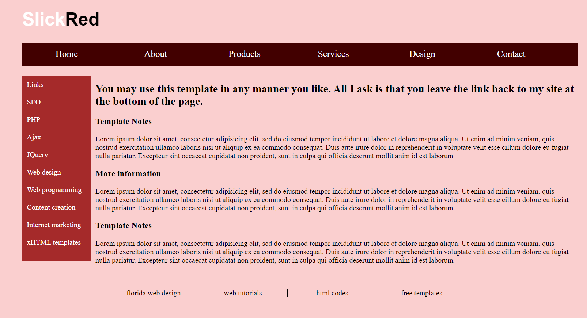
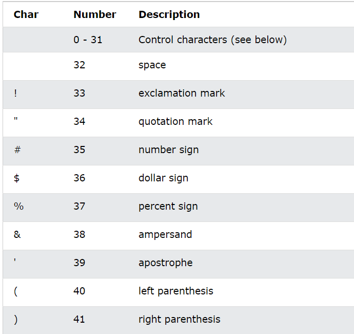

# 0. Contents
1. HTML Classes
2. HTML Id
3. HTML Iframe
4. HTML JavaScript
5. HTML File Path
6. HTML Head
7. HTML Layout
8. HTML Responsive
9. HTML Semantic Elements
10. HTML Style Guide
11. HTML Computer Code
12. HTML Entities
13. HTML Symbols
14. HTML Emojis
15. HTML Charset
16. HTML URL Encode (Uniform Resource Locators)

# 1. HTML Classes

- Thuộc tính HTML `class` thường được sử dụng để định nghĩa tên một class cho một phần tử HTML.
- *Nhiều phần tử HTML có thể có chung tên class*. Vì chúng ta muốn các phần tử này có cùng một cách "đối xử" như nhau về mặt nhìn (về css), nên chúng ta dồn chúng lại thành 1 lớp, gọi là class
- Cách sử dụng thuộc tính `class`:
    - Thường được sử dụng để chỉ tới tên một class trong một style sheet. Nó có thể được sử dụng bởi một JavaScript để truy cập và thao tác với các phần tử với một tên lớp cụ thể  (sẽ được học chi tiết trong phần JavaScript sau).
    - Thuộc tính class được sử dụng trong bất kỳ phần tử HTML nào.
- Cú pháp cho class:
    - Để tạo một class: viết một ký tự dấu `"."`, theo sau là `tên class`. Sau đó, định nghĩa thuộc tính CSS bên trong cặp dấu ngoặc nhọn `{}`.
- Các phần tử HTML có thể có nhiều hơn một tên class. Khai báo các tên class trong phần tử HTML *cách nhau bởi 1 khoảng trắng*. Những phần tử này sẽ nhận được `style` của tất cả các tên `class` đó.
Vd:
    ```html
    <div>
        <button class="btn btn--success ">GO TO NEXT APPOROVAL</button>
        <button class="btn btn--warn">OK</button>
        <button class="btn btn--danger">TRY AGAIN</button>
    </div>
    ```
- Style bằng CSS. Ba button ở ví dụ trên đều có tên class btn giống nhau nên sẽ có CSS giống nhau, chỉ khác nhau ở chỗ CSS cho tên class riêng của từng button (ở đây là khác màu sắc)
    ```css
        .btn{
            display: inline-block; /*nam ngang*/
            background-color: transparent;
            border: none;
            outline: none;
            color: #fff;
            padding: 14px 48px;
            border-radius: 50px;
            min-width: 120px;
            cursor: pointer; /*di chuot vao btn co pointer ban tay*/
            transition: opacity 0.2s ease;
        }
        .btn--success{
            background-color: #71be34;
        }
        .btn--warn{
            background-color: #ffb702;
        }
        .btn--danger{
            background-color: #ff6236;
        }
    ```
<p align = "center">

</p>

# 2. HTML Id

- Thuộc tính HTML `id` được sử dụng để định nghĩa một id riêng biệt cho mỗi phần tử HTML
- *Không thể có 2 phần tử HTML trong một tài liệu HTML có cùng 1 giá trị id.*
VD: Tồn tại 2 thẻ có cùng một giá trị id

```html
<div id="header">
    <h1>YOUR LOGO</h1>
    <span>Use a single layout to create serveral different looks</span>
</div>
<div id="header">
    <ul>
        <li><a href="#">Home</a></li>
        <li><a href="#">About</a></li>
        <li><a href="#">Services</a></li>
        <li><a href="#">Contact Us</a></li>
    </ul>
</div>
```
*Kết quả:* <p align = "center">

</p>

*Giải thích:* Tuy  2 thẻ có `id` giống nhau mà trình duyệt vẫn hiển thị được, điều này được lý giải bởi trình duyệt hiện tại đủ thông minh để cố gắng hiển thị tất cả các thành phần html, nhưng về lý thuyết thì việc cùng `id` sẽ không được phép, nếu cố tình làm vậy sẽ gây lỗi khi thực hiện thao tác với thẻ bằng JS (sẽ được thể hiện trong phần JS).
- Cách sử dụng thuộc tính `id`
    - Giá trị của thuộc tính `id` phải `riêng biệt` trong tài liệu HTML.
    - Thường được sử dụng để chỉ tới tên một class trong một style sheet. Nó có thể được sử dụng bởi một JavaScript để truy cập và thao tác với các phần tử với một id cụ thể.
    - Thuộc tính class được sử dụng trong bất kỳ phần tử HTML nào.
- Cú pháp cho id:
    - Để tạo một class: viết một ký tự dấu `"#"`, theo sau là `tên id`. Sau đó, định nghĩa thuộc tính CSS bên trong cặp dấu ngoặc nhọn `{}`.

- *Quy tắc đặt tên id:* Tên id phải chứa ít nhất một ký tự, không bắt đầu bằng chữ số và không chứa khoảng trắng.
- VD
```html
<div id="tong">
        <div id="header">
    
            <h1>YOUR LOGO</h1>
            <span>Use a single layout to create serveral different looks</span>
        </div>
        <div id="menu">
            <ul>
                <li><a href="#">Home</a></li>
                <li><a href="#">About</a></li>
                <li><a href="#">Services</a></li>
                <li><a href="#">Contact Us</a></li>
            </ul>
        </div>
        <div id="content">
            
            <div id="content-right">
                <h2>About</h2>
                <p>Lorem ipsum dolor sit, amet consectetur adipisicing elit. .</p>
            </div>
        </div>
        <div id="footer">
            <ul>
                <li><a href="#">About us</a></li>
                <li><a href="#">How we work</a></li>
                <li><a href="#">Testimonials</a></li>
                <li><a href="#">Contact Support</a></li>
            </ul>
            <div id="footer-right">
                <h3>How we work</h3>
                <p>Lorem ipsum dolor sit amet, consectetur adipisicing elit.
                </p>
                <p>Lorem ipsum dolor sit amet, consectetur adipisicing elit.
                </p>
                <p>Lorem ipsum dolor sit amet, consectetur adipisicing elit.
                </p>
            </div>
        </div>
    </div>
```
- CSS
```css
#menu ul li a {
    text-decoration: none;
    color: white;
}
#content {
    display: flex;
    justify-content: space-between;
    background-color: rgb(99, 139, 129);
}
#content img {
    width: 25%;
}
#content #content-right {
    width: 65%;
    color: white;
}
#content #content-right h2 {
    font-size: 30px;
    margin-left: -72px;
}
#content #content-right p {
    line-height: 1.3em;
    text-align: left;
    margin-left: -72px;
}
```
<p align = "center">

</p>

##  *Điểm khác nhau giữa HTML `class` và `id` là: tên một `class` có thể được sử dụng cho nhiều phần tử HTML khác nhau, còn tên một `id` chỉ có thể sử dụng cho 1 phần tử HTML trong cùng một tài liệu HTML* 

# 3. HTML Iframe
- HTML Iframe được sử dụng để hiển thị một trang web trong một trang web.
- Thẻ `<iframe>` định nghĩa một khung nội tuyến (inline frame). Một khung nội tuyến được sử dụng để nhúng một tài liệu khác vào trong một tài liệu HTML hiện tại.
- Cú pháp: `<iframe src="url" title="description"></iframe>`

- Iframe - Width & Height
    - Sử dụng thuộc tính width & height để xác định kích thước của `iframe`.
    - Cũng có thể thêm thuộc tính style vào thẻ `<iframe>` và sử dụng thuộc tính width, height của CSS.
```html
<iframe src="demo_iframe.htm" style="height:200px;width:300px;" title="Iframe Example"></iframe>
```
- Xóa bỏ border của Iframe
    - Mặc định, một `iframe` có một đường viền bao quanh nó. Để xóa đường viền này, thêm thuộc tính style và sử dụng thuộc tính `border` của CSS với giá trị là `none`.

```html
<iframe src="demo_iframe.htm" style="border:none;" title="Iframe Example"></iframe>
```

- Iframe - Target for a link
    - Một `iframe` có thể được sử dụng để làm khung hiển thị cho một liên kết. 
    - Thuộc tính `target` của thẻ liên kết `<a>` phải tham chiếu tới thuộc tính name của iframe. 

    <p align = "center">
    
    </p>

# 4. HTML JavaScript
- `JavaScript` là ngôn ngữ lập trình phổ biến dùng để tạo ra các trang web tương tác. Được tích hợp và nhúng vào HTML giúp website trở nên sống động hơn. JavaScript đóng vai trò như một phần của trang web, thực thi cho phép `Client-Side Script` từ phía người dùng cũng như phía máy chủ (Nodejs) tạo ra các trang web động.
- Thẻ HTML `<script>`
    - Thẻ `<script>` được sử dụng để định nghĩa một `client-side script (kịch bản phía máy khách.)`
    - Phần tử `<script>` chứa các câu lệnh `script` hoặc nó trỏ đến một tệp `script` bên ngoài thông qua thuộc tính `src`.
    - Để chọn một phần tử HTML, JavaScript thường sử dụng phương thức `document.getElementById()`.
    ```html
    <script>
    document.getElementById("demo").innerHTML = "Hello JavaScript!";
    </script>
    ```
   
- JavaScript có thể thay đổi nội dung, style, thuộc tính của các phần tử HTML.

    ```html
    <p id="demo">This is a demonstration.</p>

    <script>
    function myFunction() { 
    document.getElementById("demo").innerHTML = "Hello JavaScript!";
    }
    </script>
    ```

    - Ví dụ trên, JS sẽ thay đổi nội dung trong thẻ `<p>` có `id là demo` từ `This is a demostration.` thành `Hello JavaScript!`

- Thẻ HTML `<noscript>` xác định nội dung thay thế sẽ được hiển thị cho người dùng đã tắt `script` trong trình duyệt của họ hoặc có trình duyệt không hỗ trợ `script`.

- Có thể giữ mã JavaScript trong một tệp riêng biệt và sau đó đưa vào bất kỳ nơi nào cần thiết hoặc có thể xác định chức năng bên trong chính tài liệu HTML.
## 4.1. External JavaScript
- Nếu xác định một chức năng sẽ được sử dụng trong các tài liệu HTML khác nhau thì tốt hơn nên giữ chức năng đó trong một tệp JavaScript riêng và sau đó đưa tệp đó vào các tài liệu HTML. Một tệp JavaScript sẽ có phần mở rộng là `.js` và nó sẽ được bao gồm trong các tệp HTML bằng thẻ `<script>`.
    ```html
    <head>
        <title>External JS</title>
        <script type="text/javascript" src="my-scripts.js">
        </script>
    </head>
    ```
- Ưu điểm của phương pháp `External Javascript`:
    - Có thể viết một kịch bản Javascript dài và phức tạp.
    - Việc tách biệt nơi lưu trữ code Javascript và HTML giúp code trở nên gọn gàng hơn.
    - Tận dụng cơ chế caching của trình duyệt để giúp trang HTML có tốc độ load và render nhanh hơn.
    - Code Javascript có thể xuất ra dạng nén (.min.js) để có dung lượng nhỏ nhất có thể, từ đó cải thiện tốc độ load trang ở hầu hết các website hiện nay.
- Nhược điểm:
    - Tốn nhiều thao tác & bước thực hiện nhất.
    - Nếu xảy ra lỗi code Javascript, sẽ tốn thời gian để xác định dòng code lỗi đó đang nằm trên tập tin nào.
## 4.2. Internal JavaScript
- Có thể viết mã tập lệnh trực tiếp vào tài liệu HTML. Thông thường, sẽ giữ mã tập lệnh trong tiêu đề của tài liệu bằng thẻ `<script>`, nếu không thì có thể đặt mã nguồn của mình ở bất kỳ đâu trong tài liệu nhưng vẫn phải trong thẻ `<script>`.
- Không giới hạn số lượng câu lệnh JS
    ```html
    <head>
    <script type="text/javascript">
        document.addEventListener("DOMContentLoaded", function(event) { 
            alert('External Javascript đã hoạt động');
        });
        </script>
    </head>
    ```
- Ưu điểm:
    - Có thể viết một kịch bản Javascript dài và phức tạp.

    - Tốn ít thao tác thực hiện hơn so với External Javascript
- Nhược điểm:
    - Khó có thể viết một kịch bản Javascript với số lượng lớn dòng code bởi làm thế sẽ khiến file HTML trở nên rất dài và nặng.
    - Khó quan sát, quản lý cũng như nâng cấp code.

**Kết luận:** Giữa việc viết mã lệnh trong tập tin JavaScript và viết trực tiếp vào trang web thì chúng ta nên dùng cách viết mã lệnh trong tập tin JavaScript (`External JS`). Bởi vì đối với những chương trình lớn khoảng vài trăm hoặc vài nghìn dòng, việc viết vào tập tin JavaScript sẽ giúp ta dễ quan sát, quản lý cũng như cập nhật nâng cấp mã nguồn hơn.
# 5. HTML File Path: đường dẫn tệp
- Đường dẫn tệp mô tả vị trí của tệp trong cấu trúc thư mục của trang web.
- Đường dẫn tệp được sử dụng khi liên kết tới những file bên ngoài trang hiện tại như: hình ảnh, style sheets,...
- Có 2 đường dẫn tệp là `đường dẫn tuyệt đối` và `đường dẫn tương đối`.  

Hai loaị đường dẫn này đã được trình bày trong phần HTML Images. Ở đây chúng ta sẽ nói thêm về ý nghĩa 1 số ký hiệu đường dẫn tương đối.  
VD:
- ``: ý nghĩa - picture.jpg đặt trong thư mục images trong thư mục hiện tại.

- ``: ý nghĩa - picture.jpg đặt trong thư mục images ở thư mục gốc của trang web hiện tại.
- ``: ý nghĩa - picture.jpg đặt trong thư mục tăng một cấp so với thư mục hiện tại.
# 6. HTML Head
Phần tử HTML `<head>` là vùng chứa cho các phần tử sau : `<title>`, `<style>`, `<meta>`, `<link>`, `<script>`, `<base>`.

```html
<head>
    <meta charset="UTF-8">
    <meta name="viewport" content="width=device-width, initial-scale=1.0">
    <title>A Meaningful Page Title</title>
    <base href="https://www.w3schools.com/" target="_blank">
    <link rel="stylesheet" href="mystyle.css">
    <style>
        body {background-color: powderblue;}
        h1 {color: red;}
        p {color: blue;}
    </style>
    <script>
        function myFunction() {
        document.getElementById("demo").innerHTML = "Hello JavaScript!";
        }
    </script>
</head>
```
## 6.1. Phần tử HTML `<head>`
- Phần tử `<head>` là vùng chứa siêu dữ liệu `meta` (dữ liệu về dữ liệu) và được đặt giữa thẻ `<html>` và thẻ `<body>`.

- Siêu dữ liệu HTML là dữ liệu về tài liệu HTML. Siêu dữ liệu không được hiển thị trên trình duyệt.

- Siêu dữ liệu thường `xác định tiêu đề tài liệu, bộ ký tự, kiểu, tập lệnh và các thông tin meta khác.`

## 6.2. Phần tử HTML `<title>`
- Phần tử `<title>` xác định tiêu đề của tài liệu. Tiêu đề phải ở dạng văn bản và nó được hiển thị trên thanh tiêu đề của trình duyệt hoặc trong tab của trang.

- Phần tử `<title>` này là bắt buộc trong các tài liệu HTML!

- Nội dung của tiêu đề trang rất quan trọng đối với việc tối ưu hóa công cụ tìm kiếm (SEO)! Tiêu đề trang được sử dụng bởi các thuật toán của công cụ tìm kiếm để quyết định thứ tự khi liệt kê các trang trong kết quả tìm kiếm.

- Phần tử `<title>`:

    - Xác định tiêu đề trong thanh công cụ của trình duyệt.
    - Cung cấp tiêu đề cho trang khi nó được thêm vào mục yêu thích.
    - Hiển thị tiêu đề cho trang trong kết quả của công cụ tìm kiếm.

## 6.3. Phần tử `<style>` HTML
- Phần tử `<style>` được sử dụng để xác định thông tin style cho một trang HTML:
## 6.4. Phần tử `<link>` HTML
- Phần tử `<link>` xác định mối quan hệ giữa tài liệu hiện tại và tài nguyên bên ngoài.

- Thẻ `<link>` thường được sử dụng nhất để liên kết với các trang định kiểu bên ngoài
## 6.5. Phần tử HTML `<script>`
- Phần tử `<script>` được sử dụng để xác định JavaScripts phía máy khách.
## 6.6. Phần tử HTML `<base>`
- Phần tử `<base>` chỉ định URL cơ sở và (hoặc) target cho tất cả các URL tương đối trong một trang.

- Thẻ `<base>` phải có một `href` hoặc một thuộc tính đích hoặc cả hai.

- Chỉ có thể có một phần tử `<base>` duy nhất trong một tài liệu!
## 6.7. Phần tử HTML `<meta>`
- Phần tử `<meta>` này thường được sử dụng để chỉ định bộ ký tự, mô tả trang, từ khóa, tác giả của tài liệu và cài đặt chế độ xem.

- Siêu dữ liệu sẽ không được hiển thị trên trang, nhưng được sử dụng bởi các trình duyệt (cách hiển thị nội dung hoặc tải lại trang), bởi các công cụ tìm kiếm (từ khóa) và các dịch vụ web khác.

Ví dụ các chức năng của thẻ `<meta>`:
- Xác định bộ ký tự được sử dụng:
```html
<meta charset="UTF-8">
```
- Xác định từ khóa cho công cụ tìm kiếm:
```html
<meta name="keywords" content="HTML, CSS, JavaScript">
```
- Xác định mô tả về trang web của bạn:
```html
<meta name="description" content="Free Web tutorials">
```
- Xác định tác giả của một trang:
```html
<meta name="author" content="John Doe">
```
- Làm mới tài liệu sau mỗi 30 giây:
```html
<meta http-equiv="refresh" content="30">
```
- Đặt chế độ xem để làm cho trang web trông thích hợp trên tất cả các thiết bị:
```html
<meta name="viewport" content="width=device-width, initial-scale=1.0"
```

# 7. HTML Layout - Bố cục
- Các trang web thường hiển thị nội dung theo bố cục trong nhiều cột (giống như các tờ báo).
## 7.1. Bố cục của HTML
- HTML có một số yếu tố ngữ nghĩa xác định các thành phần khác nhau của một trang web:
    <p align = "center">
    
    </p>

    <p align = "center">
    
    </p>

    - `<header>`: Xác định tiêu đề cho một tài liệu hoặc một phần
    - `<nav>`: Xác định một tập hợp các liên kết điều hướng
    - `<section>`: Xác định một phần trong tài liệu
    - `<article>`: Xác định một nội dung độc lập, khép kín
    - `<aside>`: Xác định nội dung ngoài nội dung (như một thanh bên)
    - `<footer>`: Xác định chân trang cho một tài liệu hoặc một phần
    - `<details>`: Xác định các chi tiết bổ sung mà người dùng có thể mở và đóng theo yêu cầu
    - `<summary>`: Xác định tiêu đề cho phần tử `<details>`

## 7.2. Các kỹ thuật tạo bố cục HTML
- Có 4 kỹ thuật khác nhau để tạo bố cục nhiều cột:  

    - CSS framework
    - Thuộc tính `float` CSS
    - CSS flexbox
    - CSS grid (lưới CSS)

# 8. HTML Responsive
## 8.1. Định nghĩa
- `Responsive` là một tính từ để chỉ một website có thể hiển thị nội dung tương thích trên mọi kích thước hiển thị của trình duyệt (ví dụ trên laptop, máy tính bảng hay điện thoại).
- `Responsive Web Design` (RWD) là xu hướng mới theo đó quy trình thiết kế và phát triển web sẽ đáp ứng mọi thiết bị và môi trường của người dùng theo các tiêu chí kích thước và chiều của màn hình thiết bị. 
- Responsive Web Design được tạo nên từ 3 thành phần cơ bản:

    - Flexible Grid based layout
    - Media Queries
    - Flexible Media

## 8.2.Tại sao cần Responsive Web Design
- Giúp tiết kiệm rất nhiều thời gian và chi phí khi mà không cần phải duy trì từng phiên bản web khác nhau cho điện thoại và máy tính
- `Responsive Web Desig`n giúp cải thiện SEO (search ranking) cho trang web khi mà mọi luồng đều chỉ dẫn đến một địa chỉ URL duy nhất thay vì nhiều URL khác nhau.
- `Responsive Design` giúp dễ dàng bảo trì trang web khi mà nó `không liên quan gì đến phía server`, chỉ việc thay đổi html và css để thay đổi giao diện hoặc bố cục thích hợp với các thiết bị khác nhau.
## 8.3. Cách áp dụng Responsive lên website
### 8.3.1. Flexible Grid based layout
Khai báo `meta viewport`
- `Viewport` là khung hình người dùng nhìn thấy trên thiết bị của họ khi vào một trang web bất kì. 
- Đặt thẻ `<meta>` dưới đây vào trong cặp thẻ `<head>` của tài liệu HTML  
    `<meta name="viewport" content="width=device-width, initial-scale=1">`  
    - `meta viewport` nghĩa là một thẻ thiết lập cho trình duyệt hiển thị tương ứng với kích thước màn hình. Chẳng hạn như ví dụ trên, có nghĩa là chúng ta sẽ thiết lập trình duyệt hiển thị cố định và tương ứng trên tất cả các thiết bị dựa vào chiều rộng của thiết bị (`device-width`) và không cho phép người dùng phóng to (thiết lập `initial-scale` với giá trị cố định là 1). 

    <p align = "center">
    
    </p>
### 8.3.2. Sử dụng kỹ thuật CSS
### a. Media Queries
- `Media Queries` là một kỹ thuật CSS được giới thiệu trong CSS3. Ta sử dụng cú pháp `@media` để bao gồm một khối các thuộc tính CSS chỉ khi một điều kiện nhất định là đúng. Nói một cách đơn giản là ta sẽ định nghĩa CSS riêng cho một nhóm các thiết bị có kích thước giống nhau.

- `Media Queries` có thể được sử dụng trực tiếp trong thẻ HTML hoặc viết bên trong file css. (*Nên sử dụng `@media` bên trong css để tránh việc phải viết lặp lại nhiều lần*).

    `@media all and (max-width: 1024px) {...}`

    `@media only screen and (orientation: portrait) {...}`

- Các thuộc tính trong Media Queries  

    - `Height & Width`: Chiều cao và chiều rộng của viewport được chỉ định qua từ khóa height và width. Giá trị của height hoặc width có thể là đơn vị độ dài, tương đối hoặc tuyệt đối. Chúng còn thường được đi kèm với các tiền tố min và max để xác định giới hạn màn hình mà các truy vấn được áp dụng. VD - `@media all and (min-width: 320px) and (max-width: 780px) {...}`
    - `Orientation: Portrait / Landscape`: Media queries còn được sử dụng để xác định hướng của browser thiết bị sử dụng từ khóa orientation, cho phép ta xác định thiết bị đang được xem nằm ở `hướng dọc (portrait)` hay `ngang (landscape)`. VD - `@media all and (orientation: landscape) {...}`
    - `Aspect Ratio`: `Tỉ lệ khung hình (aspect ratio)` trong media queries cho phép ta chỉ định tỉ lệ chiều rộng\chiều cao của thiết bị mà truy vấn được áp dụng . `@media all and (min-device-aspect-ratio: 16/9) {...}`

- *`Nguyên tắc Mobile First trong Responsive`*: Moble First nghĩa là luôn thiết kế ứng dụng cho màn hình mobile trước rồi mới đến các màn hình lớn dần. (Điều này giúp trang web hiển thị nhanh hơn trên các thiết bị màn hình nhỏ hơn) 
    ```css
        /*Smart phone nhỏ*/
        @media screen and (min-width: 240px){

        }
        /*Iphone(480 x 640)*/
        @media screen and (min-width: 320px){

        }
        /*Tablet nhỏ(480 x 640)*/
        @media screen and (min-width: 480px){

        }
        /*Ipad dọc(768 x 1024)*/
        @media screen and (min-width: 768px){

        }
        /*Ipad ngang(1024 x 768)*/
        @media screen and (min-width: 1024px){

        }
    ```

### b. Flexible Media
- Khi mà `viewport` thay đổi kích thước thì các đa phương tiện (ảnh, video,..) cũng cần có khả năng thay đổi sao cho phù hợp.
- Một cách thông dụng là thiết lập `width là 100%` cùng với `height: auto`. Khi đó ảnh hoặc video sẽ thay đổi chiều rộng và chiều cao sao cho phù hợp với độ dãn của màn hình.
```html

```
- Nếu muốn ảnh hoặc video thay đổi theo viewport nhưng không quá kích thước gốc của nó ta có thể sử dụng thuộc tính `max-width`:  
```html 

```
- Nếu muốn thay đổi cả kích thước của chữ theo kích thước của cửa sở trình duyệt, chúng ta có thể sử dụng đơn vị cho kích thước chữ `vw` (`vw` viết tắt của `viewpoth width`):
```html
<h1 style="font-size:10vw">Hello World</h1>
```

### 8.4. Responsive Web Design - Frameworks
-  W3.CSS
- Bootstrap

# 9. HTML `semantic` elements: phần tử ngữ nghĩa
- Phần tử ngữ nghĩa là những phần tử mô tả rõ ràng ý nghĩa về cấu trúc của phần tử đó đối với các trình duyệt và lập trình viên. Nói một cách dễ hiểu hơn có nghĩa là chỉ cần đọc tên các element này là chúng ta có thể hiểu được nội dung bên trong element này nói về cái gì.
- Hiện nay có rất nhiều website vẫn đang thiết kế dựa trên các mã HTML như sau để tạo giao diện có `menu điều hướng (nav)`, `đầu trang (header)` và `cuối trang (footer)`:
    ```html
    <div class="header"> <div id="footer">
    ```

- Tuy nhiên, HTML5 cung cấp các phần tử ngữ nghĩa mới để xác định rõ từng phần khác nhau của một trang web, ngữ nghĩa của các phần tử này sẽ rõ hơn so với thẻ `<div>`:
    ```html
    <article>, <aside>, <details>, <figcaption>, <figure>,
    <footer>, <header>, <main>, <mark>,
    <nav>, <section>, <summary>, <time> 
    ```

## 9.1. Các phần tử ngữ nghĩa trong HTML
### 9.1.1. Phần tử HTML `<section>`
- Phần tử `<section>` xác định một phần trong tài liệu.

- Theo tài liệu HTML của W3C: "Phần là một nhóm nội dung theo chủ đề, thường có một tiêu đề."

- Ví dụ về nơi một phần tử `<section>` có thể được sử dụng:

    - Chương
    - Giới thiệu
    - Mục tin tức
    - Thông tin liên lạc

### 9.1.2. Phần tử HTML `<article>` 
- Phần tử `<article>` chỉ định nội dung độc lập, và chứa nội dung của riêng nó. Nội dung bên trong `<article>` có ý nghĩa riêng biệt và có thể độc lập với các nội dung khác của trang web.

- Một bài báo nên tự nó có ý nghĩa và có thể phân phối nó một cách độc lập với phần còn lại của trang web.

- Ví dụ về nơi phần tử `<article>` có thể sử dụng:

    - Bài đăng trên diễn đàn
    - Bài đăng trên blog
    - Ý kiến ​​người sử dụng
    - Thẻ sản phẩm
    - Các bài báo

### 9.1.3 Phần tử HTML `<header>`
- Phần tử `<header>` đại diện cho một vùng chứa cho nội dung giới thiệu hoặc một tập hợp các liên kết điều hướng.

- Một phần tử `<header>` thường chứa:

    - Một hoặc nhiều phần tử tiêu đề (`<h1>` - `<h6>`)
    - Logo hoặc biểu tượng
    - Thông tin về quyền tác giả

*Lưu ý*: Chúng ta có thể có nhiều phần tử `<header>` trong một tài liệu HTML. Tuy nhiên, không thể đặt `<header>` trong một phần tử `<footer>`, `<address>`, hay một `<header>` khác.

### 9.1.4. Phần tử HTML `<footer>`
- Phần tử `<footer>` xác định chân trang cho tài liệu hoặc một phần trong tài liệu.

- Một phần tử `<footer>` thường chứa:

    - Thông tin về quyền tác giả
    - Thông tin bản quyền
    - Thông tin liên lạc
    - Sơ đồ trang web
    - Quay lại liên kết đầu
    - Tài liệu liên quan
- Có thể có nhiều phần tử `<footer>` trong một tài liệu.

### 9.1.5. Phần tử HTML `<nav>`
- Phần tử `<nav>` xác định một tập hợp các liên kết điều hướng.

*Lưu ý*:  `KHÔNG` phải tất cả các liên kết của một tài liệu phải nằm bên trong một phần tử `<nav>`. Phần tử `<nav>` này chỉ dành cho các khối liên kết điều hướng chính.
    <p align = "center">
    
    </p>

### 9.1.6. Phần tử HTML `<aside>`
- Phần tử `<aside>` xác định một số nội dung ngoài nội dung mà được đặt trong trang (như một thanh bên).

- Nội dung `<aside>` cần liên quan gián tiếp đến nội dung xung quanh có trên trang.
    <p align = "center">
    
    </p>
### 9.1.7. Phần tử HTML `<figure>` và `<figcaption>`
- Phần tử `<figure>` chỉ định nội dung độc lập, như hình minh họa, sơ đồ, ảnh, danh sách mã, v.v.

- Phân tử `<figcaption>` xác định chú thích cho một phần tử `<figure>`. Phần tử `<figcaption>` có thể được đặt làm phần tử con đầu tiên hoặc cuối cùng của một `<figure>`.

    <p align = "center">
    
    </p>

# 10. HTML Style Guide
Tài liệu HTML được viết theo một quy tắc nhất quán, gọn gàng giúp cho người đọc dễ hiểu hơn.  

Một số quy tắc hướng dẫn để tạo 1 tài liệu HTML tốt:
- Luôn khai báo loại tài liệu là dòng đầu tiên trong tài liệu HTML: `<!DOCTYPE html>`
- Nên sử dụng tên phần tử được viết bằng chữ thường.
- Có thẻ đóng của tất cả các phần tử trong HTML: `<p></p>`; `<h1></h1>`,...
- Sử dụng tên thuộc tính được viết bằng chữ thường: `style`, `href`, `src`,...
- Luôn chỉ định thuộc tính `alt`, `width` và `height` cho hình ảnh: `` 
- HTML cho phép khoảng trắng xung quanh các dấu bằng. Nhưng không gian ít hơn sẽ dễ đọc hơn và nhóm các thực thể lại với nhau tốt hơn. Vd: Cách viết  `<link rel="stylesheet" href="styles.css">` tốt hơn `<link rel = "stylesheet" href = "styles.css">`
- Tránh các dòng mã dài, không thuận tiên khi phải cuộn sang trái-phải để đọc code.
- Không thêm dòng trống, khoảng trắng hoặc thụt lề mà không có lý do.
- Không bao giờ bỏ qua phần tử `<title>`. Nội dung của tiêu đề trang rất quan trọng đối với việc tối ưu hóa công cụ tìm kiếm (SEO)! Tiêu đề trang được sử dụng bởi các thuật toán của công cụ tìm kiếm để quyết định thứ tự khi liệt kê các trang trong kết quả tìm kiếm.
- Luôn bao gồm thuộc tính `lang` bên trong thẻ `<html>`, để khai báo ngôn ngữ của trang Web. Điều này có nghĩa là để hỗ trợ các công cụ tìm kiếm và trình duyệt.
- Đặt chế độ xem viewport.


# 11. HTML Computer Code
## 11.1. Thẻ `<code>`
- Thẻ `<code>` được sử dụng để định nghĩa đoạn mã máy tính. Trong quá trình tạo các trang web, đôi khi sẽ cần hiển thị đoạn mã lập trình máy tính.
- Cú pháp: `<code> Nội dung mã máy tính ... </code>`
    <p align = "center">
    
    </p>

*Lưu ý*: Nội dung trong thẻ `<code>` được hiển thị bằng font chữ `monospace` mặc định của trình duyệt. Do đó có một số kích thước và kiểu font chữ khác với thẻ tiêu đề cơ bản hay thẻ đoạn văn. 

## 11.2. Thẻ `<kbd>`
- Thẻ `<kbd>` là một thẻ ngữ pháp và được sử dụng để xác định dữ liệu nhập vào từ bàn phím. 
- Cú pháp: `<kbd> Contents... </kbd>`
 
     VD:<p align = "center">
    
    </p>
- Một số đặc điểm của thẻ `<kbd>`:
    - Nội dung trong thẻ `<kbd>` được hiển thị bằng font chữ `monospace` mặc định của trình duyệt.
    - Có thể đạt những hiệu ứng phong phú hơn với CSS.
    - Không có những thuộc tính thẻ cụ thể trong thẻ này.

## 11.3. Thẻ `<pre>`
- Thẻ `<pre>` được sử dụng để bao ngoài đoạn mã của thẻ `<code>` vì nó giúp cho đoạn mã giữ nguyên định dạng văn bản. Nó sẽ giữa nguyên dấu cách khoảng trông, xuống dòng, tabs, và những ký tự định dạng khác mà bị trình duyệt web bỏ qua. 
- Cú pháp `<pre> Contents... </pre>`
- VD: 
    - Khi không dùng thẻ `<pre>`, trình duyệt web sẽ bỏ qua cách khoảng trắng và xuống dòng.

    <p align = "center">
    
    </p>

    - Khi dùng thẻ `<pre>`, trình duyệt web sẽ giữ nguyên định dạng của nội dung có trong thẻ.
    <p align = "center">
    
    </p>

## 11.4. Thẻ `<samp>`
- Thẻ `<samp>` là một thẻ ngữ nghĩa và được sử dụng để định nghĩa kết quả đầu ra từ một chương trình máy tính. Nội dung trong thẻ `<samp>` được hiển thị bằng font chữ `monospace` mặc định của trình duyệt.
- Cú pháp: `<samp> Contents... </samp>`
## 11.5. Thẻ `<var>` 
- Thẻ `<var>` là một thẻ ngữ nghĩa và được sử dụng để định nghĩa biến trong một biểu thức toán học hoặc một chương trình máy tính. Nội dung trong thẻ này được hiển thị là kiểu chữ in nghiêng trên hầu hết các trình duyệt web.
- Cú pháp: `<var> Contents... </var>`
    <p align = "center">
    
    </p>

# 12. HTML Entities
## 12.1. HTML entities
- HTML cung cấp một số phương pháp để hiển thị các ký tự dành riêng đặc biệt. Các ký tự dành riêng là những ký tự được dành riêng cho ngôn ngữ HTML hoặc những ký tự không có trên bàn phím cơ bản (ví dụ: £, ¥, €, ©,...).
- HTML cung cấp 1 số `tên thực thể (Entity names)` và `số thực thể (Entity numbers`) để sử dụng được những ký tự này.
- Cú pháp: `&entity_name;` hoặc `&#entity_number;`

    VD: Để hiển thị dấu (`<`), chúng ta viết như sau: `&lt;` hoặc `&#60;`
- Một số thực thể ký tự sử dụng trong HTML:
    <p align = "center">
    
    </p>

VD: <p align = "center">
    
    </p>
*Lưu ý:* Việc sử dụng tên thực thể thì dễ nhớ. Nhưng các trình duyệt web không hỗ trợ hết tất cả các tên thực thể, thay vào đó các trình duyệt có thể hỗ trợ số thực thể rất tốt.
## 12.2. `Non-breaking Space`: dấu cách không ngắt
- Nó được sử dụng để cung cấp khoảng trống mà sẽ không ngắt thành một dòng mới. Thực thể này được đại diện bằng ký tự `&nbsp`.
- Hai từ được cách nhau bởi dấu cách không ngắt sẽ dính liền với nhau (không ngắt xuống dòng mới). 

VD: Một thẻ `<p>` sử dụng dấu cách không ngắt, và 1 thẻ `<p>` sử dụng bình thường
```html
<p style="font-size:40px">
    &nbsp;&nbsp;This&nbsp;is&nbsp;a&nbsp;non&nbsp;breaking&nbsp;Sentence&nbsp;&nbsp;&nbsp;!!
</p>
 
<p style="font-size:40px">
          This sentence will be line breaks.
</p>
```
- Kết quả:
    - Ở thẻ `<p>` thứ 2, trước nội dung `This sentence will be line breaks.`, chúng ta thêm 3 dấu cách khoảng trắng ở đó, nhưng khi chạy hiển thị trình duyệt tự động xóa 2 dấu cách trong số đó. 
    - Còn ở thẻ `<p>` thứ 1, chúng ta sử dụng dấu cách không ngắt, khi hiển thị trình duyệt vẫn giữ nguyên khoảng trống đó.

    <p align = "center">
    
    </p>

    - Sự khác nhau nữa là, khi ta thay đổi kích thước hiển thị của cửa sổ trang web, thẻ `<p>` thứ 1 các từ vẫn dính với nhau, không bị xuống dòng như thẻ `<p>` thứ 2.

    <p align = "center">
    
    </p>

## 12.3. Kết hợp dấu phụ và chữ
- Dấu phụ là một "glyph" được thêm vào một chữ cái. 
- Các dấu phụ như ``dấu huyền (`)`` và `dấu sắc (́ )` được gọi là dấu trọng âm. Nó có thể xuất hiện cả bên trên và bên dưới một chữ cái, bên trong một chữ cái và giữa hai chữ cái. 
- Dấu phụ có thể được sử dụng kết hợp với các ký tự chữ và số để tạo ra một ký tự không có trong bộ ký tự (mã hóa) được sử dụng trên trang. 
- Đây là danh sách một số dấu phụ.
    <p align = "center">
    
    </p>

# 13. HTML Symbols
- `Symbol (ký hiệu)` là những ký hiệu không có trên bàn phím và có thể được thêm vào tài liệu bằng những thực thể.
## 13.1. Thực thể ký hiệu
- Nhiều `ký hiệu toán học`, `kỹ thuật`, `tiền tệ` không có trên bàn phím cơ bản của chúng ta. Để thêm được những ký hiệu đó vào tài liệu HTML, chúng ta sử dụng tên thực thể hoặc số thực thể (số hệ thập phân hoặc hệ thậ lục phân) cho những ký hiệu đó.

VD: Hiển thị ký hiệu tổng sigma (`∑`) trong toán học, chúng ta có thể sử dụng 1 trong 3 cách sau (tên thực thể, số thập phân và thập lục phân):
    <p align = "center">
    
    </p>

- Một số ký hiệu toán học được hỗ trợ trong HTML
    <p align = "center">
    
    </p>
    - Có thể tham khảo thêm những ký hiệu toán học khác tại   
    
    [Ký hiệu toán học trong HTML](https://www.w3schools.com/charsets/ref_utf_math.asp)
- Một số ký tự Hy Lạp được hỗ trợ trong HTML
    <p align = "center">
    
    </p>

    - Có thể tham khảo thêm những ký tự Hy Lạp khác tại [Ký tự Hy Lạp trong HTML](https://www.w3schools.com/charsets/ref_utf_greek.asp)

- Một số thực thế khác

    <p align = "center">
    
    </p>

- Có thể tham khảo thêm những ký hiệu khác:  
    
    [Ký hiệu tiền tệ trong HTML](https://www.w3schools.com/charsets/ref_utf_currency.asp)

    [Ký hiệu mũi tên trong HTML](https://www.w3schools.com/charsets/ref_utf_arrows.asp)


# 14. HTML Emojis
- `Emojis (biểu tượng cảm xúc)` là những ký tự thuộc bộ ký tự UTF-8.
- Nó trông giống như những hình ảnh, biểu tượng.
## 14.1. Thuộc tính HTML `charset`
- Để hiển thị một trang HTML 1 cách chính xác, một trình duyệt web phải biết bộ ký tự được sử dụng trên trang web đó.
- Thuộc tính này được định nghĩa trong thẻ `<meta>`:
`<meta charset="UTF-8">`
    - Nếu không được định nghĩa, thì UTF-8 mặc định là bộ ký tự sử dụng trong HTML

## 14.2. Bộ ký tự `UTF-8`
- Nhiều ký tự trong UTF-8 không thể được gõ từ bàn phím, nhưng chúng có thể được hiển thị trên trình duyệt bằng cách sử dụng `số thực thể (entity numbers)`
- Để trình duyệt hiểu được là chúng ta đang muốn hiển thị một ký tự, thì chúng ta phải sử dụng cú pháp sau: `&#` + `entitynumber` + `;`

    VD: <p align = "center">
    
    </p>

## 14.3. Biểu tượng cảm xúc (Emojis)
- Biểu tượng cảm xúc là những ký tự từ bộ UTF-8  
    VD: <p align = "center">
    
    </p>

- Một số ký hiệu biểu tượng cảm xúc trong UTF-8
    <p align = "center">
    
    </p>
Ngoài ra có thể tham khảo thêm các ký hiệu biểu tượng cảm xúc tại 
[Biểu tượng cảm xúc trong HTML](https://www.w3schools.com/charsets/ref_emoji.asp)

# 15. HTML Charset
## 15.1. Các bộ ký tự HTML
- `ASCII` là bộ ký tự mã hóa tiêu chuẩn đầu tiên. ASCII định nghĩa 128 ký tự khác nhau mà có thể được sử dụng trên Internet: số (0-9), chữ cái (A-Z), và một số ký tự đặc biệt như !, $, +, _ ...
- `ISO-8859-1` là bộ ký tự mặc định cho HTML 4. Bộ mã này hỗ trợ 256 mã ký tự khác nhau. HTML 4 cũng hộ trợ UTF-8.
- `ANSI (Windows-1252)` là bộ ký tự Windows gốc ban đầu. ANSI giống với ISO-8859-1, ngoại trừ ANSI có thêm 32 ký tự.
- **HTML5 khuyến cáo những lập trình viên web sử dụng bộ ký tự UTF-8, vì nó chứa hầu hết tất cả các kí tự và biểu tượng trên thế giới.**

## 15.2. Bộ ký tự ASCII
- Dữ liệu máy tính được lưu trữ dưới dạng mã nhị phân, chỉ bao gồm có số 0, 1.
- Để tiêu chuẩn hóa việc lưu trữ chữ cái, ASCII (American Standard Code for Information Interchange: mã tiêu chuẩn Hoa Kỳ để trao đổi thông tin) đã được tạo ra. Nó định nghĩa một con số nhị phân riêng biệt cho việc lưu trữ các ký tự: số (0-9), chữ cái in hoa và thường (A-Z, a-z), và những ký tự đặc biệt (! $ + - ( ) @ < > ,).
- Vì sử dụng 7 bits, nên ASCII chỉ đại diện cho 128 ký tự khác nhau.
- Điểm yếu lớn nhất của ASCII là nó đã loại trừ những chữ cái không phải tiếng Anh.
- Hiện nay ASCII vẫn còn sử dụng, đặc biệt trong các hệ thống máy tính lớn.
- Một số ký tự trong bộ ASCII và giá trị thiết lập của nó:
    <p align = "center">
    
    </p>
Những ký tự khác có thể tham khảo thêm tại 
[ASCII Character trong HTML](https://www.w3schools.com/charsets/ref_html_ascii.asp)

## 15.3. HTML ISO-8859-1
- ISO-8859-1 là bộ ký tự mặc định trong HTML 4.
- ISO-8859-1 giống bộ ASCII với những giá trị từ 0-127.
- ISO-8859-1 không sử dụng những giá trị từ 128-159.
- Những giá trị mã tiếp theo từ 160-191 của ISO-8859-1 chứa những ký tự đặc biệt thường được sử dụng.
    <p align = "center">
    
    </p>

- Phần tiếp theo của ISO-8859-1 (mã từ 192-255, ngoại trừ 215 và 247) chứa những ký tự được sử dụng ở các nước Tây Âu.
    <p align = "center">
    
    </p>

- Có thể xem chi tiết những ký tự của bộ ISO-8859-1 tại đây:
[ISO-8859-1 Character trong HTML](https://www.w3schools.com/charsets/ref_html_8859.asp)

## 15.4. HTML Windows-1252 (ANSI)
- Windows-1252 là bộ ký tự mặc định của Microsoft Windows. Nó là bộ ký tự phổ biến nhất cỉa Windows từ 1985-1990.
- Nó là một phần mở rộng cho ASCII, với các ký tự quốc tế được thêm vào.

- Nó sử dụng một byte đầy đủ (8-bit) để đại diện cho 256 ký tự khác nhau.

- Vì Windows-1252 đã là mặc định trong Windows nên nó được hỗ trợ bởi tất cả các trình duyệt.
- ANSI giống với ASCII cho các giá trị từ 0 đến 127.
- ANSI có một bộ ký tự độc quyền cho các giá trị từ 128 đến 159.
- ANSI giống với UTF-8 cho các giá trị từ 160 đến 255.
- Có thể xem chi tiết những ký tự của bộ ISO-8859-1 tại đây:
[Windows-1252 Character trong HTML](https://www.w3schools.com/charsets/ref_html_ansi.asp)

## 15.5. HTML Unicode (UTF-8)
- UTF-8 giống với ASCII cho các giá trị từ 0 đến 127.

- UTF-8 không sử dụng các giá trị từ 128 đến 159. 

- UTF-8 giống với cả ANSI và 8859-1 cho các giá trị từ 160 đến 255.

- UTF-8 tiếp tục từ giá trị 256 với hơn 10 000 ký tự khác nhau.
- Có thể xem chi tiết những ký tự của bộ ISO-8859-1 tại đây:
[Windows-1252 Character trong HTML](https://www.w3schools.com/charsets/ref_html_utf8.asp)

# 16. HTML URL Encode (Uniform Resource Locators)
- URL là một cụm từ để chỉ địa chỉ của một trang web.
## 16.1. URL - Uniform Resource Locator
- Trình duyệt web yêu cầu các trang từ máy chủ web bằng cách sử dụng một đường dẫn URL.
- Một đường dẫn URL được dùng để chỉ định đến một tài liệu hay một dữ liệu khác trên trang web.
- Một địa chỉ web sẽ có cú pháp như sau: `scheme://prefix.domain:port/path/filename`. 
Trong đó:

    - `scheme`: định nghĩa loại dịch vụ của Internet (thường là http hoặc https)
    - `prefix`: định nghĩa tiền tố của tên miền (mặc định cho http là www)
    - `domain`: tên miền Internet (vd như google.com)
    - `port`: xác định số cổng của máy chủ (mặc định cho http là 80)
    - `path`: xác định đường dẫn tới máy chủ 
    - `filename`: xác định tên của một tài liệu hoặc tài nguyên 
## 16.2. URL Encoding - mã hóa URL
 - URL chỉ có thể được gửi qua Internet bằng cách sử dụng bộ ký tự ASCII . Nếu một URL chứa các ký tự bên ngoài bộ ASCII, thì URL đó phải được chuyển đổi.

- Mã hóa URL chuyển đổi các ký tự không phải ASCII thành một định dạng có thể được truyền qua Internet.

- Mã hóa URL thay thế các ký tự không phải ASCII bằng "%" theo sau là các chữ số thập lục phân.

- URL không được chứa khoảng trắng. Mã hóa URL thường thay thế khoảng trắng bằng dấu cộng (+) hoặc% 20.

VD: Khi nhập URL đầu vào là `Hello Günter`, trình duyệt sẽ mã hóa nó thành `text=Hello+G%C3%BCnter` trước khi nó được gửi đến máy chủ

 Tham khảo bảng mã hóa ASCII tại [ASCII Encoding trong HTML](https://www.w3schools.com/tags/ref_urlencode.asp)

<br>

# Câu hỏi trắc nghiệm ôn tập kiến thức

1. Để định nghĩa một tập các FRAME đơn ta sử dụng thẻ:
    - `a. <frame>`
    - `b. <noframe>`
    - ***`c. <iframe>`***
    - `d. <frameset>`

<br>

2. Đoạn mã HTML nào thực hiện việc thêm màu nền cho trang web?

    - a. `<body style="color:yellow;">`
    - b. `<body bg="yellow">`
    - c. `<background>yellow</background>`
    - ***d. `<body style="background-color:yellow;">`***

<br>

3. Có những cách nào viết code Javascript để chạy trong trang web?
    - a. Viết chung với HTML
    - b. Không thuộc dạng nào
    - ***c. Cả hai dạng viết tệp riêng hoặc viết trong trang HTML***
    - d. Viết trên một tệp riêng

<br>

# Summary
Trong bài này, chúng ta đã học về:
- ID, class: hai khái niệm quan trọng và rất hay gặp của HTML và CSS, thậm chí là JavaScript sẽ được học sau này.
- Đường dẫn tương đối và tuyệt đối.
- Học sâu hơn về thẻ `head`: meta, viewport, title, description, ...
- Responsive web: Các khái niệm và kĩ thuật cơ bản để bắt đầu tiếp xúc với responsive web, một khía cạnh mà trong các dự án front end luôn quan tâm tới.
- HTML semantic nói về ngữ nghĩa và cách sử dụng đúng ngữ nghĩa của các thẻ trong hệ thống thẻ của HTML
- Cách thể hiện các ký tự đặc biệt trong HTML: Computer code, entity, symbol, emoji.
- Cách thể hiện icon trong HTML.
