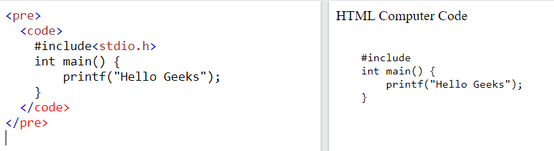
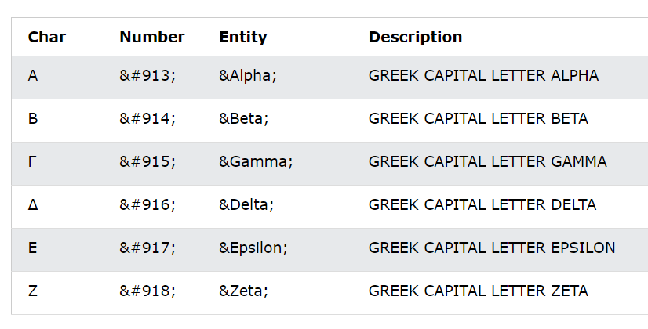
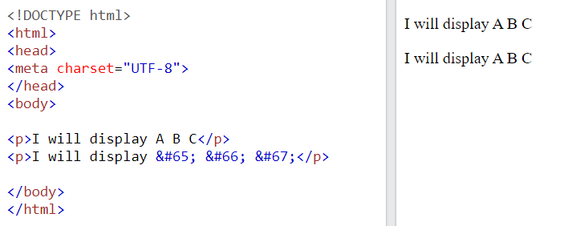
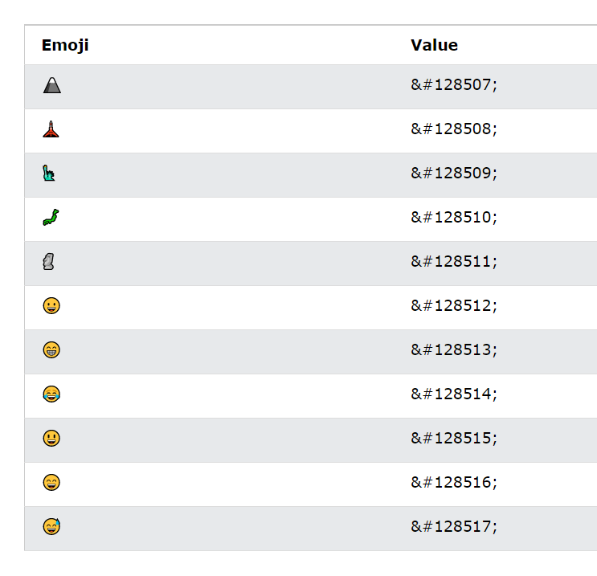

# 0. Contents
1. HTML Computer Code
2. HTML Symbols
3. HTML Emojis
4. HTML Charset
5. HTML URL Encode (Uniform Resource Locators)

 

# 1. HTML Computer Code
## 1.1. Thẻ `<code>`
- Thẻ `<code>` được sử dụng để định nghĩa đoạn mã máy tính. Trong quá trình tạo các trang web, đôi khi sẽ cần hiển thị đoạn mã lập trình máy tính.
- Cú pháp: `<code> Nội dung mã máy tính ... </code>`
    

    
    

*Lưu ý*: Nội dung trong thẻ `<code>` được hiển thị bằng font chữ `monospace` mặc định của trình duyệt. Do đó có một số kích thước và kiểu font chữ khác với thẻ tiêu đề cơ bản hay thẻ đoạn văn. 

## 1.2. Thẻ `<kbd>`
- Thẻ `<kbd>` là một thẻ ngữ pháp và được sử dụng để xác định dữ liệu nhập vào từ bàn phím. 
- Cú pháp: `<kbd> Contents... </kbd>`
 
     VD:

    
    

- Một số đặc điểm của thẻ `<kbd>`:
    - Nội dung trong thẻ `<kbd>` được hiển thị bằng font chữ `monospace` mặc định của trình duyệt.
    - Có thể đạt những hiệu ứng phong phú hơn với CSS.
    - Không có những thuộc tính thẻ cụ thể trong thẻ này.

## 1.3. Thẻ `<pre>`
- Thẻ `<pre>` được sử dụng để bao ngoài đoạn mã của thẻ `<code>` vì nó giúp cho đoạn mã giữ nguyên định dạng văn bản. Nó sẽ giữa nguyên dấu cách khoảng trông, xuống dòng, tabs, và những ký tự định dạng khác mà bị trình duyệt web bỏ qua. 
- Cú pháp `<pre> Contents... </pre>`
- VD: 
    - Khi không dùng thẻ `<pre>`, trình duyệt web sẽ bỏ qua cách khoảng trắng và xuống dòng.

    

    
    

    - Khi dùng thẻ `<pre>`, trình duyệt web sẽ giữ nguyên định dạng của nội dung có trong thẻ.
    

    
    

## 1.4. Thẻ `<samp>`
- Thẻ `<samp>` là một thẻ ngữ nghĩa và được sử dụng để định nghĩa kết quả đầu ra từ một chương trình máy tính. Nội dung trong thẻ `<samp>` được hiển thị bằng font chữ `monospace` mặc định của trình duyệt.
- Cú pháp: `<samp> Contents... </samp>`
## 1.5. Thẻ `<var>` 
- Thẻ `<var>` là một thẻ ngữ nghĩa và được sử dụng để định nghĩa biến trong một biểu thức toán học hoặc một chương trình máy tính. Nội dung trong thẻ này được hiển thị là kiểu chữ in nghiêng trên hầu hết các trình duyệt web.
- Cú pháp: `<var> Contents... </var>`
    

    
    

# 2. HTML Symbols
- `Symbol (ký hiệu)` là những ký hiệu không có trên bàn phím và có thể được thêm vào tài liệu bằng những thực thể.
## 2.1. Thực thể ký hiệu
- Nhiều `ký hiệu toán học`, `kỹ thuật`, `tiền tệ` không có trên bàn phím cơ bản của chúng ta. Để thêm được những ký hiệu đó vào tài liệu HTML, chúng ta sử dụng tên thực thể hoặc số thực thể (số hệ thập phân hoặc hệ thậ lục phân) cho những ký hiệu đó.

VD: Hiển thị ký hiệu tổng sigma (`∑`) trong toán học, chúng ta có thể sử dụng 1 trong 3 cách sau (tên thực thể, số thập phân và thập lục phân):
    

    
    

- Một số ký hiệu toán học được hỗ trợ trong HTML
    

    
    

    - Có thể tham khảo thêm những ký hiệu toán học khác tại   
    
    [Ký hiệu toán học trong HTML](https://www.w3schools.com/charsets/ref_utf_math.asp)
- Một số ký tự Hy Lạp được hỗ trợ trong HTML
    

    
    

    - Có thể tham khảo thêm những ký tự Hy Lạp khác tại [Ký tự Hy Lạp trong HTML](https://www.w3schools.com/charsets/ref_utf_greek.asp)

## 2.2 Một số thực thế khác
- Một số thực thế khác
    

    
    

- Có thể tham khảo thêm những ký hiệu khác:  
    
    [Ký hiệu tiền tệ trong HTML](https://www.w3schools.com/charsets/ref_utf_currency.asp)

    [Ký hiệu mũi tên trong HTML](https://www.w3schools.com/charsets/ref_utf_arrows.asp)

# 3. HTML Emojis
- `Emojis (biểu tượng cảm xúc)` là những ký tự thuộc bộ ký tự UTF-8.
- Nó trông giống như những hình ảnh, biểu tượng.
## 3.1. Thuộc tính HTML `charset`
- Để hiển thị một trang HTML 1 cách chính xác, một trình duyệt web phải biết bộ ký tự được sử dụng trên trang web đó.
- Thuộc tính này được định nghĩa trong thẻ `<meta>`:
`<meta charset="UTF-8">`
    - Nếu không được định nghĩa, thì UTF-8 mặc định là bộ ký tự sử dụng trong HTML

## 3.2. Bộ ký tự `UTF-8`
- Nhiều ký tự trong UTF-8 không thể được gõ từ bàn phím, nhưng chúng có thể được hiển thị trên trình duyệt bằng cách sử dụng `số thực thể (entity numbers)`
- Để trình duyệt hiểu được là chúng ta đang muốn hiển thị một ký tự, thì chúng ta phải sử dụng cú pháp sau: `&#` + `entitynumber` + `;`

    VD: 

    
    

## 3.3. Biểu tượng cảm xúc (Emojis)
- Biểu tượng cảm xúc là những ký tự từ bộ UTF-8  
    VD: 

    
    

- Một số ký hiệu biểu tượng cảm xúc trong UTF-8
    

    
    

Ngoài ra có thể tham khảo thêm các ký hiệu biểu tượng cảm xúc tại 
[Biểu tượng cảm xúc trong HTML](https://www.w3schools.com/charsets/ref_emoji.asp)

# 4. HTML Charset
## 4.1. Các bộ ký tự HTML
- `ASCII` là bộ ký tự mã hóa tiêu chuẩn đầu tiên. ASCII định nghĩa 128 ký tự khác nhau mà có thể được sử dụng trên Internet: số (0-9), chữ cái (A-Z), và một số ký tự đặc biệt như !, $, +, _ ...
- `ISO-8859-1` là bộ ký tự mặc định cho HTML 4. Bộ mã này hỗ trợ 256 mã ký tự khác nhau. HTML 4 cũng hộ trợ UTF-8.
- `ANSI (Windows-1252)` là bộ ký tự Windows gốc ban đầu. ANSI giống với ISO-8859-1, ngoại trừ ANSI có thêm 32 ký tự.
- **HTML5 khuyến cáo những lập trình viên web sử dụng bộ ký tự UTF-8, vì nó chứa hầu hết tất cả các kí tự và biểu tượng trên thế giới.**

## 4.2. Bộ ký tự ASCII
- Dữ liệu máy tính được lưu trữ dưới dạng mã nhị phân, chỉ bao gồm có số 0, 1.
- Để tiêu chuẩn hóa việc lưu trữ chữ cái, ASCII (American Standard Code for Information Interchange: mã tiêu chuẩn Hoa Kỳ để trao đổi thông tin) đã được tạo ra. Nó định nghĩa một con số nhị phân riêng biệt cho việc lưu trữ các ký tự: số (0-9), chữ cái in hoa và thường (A-Z, a-z), và những ký tự đặc biệt (! $ + - ( ) @ < > ,).
- Vì sử dụng 7 bits, nên ASCII chỉ đại diện cho 128 ký tự khác nhau.
- Điểm yếu lớn nhất của ASCII là nó đã loại trừ những chữ cái không phải tiếng Anh.
- Hiện nay ASCII vẫn còn sử dụng, đặc biệt trong các hệ thống máy tính lớn.
- Một số ký tự trong bộ ASCII và giá trị thiết lập của nó:
    

    
    

Những ký tự khác có thể tham khảo thêm tại 
[ASCII Character trong HTML](https://www.w3schools.com/charsets/ref_html_ascii.asp)

## 4.3. HTML ISO-8859-1
- ISO-8859-1 là bộ ký tự mặc định trong HTML 4.
- ISO-8859-1 giống bộ ASCII với những giá trị từ 0-127.
- ISO-8859-1 không sử dụng những giá trị từ 128-159.
- Những giá trị mã tiếp theo từ 160-191 của ISO-8859-1 chứa những ký tự đặc biệt thường được sử dụng.
    

    
    

- Phần tiếp theo của ISO-8859-1 (mã từ 192-255, ngoại trừ 215 và 247) chứa những ký tự được sử dụng ở các nước Tây Âu.
    

    
    

- Có thể xem chi tiết những ký tự của bộ ISO-8859-1 tại đây:
[ISO-8859-1 Character trong HTML](https://www.w3schools.com/charsets/ref_html_8859.asp)

## 4.4. HTML Windows-1252 (ANSI)
- Windows-1252 là bộ ký tự mặc định của Microsoft Windows. Nó là bộ ký tự phổ biến nhất cỉa Windows từ 1985-1990.
- Nó là một phần mở rộng cho ASCII, với các ký tự quốc tế được thêm vào.

- Nó sử dụng một byte đầy đủ (8-bit) để đại diện cho 256 ký tự khác nhau.

- Vì Windows-1252 đã là mặc định trong Windows nên nó được hỗ trợ bởi tất cả các trình duyệt.
- ANSI giống với ASCII cho các giá trị từ 0 đến 127.
- ANSI có một bộ ký tự độc quyền cho các giá trị từ 128 đến 159.
- ANSI giống với UTF-8 cho các giá trị từ 160 đến 255.
- Có thể xem chi tiết những ký tự của bộ ISO-8859-1 tại đây:
[Windows-1252 Character trong HTML](https://www.w3schools.com/charsets/ref_html_ansi.asp)

## 4.5. HTML Unicode (UTF-8)
- UTF-8 giống với ASCII cho các giá trị từ 0 đến 127.

- UTF-8 không sử dụng các giá trị từ 128 đến 159. 

- UTF-8 giống với cả ANSI và 8859-1 cho các giá trị từ 160 đến 255.

- UTF-8 tiếp tục từ giá trị 256 với hơn 10 000 ký tự khác nhau.
- Có thể xem chi tiết những ký tự của bộ ISO-8859-1 tại đây:
[Windows-1252 Character trong HTML](https://www.w3schools.com/charsets/ref_html_utf8.asp)

# 5. HTML URL Encode (Uniform Resource Locators)
- URL là một cụm từ để chỉ địa chỉ của một trang web.
## 5.1. URL - Uniform Resource Locator
- Trình duyệt web yêu cầu các trang từ máy chủ web bằng cách sử dụng một đường dẫn URL.
- Một đường dẫn URL được dùng để chỉ định đến một tài liệu hay một dữ liệu khác trên trang web.
- Một địa chỉ web sẽ có cú pháp như sau: `scheme://prefix.domain:port/path/filename`. 
Trong đó:

    - `scheme`: định nghĩa loại dịch vụ của Internet (thường là http hoặc https)
    - `prefix`: định nghĩa tiền tố của tên miền (mặc định cho http là www)
    - `domain`: tên miền Internet (vd như google.com)
    - `port`: xác định số cổng của máy chủ (mặc định cho http là 80)
    - `path`: xác định đường dẫn tới máy chủ 
    - `filename`: xác định tên của một tài liệu hoặc tài nguyên 
## 5.2. URL Encoding - mã hóa URL
 - URL chỉ có thể được gửi qua Internet bằng cách sử dụng bộ ký tự ASCII . Nếu một URL chứa các ký tự bên ngoài bộ ASCII, thì URL đó phải được chuyển đổi.

- Mã hóa URL chuyển đổi các ký tự không phải ASCII thành một định dạng có thể được truyền qua Internet.

- Mã hóa URL thay thế các ký tự không phải ASCII bằng "%" theo sau là các chữ số thập lục phân.

- URL không được chứa khoảng trắng. Mã hóa URL thường thay thế khoảng trắng bằng dấu cộng (+) hoặc% 20.

VD: Khi nhập URL đầu vào là `Hello Günter`, trình duyệt sẽ mã hóa nó thành `text=Hello+G%C3%BCnter` trước khi nó được gửi đến máy chủ

 Tham khảo bảng mã hóa ASCII tại [ASCII Encoding trong HTML](https://www.w3schools.com/tags/ref_urlencode.asp)

 

# Summary
- Tại bài học này, chúng ta đã biết cách thể hiện các ký tự đặc biệt trong HTML: Computer code, symbol, emoji.
- Cách thể hiện icon trong HTML.

